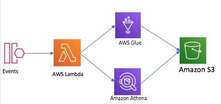
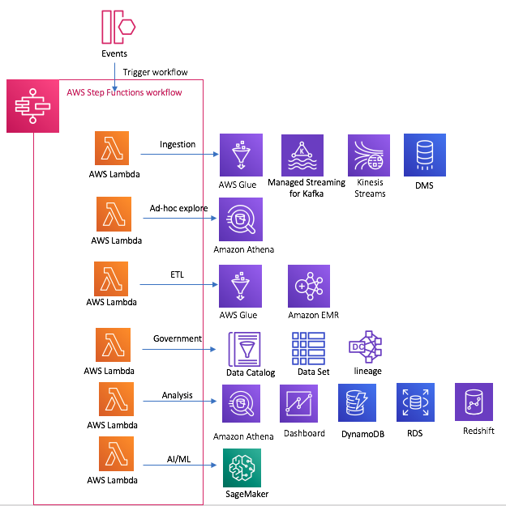

# Automate the Athena query

Every 2 hour, I need execute the 
1. Create external Table for json files stored in S3 bucket
2. Run the query to get the result

- Use single lambda file


- Step function orchestration


## Use single lambda file
1. Build the lambda function deployment package
```bash
mkdir package && cd package
pip install retrying -t ./
pip install boto3 -t ./
chmod -R 755 .
zip -r9 ../function.zip .

cd .. && zip -g function.zip basic-athena-query-lambda.py
```

2. Create lambda function
```bash
aws lambda create-function --function-name  BasicAthenaQuery --runtime python3.7 \
--zip-file fileb://function.zip --handler basic-athena-query-lambda.lambda_handler \
--role arn:aws-cn:iam::$account_id:role/lambda_basic_execution \
--timeout 300 --memory-size 256

aws lambda invoke --function-name BasicAthenaQuery \
--payload '{ "database": "sampledb", "table": "user_email", "s3_location": "s3://ray-datalake-lab/sample/user_email" }' \
out --log-type Tail --query 'LogResult' --output text |  base64 -d

cat out 
#[{"name": "user1", "email": "user1@example.com"}, {"name": "user2", "email": "user2@example.com"}, {"name": "user3", "email": "user3@example.com"}, {"name": "user4", "email": "user4@example.com"}, {"name": "user5", "email": "user5@example.com"}, {"name": "user6", "email": "user6@example.com"}]

zip -g function.zip basic-athena-query-lambda.py
aws lambda update-function-code --function-name BasicAthenaQuery \
--zip-file fileb://function.zip
```
3. Then you can create the cloud
3. cleanup
```bash
# lambda
aws lambda delete-function --function-name BasicAthenaQuery
drop table user_email
drop database sampledb
```

4. code ananlysis

Below is main logic to run query against Athena by SDK. 

```python
import boto3

query = "Your query"
database = "database_name"
athena_result_bucket = "s3://my-bucket/"

response = athena_client.start_query_execution(
    QueryString=query,
    QueryExecutionContext={
        'Database': database
    },
    ResultConfiguration={
        'OutputLocation': athena_result_bucket,
    }
)

query_execution_id = response["QueryExecutionId"]
result = poll_status(query_execution_id)
if result['QueryExecution']['Status']['State'] == 'SUCCEEDED':
    # get query results
    result = athena_client.get_query_results(
            QueryExecutionId=query_execution_id)
```

But if the query take long time, I use the python retry annotation to polling the execution status. Seems OK, but it is not Loose couple appoarch, if my query take longer time, I have to modify my code. 

```python
@retry(stop_max_attempt_number=10,
       wait_exponential_multiplier=300,
       wait_exponential_max=1 * 60 * 1000)
def poll_status(_id):
    result = athena_client.get_query_execution(QueryExecutionId=_id)
    state = result['QueryExecution']['Status']['State']
    logger.info("STATUS:" + state)

    if state == 'SUCCEEDED':
        logger.info(result)
        return result
    elif state == 'FAILED':
        logger.error(result)
        return result
    else:
        logger.info(result)
        raise Exception
```

I need a way to resolve below 2 requirements

- Need a Lambda trigger, when the query terminates
- Need a integration like SNS or SQS for queries that finish and make the other Athena process moving forward.

Seems Step function can orchestrate workflow, let's try it.


# Step function orchestration

Let's make the scenaio more complex

1. Step 1: Create a Table Based on the Original Dataset with CSV format

- Define the lambda trigger event

```json
{
    "Athena_Database" : "blogdb",
    "Athena_Table" : "original_csv",
    "Output_Data_Bucket" : "ray-datalake-lab",
    "Output_Prefix" : "results/blogdb",
    "CreateTable_DDL_Bucket" : "ray-datalake-lab",
    "CreateTable_DDL_File" : "scripts/blogdb/create_blogdb_original_csv.ddl"
}
```

- Create the lambda function: athena_createdb_createtable

The script under scripts/athena_createdb_createtable.py

- Invoke lambda function by Step Function

2. Step 2: Use CTAS (Create Table As Select) to create a table with partitions for the years 2015 to 2019. 

- Define the lambda trigger event

```json
{
    "Athena_Database" : "blogdb",
    "Athena_Table" : "new_parquet",
    "Output_Data_Bucket" : "ray-datalake-lab",
    "Output_Prefix" : "results/blogdb",
    "CreateTable_DDL_Bucket" : "ray-datalake-lab",
    "CreateTable_DDL_File" : "scripts/blogdb/create_blogdb_new_parquet.ddl"
}
```

- Invoke lambda function athena_createdb_createtable by Step Function

Create new table `new_parquet`: Partition the data by year, Convert the data to Parquet, and Compress the Data with Snappy

- Check the partitions and parquet files created by the CTAS statement
```bash
aws s3 ls s3://ray-datalake-lab/sample/athena-ctas-insert-into-optimized/ --region cn-northwest-1
    # PRE year=2015/
    # PRE year=2016/
    # PRE year=2017/
    # PRE year=2018/
    # PRE year=2019/

aws s3 ls s3://ray-datalake-lab/sample/athena-ctas-insert-into-optimized/ --recursive --human-readable --region cn-northwest-1 | head -5
# 2020-06-04 23:43:28    0 Bytes sample/athena-ctas-insert-into-optimized/
# 2020-06-08 22:37:59   12.9 MiB sample/athena-ctas-insert-into-optimized/year=2015/20200608_143644_00003_8kimg_0b2b66b0-7655-4169-bf0c-02a9b5fc1ec6
# 2020-06-08 22:37:59   15.0 MiB sample/athena-ctas-insert-into-optimized/year=2015/20200608_143644_00003_8kimg_267acb54-6ce8-4834-836a-ec7f0992517e
# 2020-06-08 22:37:59   13.5 MiB sample/athena-ctas-insert-into-optimized/year=2015/20200608_143644_00003_8kimg_3c0de4c9-0806-435e-bdb9-0bb0f9346508
# 2020-06-08 22:37:59   12.5 MiB sample/athena-ctas-insert-into-optimized/year=2015/20200608_143644_00003_8kimg_64337ca9-63b6-4af9-8dcd-bcae8f57bbbf

```

3. Step 3: Use INSERT INTO to Add Data from years 2010 to 2014.

- Define the lambda trigger event

```json
{
    "Athena_Database" : "blogdb",
    "Athena_Table" : "new_parquet",
    "Output_Data_Bucket" : "ray-datalake-lab",
    "Output_Prefix" : "results/blogdb",
    "CreateTable_DDL_Bucket" : "ray-datalake-lab",
    "CreateTable_DDL_File" : "scripts/blogdb/insert_blogdb_new_parquet.ddl"
}
```

- Invoke lambda function athena_long_running_query by Step Function

The script under scripts/athena_long_running_query.py

Use INSERT INTO to Add Data from years 2010 to 2014 to `new_parquet`.

- Check the partitions and parquet files created by the CTAS statement
```bash
aws s3 ls s3://ray-datalake-lab/sample/athena-ctas-insert-into-optimized/ --region cn-northwest-1
    # PRE year=2010/
    # PRE year=2011/
    # PRE year=2012/
    # PRE year=2013/
    # PRE year=2014/
    # PRE year=2015/
    # PRE year=2016/
    # PRE year=2017/
    # PRE year=2018/
    # PRE year=2019/

aws s3 ls s3://ray-datalake-lab/sample/athena-ctas-insert-into-optimized/ --recursive --human-readable --summarize --region cn-northwest-1
# 2020-06-04 23:43:28    0 Bytes sample/athena-ctas-insert-into-optimized/
# 2020-06-08 22:42:21   14.6 MiB sample/athena-ctas-insert-into-optimized/year=2010/20200608_144118_00022_8kimg_0ee1ad3a-bafc-4d95-8542-c4da39eef1d3
# 2020-06-08 22:42:21   15.6 MiB sample/athena-ctas-insert-into-optimized/year=2010/20200608_144118_00022_8kimg_4caac24e-54fa-4f5b-92f4-0e3b6f39f7d9
# 2020-06-08 22:42:21   14.5 MiB sample/athena-ctas-insert-into-optimized/year=2010/20200608_144118_00022_8kimg_52f51cbc-086f-4a56-81e6-28d481f4ad71
# .....
# 2020-06-08 22:38:01    9.3 MiB sample/athena-ctas-insert-into-optimized/year=2019/20200608_143644_00003_8kimg_efcb12dc-6371-4ae3-adcd-2af9106ee811

# Total Objects: 91
#    Total Size: 1.2 GiB
```

4. Step 4: Query the data and measure performance

- Define lambda environment variable or include the lambda trigger event

```json
{
    "Athena_Database" : "blogdb",
    "Athena_Table" : "new_parquet",
    "Output_Data_Bucket" : "ray-datalake-lab",
    "Output_Prefix" : "results/blogdb",
    "Athena_DDL_Bucket" : "ray-datalake-lab",
    "Athena_DDL_File" : "scripts/blogdb/query_orders_group_by_yeaer.ddl"
}
```

- Invoke lambda function athena_long_running_query by Step Function

- Define the lambda trigger event

```json
{
    "Athena_Database" : "blogdb",
    "Athena_Table" : "new_parquet",
    "Output_Data_Bucket" : "ray-datalake-lab",
    "Output_Prefix" : "results/blogdb",
    "Athena_DDL_Bucket" : "ray-datalake-lab",
    "Athena_DDL_File" : "scripts/blogdb/analysis_orders_in_2018.ddl"
}
```

- Invoke lambda function athena_long_running_query by Step Function

# Cleanup
```bash
DROP TABLE IF EXISTS new_parquet
DROP TABLE IF EXISTS original_csv
DROP DATABASE blogdb
clean up the data under s3://ray-datalake-lab/sample/athena-ctas-insert-into-optimized/
```

## You can extend the Step function to data analytics workflow


# Reference
1. https://pypi.org/project/pythena/
2. https://boto3.amazonaws.com/v1/documentation/api/latest/reference/services/athena.html
3. [Creating a Table from Query Results](https://docs.aws.amazon.com/athena/latest/ug/ctas.html)
4. [Orchestrate multiple ETL jobs using AWS Step Functions and AWS Lambda](https://aws.amazon.com/blogs/big-data/orchestrate-multiple-etl-jobs-using-aws-step-functions-and-aws-lambda/)

5. [Replace Data pipeline to export an Amazon DynamoDB table to Amazon S3 using AWS Step Functions and AWS Glue](https://aws.amazon.com/blogs/big-data/how-to-export-an-amazon-dynamodb-table-to-amazon-s3-using-aws-step-functions-and-aws-glue/)