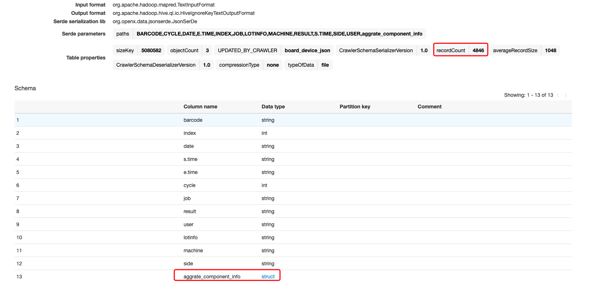
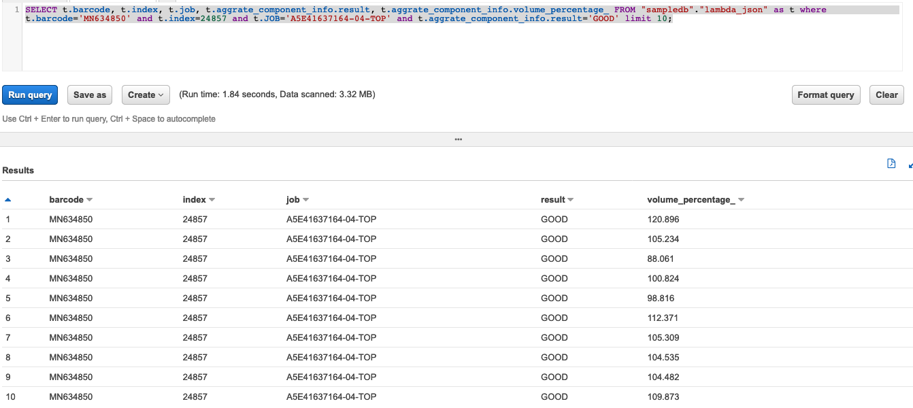
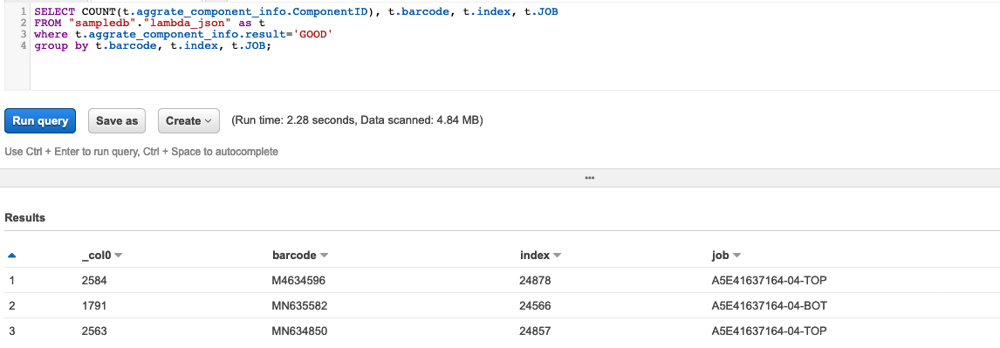
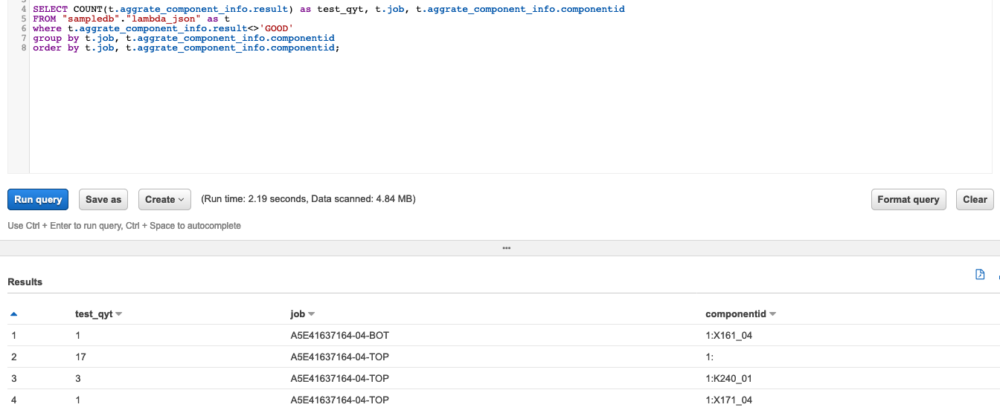

# How to use the Athena to create the complex embeded table and query the table

The complex embeded table example: you can find the first 2 rows schema (red rectangle) is different from remaining rows (green rectangle)


## Case 1: You want to create the table only include green rectangle rows data
- You create external table in Athena by using the `TBLPROPERTIES ("skip.header.line.count"="3")` to skip the first 2 rows and header. The [create_athena_device_table](scripts/create_athena_device_table.ddl) script for your reference.

- Then you can query the table `SELECT * FROM "sampledb"."device_csv" limit 10;`


## Case 2: You want to create the table for both red and green rectangle rows data
- Step 1: you can use the Glue Crawler to generate the raw table which include all rows data or you can create external table directly in Athena. The [create_athena_rawdata_table](scripts/create_athena_rawdata_table.ddl) script for your reference.

- Step 2: you can query the table `SELECT * FROM "sampledb"."rawdata_csv" limit 10;`


- Step 3: You can query the red rectangle rows data
    ```sql
    SELECT * 
    FROM "rawdata_csv"
    WHERE "Volume(%)" IS NOT NULL AND "Height(um)" IS NOT NULL AND "Area(%)" IS NOT NULL
    limit 10;
    ```
    

- Step 4： You can query the green rectangle rows data
    
    1. query as string
    ```sql
    SELECT "component id" 
    FROM "rawdata_csv"
    WHERE "Volume(%)" IS NULL AND "Height(um)" IS NULL AND "Area(%)" IS NULL
    ORDER BY 'Volume(%)' NULLS FIRST LIMIT 1
    ```
    

    By using [Presto Functions in Amazon Athena](https://docs.aws.amazon.com/athena/latest/ug/presto-functions.html) such as [Presto String Functions and Operators](https://prestodb.io/docs/0.172/functions/string.html) and [Presto Regular Expression Functions](https://prestodb.io/docs/0.172/functions/regexp.html), you can help more options to access the data

    2. query as array
    ```sql
    WITH dataset AS (SELECT trim("component id") as boardinfo FROM "rawdata_csv"
        WHERE "Volume(%)" IS NULL AND "Height(um)" IS NULL AND "Area(%)" IS NULL
        ORDER BY 'Volume(%)' NULLS FIRST LIMIT 1)
    SELECT 
        regexp_split(boardinfo, '\s+') as boardinfo_no_space
    FROM dataset;
    ```
    
    
    3. query with column name
    ```sql
    SELECT 
        split_part(boardinfo_no_space, '|', 1) as "BARCODE",
        split_part(boardinfo_no_space, '|', 2) as "INDEX",
        split_part(boardinfo_no_space, '|', 3) as "DATE",
        split_part(boardinfo_no_space, '|', 4) as "S.TIME",
        split_part(boardinfo_no_space, '|', 5) as "E.TIME",
        split_part(boardinfo_no_space, '|', 6) as "CYCLE",
        split_part(boardinfo_no_space, '|', 7) as "JOB",
        split_part(boardinfo_no_space, '|', 8) as "RESULT",
        split_part(boardinfo_no_space, '|', 9) as "USER",
        split_part(boardinfo_no_space, '|', 10) as "LOTINFO",
        split_part(boardinfo_no_space, '|', 11) as "MACHINE",
        split_part(boardinfo_no_space, '|', 12) as "SIDE"
    FROM
        (SELECT 
            regexp_replace(boardinfo, '\s+', '|') as boardinfo_no_space
        FROM (
            SELECT trim("component id") as boardinfo FROM "rawdata_csv"
                WHERE "Volume(%)" IS NULL AND "Height(um)" IS NULL AND "Area(%)" IS NULL
                ORDER BY 'Volume(%)' NULLS FIRST LIMIT 1
            )
        )
    ```
    

## Case 3: You want to create seperated tables for red and green rectangle rows data
- Step 1: Follow up the [Case 2](#case-2:-you-want-to-create-the-table-for-both-red-and-green-rectangle-rows-data) to creat the table `rawdata_csv`

- Step 2: you can use the `CREATE TABLE AS` to create the table `component_csv` for green rectangle rows data

    The script [create_athena_component_table](scripts/create_athena_component_table.ddl) for your reference. More details you can refer the ["CREATE TABLE AS" user guide](https://docs.aws.amazon.com/athena/latest/ug/create-table-as.html)

    Then you can query the table `SELECT * FROM "sampledb"."component_csv" limit 10;`

    

- Step 3: you can use the `CREATE TABLE AS` to create the table `board_csv` for red rectangle rows data

    The script [create_athena_board_table](scripts/create_athena_board_table.ddl) for your reference. More details you can refer the ["CREATE TABLE AS" user guide](https://docs.aws.amazon.com/athena/latest/ug/create-table-as.html)

    Then you can query the table `SELECT * FROM "sampledb"."board_csv" limit 10;`

    


## Case 4, You want to setup the relationship for red and green rectangle rows data within same file and you will have multiple similar csv files in S3 bucket

For example, if I want to query the "BARCODE"="MN635582" and "INDEX"= 24566 and "JOB"="A5E41637164-04-BOT" and "Result"="GOOD", I need setup the relationship of red and green rectangle rows data within same file

Here I add red rectangle info to each row of green rectangle. Json format can well define such schema, such as below

```json
{"BARCODE":"MN635582","INDEX":24566,"DATE":"11\/10\/2020","S.TIME":"11:54:09","E.TIME":"11:54:15","CYCLE":6,"JOB":"A5E41637164-04-BOT","RESULT":"FAIL","USER":"SV","LOTINFO":"KOHYOUNG","MACHINE":null,"aggrate_component_info":{"ComponentID":"1:","Volume_percentage_":105.857,"Height_um_":125.153,"Area_percentage_":101.498,"OffsetX_percentage_":-0.04,"OffsetY_percentage_":0.47,"Volume_um3_":31230310,"Area_um2_":249537,"Result":"GOOD","PinNumber":null,"PadVerification":null,"Shape":"45.6um","Library_Name":"PART2","Vol_Min_percentage_":45,"Vol_Max_percentage_":190,"Height_Low_um_":60,"Height_High_um_":230,"Area_Min_percentage_":60,"Area_Max_percentage_":170,"OffsetX_Error_mm_":0.18,"OffsetY_Error_mm_":0.18,"Unnamed_21":null}}
```

Then I can query the data
```sql
SELECT * FROM "sampledb"."complex_json_structure" as t 
where t.barcode='MN635582' and t.index=24566 and t.JOB='A5E41637164-04-BOT' and t.aggrate_component_info.Result='GOOD' limit 10;
```

Python library [pandas](https://pandas.pydata.org/pandas-docs/stable/reference/frame.html) is very popular data analysis tool which provide the API for read/write csv file or json file and DataFrame/Series are powerful data structure used in data analysis

AWS [aws-data-wrangler](https://aws-data-wrangler.readthedocs.io/en/stable/index.html)
extends the power of Pandas library to AWS connecting DataFrames and AWS data related services (Amazon Redshift, AWS Glue, Amazon Athena, Amazon Timestream, Amazon EMR, Amazon QuickSight, etc).

I use the Jupyter notebook do finish the transformation by leverage the [pandas](https://pandas.pydata.org/pandas-docs/stable/reference/frame.html) and using [aws-data-wrangler](https://aws-data-wrangler.readthedocs.io/en/stable/index.html) to create the AWS Glue data catalog and execute Amazon Athen query in python script

```python
# Read the csv from S3 bucket
raw_component_csv_df = wr.s3.read_csv(s3_file_path, index_col=None, header=2, delimiter=',', skipinitialspace=True, keep_default_na=True, na_filter=True)

#Add your logic add barcode info to each row of component
raw_component_csv_df -> raw_data_json
raw_data_json_df = pd.DataFrame.from_dict(raw_data_json)

# upload transformed object to S3 bucket
wr.s3.to_json(
        df=raw_data_json_df,
        path=upload_file_path,
        orient="records", 
        lines=True
    )

# Create the Athena Table (AWS Glue Catalog table)
query = r'''
      CREATE EXTERNAL TABLE IF NOT EXISTS `sampledb`.`complex_json_structure` (
      `BARCODE` string, 
      `INDEX` int,
      `DATE` string,
      `S.TIME` string,
      `E.TIME` string,
      `JOB` string,
      `RESULT` string,
      `USER` string,
      `LOTINFO` string,
      `MACHINE` string,
      `SIDE` string,
      `aggrate_component_info` struct<ComponentID:string,Volume_percentage_:float,Height_um_:float,Area_percentage_:float,OffsetX_percentage_:float,OffsetY_percentage_:float,Volume_um3_:int,Area_um2_:int,Result:string,PinNumber:string,PadVerification:string,Shape:string,Library_Name:string,Vol_Min_percentage_:int,Vol_Max_percentage_:int,Height_Low_um_:int,Height_High_um_:int,Area_Min_percentage_:int,Area_Max_percentage_:int,OffsetX_Error_mm_:float,OffsetY_Error_mm_:float,Unnamed_21:string>
      )
    ROW FORMAT SERDE 'org.openx.data.jsonserde.JsonSerDe'
    WITH SERDEPROPERTIES (
      'ignore.malformed.json'='true',
      'paths'='BARCODE,INDEX,DATE,S.TIME,E.TIME,JOB,RESULT,USER,LOTINFO,MACHINE,SIDE,aggrate_component_info'
    )
    STORED AS INPUTFORMAT 'org.apache.hadoop.mapred.TextInputFormat' 
    OUTPUTFORMAT 'org.apache.hadoop.hive.ql.io.HiveIgnoreKeyTextOutputFormat'
    LOCATION '{}'
    '''

query_exec_id = wr.athena.start_query_execution(sql=query, database="sampledb")
wr.athena.wait_query(query_execution_id=query_exec_id)
res = wr.athena.get_query_execution(query_execution_id=query_exec_id)

# Run the Athena query
query = r'''
SELECT * FROM "sampledb"."complex_json_structure" as t 
where t.barcode='MN635582' and t.index=24566 and t.JOB='A5E41637164-04-BOT' and t.aggrate_component_info.ComponentID='1:C82_01' 
limit 10;
'''
df = wr.athena.read_sql_query(sql=query, database="sampledb")
```

The whole script can be found in [Handle_Complex_CSV.ipynb](scripts/Handle_Complex_CSV.ipynb) or [Handle_Complex_CSV.py](scripts/Handle_Complex_CSV.py)

More Athena query

```sql
select count(1) FROM "sampledb"."complex_json_structure"; 

SELECT * FROM "sampledb"."complex_json_structure" as t where t.barcode='MN634850' and t.index=24857 and t.JOB='A5E41637164-04-TOP' and t.aggrate_component_info.result='GOOD' limit 10;
```


```sql
SELECT COUNT(t.aggrate_component_info.ComponentID), t.barcode, t.index, t.JOB
FROM "sampledb"."complex_json_structure" as t 
where t.aggrate_component_info.result='GOOD'
group by t.barcode, t.index, t.JOB;
```


## Case 5: I want to handle the schema convert automatically (in Case 4) when the new csv file uplaod to S3 bucket

[You can create a Lambda function to handle each Amazon S3 object upload event](https://docs.aws.amazon.com/lambda/latest/dg/with-s3-example.html)


1. Lambda Execution Policy `AWSLambdaS3Policy`
```json
{
    "Version": "2012-10-17",
    "Statement": [
        {
            "Effect": "Allow",
            "Action": [
                "logs:PutLogEvents",
                "logs:CreateLogGroup",
                "logs:CreateLogStream"
            ],
            "Resource": "arn:aws-cn:logs:*:*:*"
        },
        {
            "Effect": "Allow",
            "Action": [
                "s3:GetObject"
            ],
            "Resource": "arn:aws-cn:s3:::mybucket/*"
        },
        {
            "Effect": "Allow",
            "Action": [
                "s3:PutObject"
            ],
            "Resource": "arn:aws:s3-cn:::mybucket-resized/*"
        }
    ]
}         
```

2. Create Lambda Execution Role
- IAM Create new Role
  - Trusted entity – AWS Lambda.
  - Permissions – AWSLambdaS3Policy.
  - Role name – lambda-s3-role.

3. Create the function [lambda_handle_complex_csv](scripts/lambda_handle_complex_csv.py)
- Name: lambda_handle_complex_csv
- Runtime: python 3.8
- Memory: 512MB
- Timeout: 120 seconds

Option 1: [Build the pandas lambda layer and use it for your function](../../lambda/How-to-build-lambda-layer.md)

Option 2: Build from sctach
```bash
# install dependency
mkdir package && cd package
pip install --use-feature=2020-resolver -i https://pypi.tuna.tsinghua.edu.cn/simple pytz -t ./
pip install --use-feature=2020-resolver -i https://pypi.tuna.tsinghua.edu.cn/simple s3fs -t ./
# Download the pandas package from https://pypi.org/project/pandas/ For Python 3.8, pandas-1.2.0-cp38-cp38-manylinux1_x86_64.whl
wget https://files.pythonhosted.org/packages/7d/4d/c1df56ed2370839f5a1b7bc5a4835ee73f46c2582beb5d3b14e87f2b3dc0/pandas-1.2.0-cp38-cp38-manylinux1_x86_64.whl
unzip pandas-1.2.0-cp38-cp38-manylinux1_x86_64.whl
# Download the numpy package from https://pypi.org/project/numpy/ For Python 3.8, numpy-1.19.4-cp38-cp38-manylinux1_x86_64.whl
wget https://files.pythonhosted.org/packages/77/0b/41e345a4f224aa4328bf8a640eeeea1b2ad0d61517f7d0890f167c2b5deb/numpy-1.19.4-cp38-cp38-manylinux1_x86_64.whl
unzip numpy-1.19.4-cp38-cp38-manylinux1_x86_64.whl
rm -r *.whl *.dist-info __pycache__
chmod -R 755 .
zip -r9 ../function.zip .

# 2. Create lambda function
cd .. && zip -g function.zip lambda_handle_complex_csv.py
aws s3 cp function.zip s3://ray-glue-streaming/catalog_test/lambda_code/function.zip --region cn-north-1

aws lambda create-function --function-name  lambda_handle_complex_csv --runtime python3.8 \
--code S3Bucket=ray-glue-streaming,S3Key=catalog_test/lambda_code/function.zip \
--package-type Zip --handler lambda_handle_complex_csv.lambda_handler \
--role arn:aws-cn:iam::$account_id:role/lambda_basic_execution \
--timeout 120 --memory-size 512 --region cn-north-1

# 3. Update the lambda function code
zip -g function.zip lambda_handle_complex_csv.py

aws s3 cp function.zip s3://ray-glue-streaming/catalog_test/lambda_code/function.zip --region cn-north-1

aws lambda update-function-code --function-name lambda_handle_complex_csv \
--s3-bucket ray-glue-streaming --s3-key catalog_test/lambda_code/function.zip \
--region cn-north-1
```

4. Configure Amazon S3 to publish events
- To add permissions to the function policy to grant Amazon S3 service to perform the lambda:InvokeFunction action
```bash
aws lambda add-permission --function-name lambda_handle_complex_csv \
--principal s3.amazonaws.com \
--statement-id s3invoke --action "lambda:InvokeFunction" \
--source-arn arn:aws-cn:s3:::ray-glue-streaming \
--source-account account-id
```
- To configure S3 notifications
  - Name: s3-upload-lambda-trigger.
  - Prefix: catalog_test/complextable/
  - Suffix: csv
  - Events: All object create events.
  - Send to: Lambda function.
  - Lambda: lambda_handle_complex_csv.


6. Test the setup
- Upload file to the source bucket using the Amazon S3 console.
    ```bash
    aws s3 cp MN63459620201110165647.csv s3://ray-glue-streaming/catalog_test/complextable/MN63459620201110165647.csv --region cn-north-1
    ```
- Verify that the json file was created in the source bucket `lambda_json/` folder
- View function logs in the CloudWatch console

7. Batch upload multiple files
    ```bash
    aws s3 sync . s3://ray-glue-streaming/catalog_test/complextable/ --exclude "*" --include "*.csv" --exclude "package/*" --region cn-north-1
    ```
    Verify the files has been generated under sementic layer `lambda_json/`

7. Query by Athena
- Using the Glue Crawler automatically discovery the schema for files under under sementic layer `lambda_json/`

- Using Athena to query the table
```sql
SELECT * FROM "sampledb"."lambda_json" limit 10;
SELECT count(1) FROM "sampledb"."lambda_json"; 
SELECT count(1) FROM "sampledb"."lambda_json" as t where t.barcode='MN634850'; 
SELECT t.barcode, t.index, t.job, t.aggrate_component_info.result, t.aggrate_component_info.volume_percentage_ FROM "sampledb"."lambda_json" as t where t.barcode='MN634850' and t.index=24857 and t.JOB='A5E41637164-04-TOP' and t.aggrate_component_info.result='GOOD' limit 10;
```


```sql
SELECT COUNT(t.aggrate_component_info.ComponentID), t.barcode, t.index, t.JOB
FROM "sampledb"."lambda_json" as t 
where t.aggrate_component_info.result='GOOD'
group by t.barcode, t.index, t.JOB;
```


```sql
SELECT COUNT(t.aggrate_component_info.result), t.job, t.aggrate_component_info.componentid
FROM "sampledb"."lambda_json" as t 
where t.aggrate_component_info.result='GOOD'
group by t.job, t.aggrate_component_info.componentid
order by t.job, t.aggrate_component_info.componentid;
```



## Using AWS Athena To Convert A CSV File To Parquet
```sql
CREATE TABLE sampledb.athena_created_parquet_snappy_data
    WITH (
          format = 'PARQUET',
          parquet_compression = 'SNAPPY',
          external_location = 's3://ray-glue-streaming/catalog_test/lambda_json_parquet/'
    ) AS SELECT "barcode", "index", "date", "s.time", "e.time", "cycle", "job", "result", user, lotinfo, machine, side, t.aggrate_component_info.componentid, t.aggrate_component_info.volume_percentage_, t.aggrate_component_info.height_um_, t.aggrate_component_info.area_percentage_, t.aggrate_component_info.offsetx_percentage_, t.aggrate_component_info.offsety_percentage_, t.aggrate_component_info.volume_um3_, t.aggrate_component_info.area_um2_, t.aggrate_component_info.result as c_result, t.aggrate_component_info.pinnumber, t.aggrate_component_info.padverification, t.aggrate_component_info.shape, t.aggrate_component_info.library_name, t.aggrate_component_info.vol_min_percentage_, t.aggrate_component_info.vol_max_percentage_,t.aggrate_component_info.height_low_um_,t.aggrate_component_info.height_high_um_,t.aggrate_component_info.area_min_percentage_,t.aggrate_component_info.area_max_percentage_,t.aggrate_component_info.offsetx_error_mm_,t.aggrate_component_info.offsety_error_mm_,t.aggrate_component_info.unnamed_21
    FROM sampledb.lambda_json as t
```

```sql
SELECT * FROM "sampledb"."athena_created_parquet_snappy_data" limit 10;

SELECT COUNT(t.componentid), t.barcode, t.index, t.job
FROM "sampledb"."athena_created_parquet_snappy_data" as t 
where t.c_result='GOOD'
group by t.barcode, t.index, t.job;
```

| Task | Runtime | Data Scanned |
| --- | --- | --- |
| json preview 10 lines | 1.65s | 580.37 KB |
| parquet preview 10 lines | 1.64s | 234.14 KB |
| json count (*) | 1.64 | 4.84 MB |
| parquet count (*) | 1.56s | 0 KB |
| json group query | 1.97s |  4.84 MB |
| parquet group query | 0.65s |  12.46 KB |


## Reference
[AWS Lambda with Pandas and NumPy](https://korniichuk.medium.com/lambda-with-pandas-fd81aa2ff25e)

[Pandas in AWS lambda gives numpy error](https://aws.amazon.com/premiumsupport/knowledge-center/lambda-python-package-compatible/)