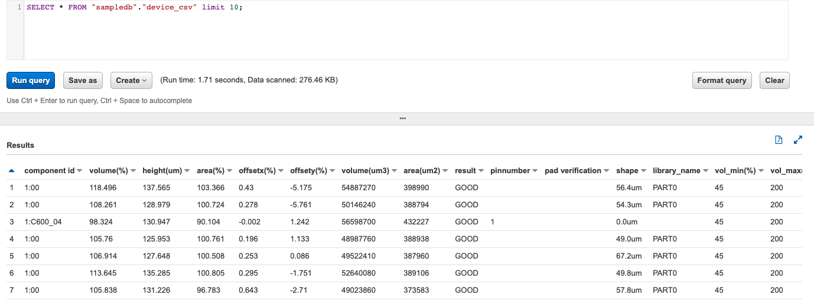
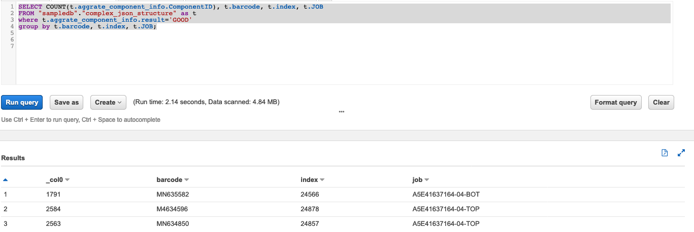

# How to use the Athena to create the complex embeded table and query the table

The complex embeded table example: you can find the first 2 rows schema (red rectangle) is different from remaining rows (green rectangle)


## Case 1: You want to create the table only include green rectangle rows data
- You create external table in Athena by using the `TBLPROPERTIES ("skip.header.line.count"="3")` to skip the first 2 rows and header. The [create_athena_device_table](scripts/create_athena_device_table.ddl) script for your reference.

- Then you can query the table `SELECT * FROM "sampledb"."device_csv" limit 10;`



## Case 2: You want to create the table for both red and green rectangle rows data
- Step 1: you can use the Glue Crawler to generate the raw table which include all rows data or you can create external table directly in Athena. The [create_athena_rawdata_table](scripts/create_athena_rawdata_table.ddl) script for your reference.

- Step 2: you can query the table `SELECT * FROM "sampledb"."rawdata_csv" limit 10;`


- Step 3: You can query the red rectangle rows data
    ```sql
    SELECT * 
    FROM "rawdata_csv"
    WHERE "Volume(%)" IS NOT NULL AND "Height(um)" IS NOT NULL AND "Area(%)" IS NOT NULL
    limit 10;
    ```
    

- Step 4： You can query the green rectangle rows data
    
    1. query as string
    ```sql
    SELECT "component id" 
    FROM "rawdata_csv"
    WHERE "Volume(%)" IS NULL AND "Height(um)" IS NULL AND "Area(%)" IS NULL
    ORDER BY 'Volume(%)' NULLS FIRST LIMIT 1
    ```
    

    By using [Presto Functions in Amazon Athena](https://docs.aws.amazon.com/athena/latest/ug/presto-functions.html) such as [Presto String Functions and Operators](https://prestodb.io/docs/0.172/functions/string.html) and [Presto Regular Expression Functions](https://prestodb.io/docs/0.172/functions/regexp.html), you can help more options to access the data

    2. query as array
    ```sql
    WITH dataset AS (SELECT trim("component id") as boardinfo FROM "rawdata_csv"
        WHERE "Volume(%)" IS NULL AND "Height(um)" IS NULL AND "Area(%)" IS NULL
        ORDER BY 'Volume(%)' NULLS FIRST LIMIT 1)
    SELECT 
        regexp_split(boardinfo, '\s+') as boardinfo_no_space
    FROM dataset;
    ```
    
    
    3. query with column name
    ```sql
    SELECT 
        split_part(boardinfo_no_space, '|', 1) as "BARCODE",
        split_part(boardinfo_no_space, '|', 2) as "INDEX",
        split_part(boardinfo_no_space, '|', 3) as "DATE",
        split_part(boardinfo_no_space, '|', 4) as "S.TIME",
        split_part(boardinfo_no_space, '|', 5) as "E.TIME",
        split_part(boardinfo_no_space, '|', 6) as "CYCLE",
        split_part(boardinfo_no_space, '|', 7) as "JOB",
        split_part(boardinfo_no_space, '|', 8) as "RESULT",
        split_part(boardinfo_no_space, '|', 9) as "USER",
        split_part(boardinfo_no_space, '|', 10) as "LOTINFO",
        split_part(boardinfo_no_space, '|', 11) as "MACHINE",
        split_part(boardinfo_no_space, '|', 12) as "SIDE"
    FROM
        (SELECT 
            regexp_replace(boardinfo, '\s+', '|') as boardinfo_no_space
        FROM (
            SELECT trim("component id") as boardinfo FROM "rawdata_csv"
                WHERE "Volume(%)" IS NULL AND "Height(um)" IS NULL AND "Area(%)" IS NULL
                ORDER BY 'Volume(%)' NULLS FIRST LIMIT 1
            )
        )
    ```
    

## Case 3: You want to create seperated tables for red and green rectangle rows data
- Step 1: Follow up the [Case 2](#case-2:-you-want-to-create-the-table-for-both-red-and-green-rectangle-rows-data) to creat the table `rawdata_csv`

- Step 2: you can use the `CREATE TABLE AS` to create the table `component_csv` for green rectangle rows data

    The script [create_athena_component_table](scripts/create_athena_component_table.ddl) for your reference. More details you can refer the ["CREATE TABLE AS" user guide](https://docs.aws.amazon.com/athena/latest/ug/create-table-as.html)

    Then you can query the table `SELECT * FROM "sampledb"."component_csv" limit 10;`

    

- Step 3: you can use the `CREATE TABLE AS` to create the table `board_csv` for red rectangle rows data

    The script [create_athena_board_table](scripts/create_athena_board_table.ddl) for your reference. More details you can refer the ["CREATE TABLE AS" user guide](https://docs.aws.amazon.com/athena/latest/ug/create-table-as.html)

    Then you can query the table `SELECT * FROM "sampledb"."board_csv" limit 10;`

    


## Case 4, You want to setup the relationship for red and green rectangle rows data within same file and you will have multiple similar csv files in S3 bucket

For example, if I want to query the "BARCODE"="MN635582" and "INDEX"= 24566 and "JOB"="A5E41637164-04-BOT" and "Result"="GOOD", I need setup the relationship of red and green rectangle rows data within same file

Here I add red rectangle info to each row of green rectangle. Json format can well define such schema, such as below

```json
{"BARCODE":"MN635582","INDEX":24566,"DATE":"11\/10\/2020","S.TIME":"11:54:09","E.TIME":"11:54:15","CYCLE":6,"JOB":"A5E41637164-04-BOT","RESULT":"FAIL","USER":"SV","LOTINFO":"KOHYOUNG","MACHINE":null,"aggrate_component_info":{"ComponentID":"1:","Volume_percentage_":105.857,"Height_um_":125.153,"Area_percentage_":101.498,"OffsetX_percentage_":-0.04,"OffsetY_percentage_":0.47,"Volume_um3_":31230310,"Area_um2_":249537,"Result":"GOOD","PinNumber":null,"PadVerification":null,"Shape":"45.6um","Library_Name":"PART2","Vol_Min_percentage_":45,"Vol_Max_percentage_":190,"Height_Low_um_":60,"Height_High_um_":230,"Area_Min_percentage_":60,"Area_Max_percentage_":170,"OffsetX_Error_mm_":0.18,"OffsetY_Error_mm_":0.18,"Unnamed_21":null}}
```

Then I can query the data
```sql
SELECT * FROM "sampledb"."complex_json_structure" as t 
where t.barcode='MN635582' and t.index=24566 and t.JOB='A5E41637164-04-BOT' and t.aggrate_component_info.Result='GOOD' limit 10;
```

Python library [pandas](https://pandas.pydata.org/pandas-docs/stable/reference/frame.html) is very popular data analysis tool which provide the API for read/write csv file or json file and DataFrame/Series are powerful data structure used in data analysis

AWS [aws-data-wrangler](https://aws-data-wrangler.readthedocs.io/en/stable/index.html)
extends the power of Pandas library to AWS connecting DataFrames and AWS data related services (Amazon Redshift, AWS Glue, Amazon Athena, Amazon Timestream, Amazon EMR, Amazon QuickSight, etc).

I use the Jupyter notebook do finish the transformation by leverage the [pandas](https://pandas.pydata.org/pandas-docs/stable/reference/frame.html) and using [aws-data-wrangler](https://aws-data-wrangler.readthedocs.io/en/stable/index.html) to create the AWS Glue data catalog and execute Amazon Athen query in python script

```python
# Read the csv from S3 bucket
raw_component_csv_df = wr.s3.read_csv(s3_file_path, index_col=None, header=2, delimiter=',', skipinitialspace=True, keep_default_na=True, na_filter=True)

#Add your logic add barcode info to each row of component
raw_component_csv_df -> raw_data_json
raw_data_json_df = pd.DataFrame.from_dict(raw_data_json)

# upload transformed object to S3 bucket
wr.s3.to_json(
        df=raw_data_json_df,
        path=upload_file_path,
        orient="records", 
        lines=True
    )

# Create the Athena Table (AWS Glue Catalog table)
query = r'''
      CREATE EXTERNAL TABLE IF NOT EXISTS `sampledb`.`complex_json_structure` (
      `BARCODE` string, 
      `INDEX` int,
      `DATE` string,
      `S.TIME` string,
      `E.TIME` string,
      `JOB` string,
      `RESULT` string,
      `USER` string,
      `LOTINFO` string,
      `MACHINE` string,
      `SIDE` string,
      `aggrate_component_info` struct<ComponentID:string,Volume_percentage_:float,Height_um_:float,Area_percentage_:float,OffsetX_percentage_:float,OffsetY_percentage_:float,Volume_um3_:int,Area_um2_:int,Result:string,PinNumber:string,PadVerification:string,Shape:string,Library_Name:string,Vol_Min_percentage_:int,Vol_Max_percentage_:int,Height_Low_um_:int,Height_High_um_:int,Area_Min_percentage_:int,Area_Max_percentage_:int,OffsetX_Error_mm_:float,OffsetY_Error_mm_:float,Unnamed_21:string>
      )
    ROW FORMAT SERDE 'org.openx.data.jsonserde.JsonSerDe'
    WITH SERDEPROPERTIES (
      'ignore.malformed.json'='true',
      'paths'='BARCODE,INDEX,DATE,S.TIME,E.TIME,JOB,RESULT,USER,LOTINFO,MACHINE,SIDE,aggrate_component_info'
    )
    STORED AS INPUTFORMAT 'org.apache.hadoop.mapred.TextInputFormat' 
    OUTPUTFORMAT 'org.apache.hadoop.hive.ql.io.HiveIgnoreKeyTextOutputFormat'
    LOCATION '{}'
    '''

query_exec_id = wr.athena.start_query_execution(sql=query, database="sampledb")
wr.athena.wait_query(query_execution_id=query_exec_id)
res = wr.athena.get_query_execution(query_execution_id=query_exec_id)

# Run the Athena query
query = r'''
SELECT * FROM "sampledb"."complex_json_structure" as t 
where t.barcode='MN635582' and t.index=24566 and t.JOB='A5E41637164-04-BOT' and t.aggrate_component_info.ComponentID='1:C82_01' 
limit 10;
'''
df = wr.athena.read_sql_query(sql=query, database="sampledb")
```

The whole script can be found in [Handle_Complex_CSV.ipynb](scripts/Handle_Complex_CSV.ipynb) or [Handle_Complex_CSV.py](scripts/Handle_Complex_CSV.py)

More Athena query

```sql
select count(1) FROM "sampledb"."complex_json_structure"; 

SELECT * FROM "sampledb"."complex_json_structure" as t where t.barcode='MN634850' and t.index=24857 and t.JOB='A5E41637164-04-TOP' and t.aggrate_component_info.result='GOOD' limit 10;
```


```sql
SELECT COUNT(t.aggrate_component_info.ComponentID), t.barcode, t.index, t.JOB
FROM "sampledb"."complex_json_structure" as t 
where t.aggrate_component_info.result='GOOD'
group by t.barcode, t.index, t.JOB;
```

