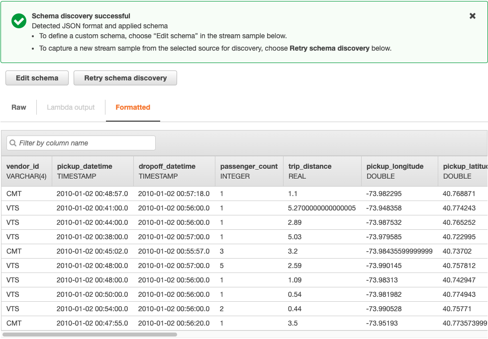
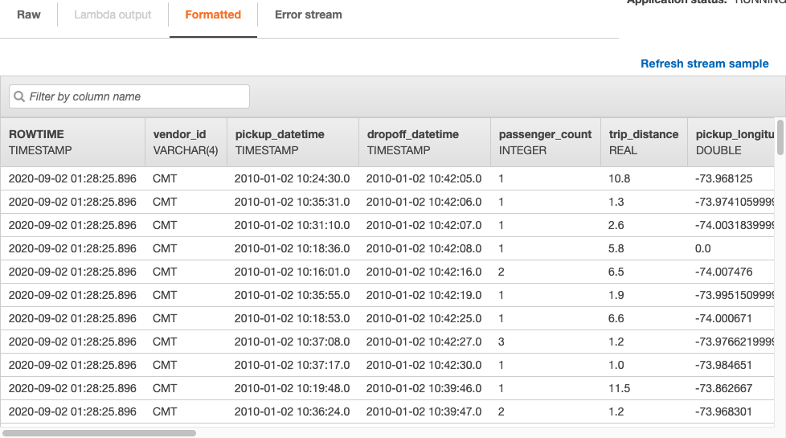
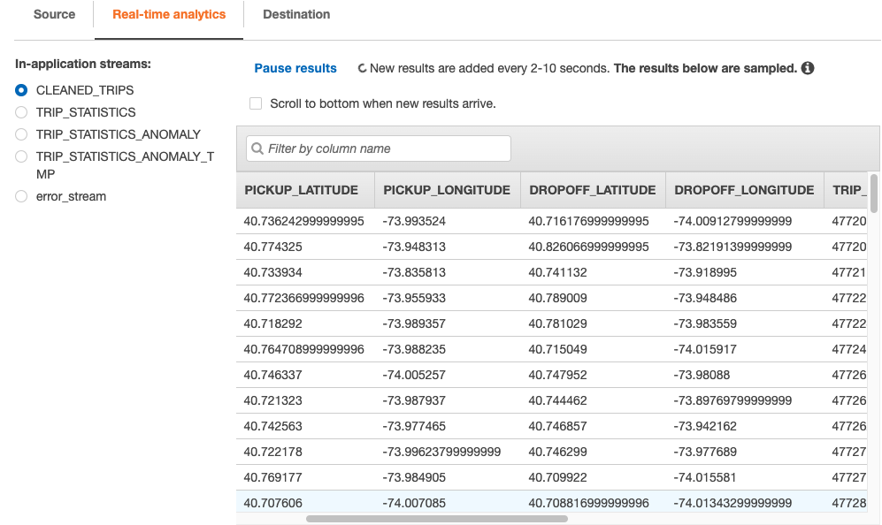
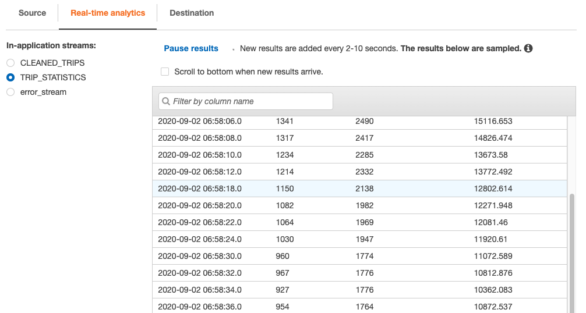
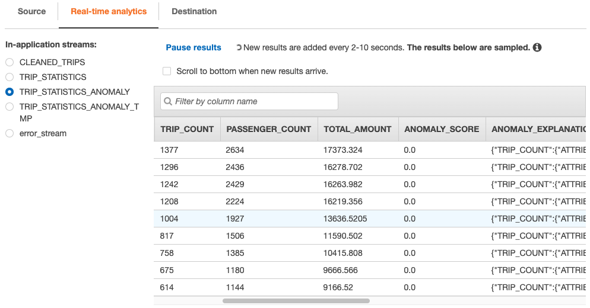
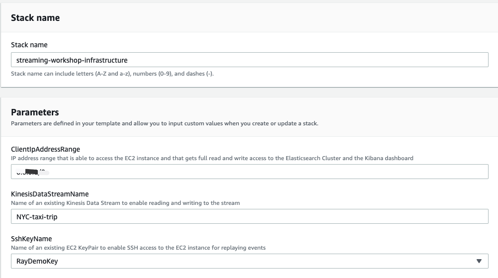

# Ingest Data into a Kinesis Data Stream

Running a producer client program on an EC2 instance that streams a data set of taxi trips in New York City. Ingest the stream data to Amazon Kinesis Data Stream.

## Option1 Build manually

### Create Kinesis Data Stream
Create Kinesis Data Stream `ingest-taxi-trips` with 8 Shards

### Stream Producer Client
- Build client
```bash
git clone https://github.com/aws-samples/amazon-kinesis-replay
cd amazon-kinesis-replay
mvn clean install
```

- Produce the stream data
```bash
#java -jar amazon-kinesis-replay-1.0-SNAPSHOT.jar -streamName ingest-taxi-trips -streamRegion us-west-2 -speedup 3600 -aggregate
java -jar amazon-kinesis-replay-1.0-SNAPSHOT.jar -streamName ingest-taxi-trips -streamRegion us-west-2 -speedup 180

```

### Process stream with analytics application

1. Create the Kinesis Analytics Application 


- Application Name: taxi-trip-KDA
- Source Stream: ingest-taxi-trips
- Record pre-processing with AWS Lambda: Disable


2. Click Discover Schema

Once Disocver Schema Successfully complete, you can `Edit the Schema`



- trip.id, change the type from INT to BIGINT
- type, change the Length from 4 to 9. 

Complete this step by pressing Save schema and update stream samples.

3. Verify the incoming events are successfully mapped to the corrected schema and click on Exit (done)



4. Analysis the trip stream

- Go to SQL editor, then Select Save and run to start the execution of the SQL code.

The first stream is called cleaned_trips which is populated by our clean_pump pump which selects only those records of the type='trip' that have valid longitude and latitudes.

The second stream is called trip_statistics which is populated by our statistics_pump pump. The statistics_pump pump calculates summary passenger_count and total_amount of trips for every 2 second interval. These results can give you a real-time look at what is happening as data arrives into the stream.

A Stream is like an in-memory table. A Pump is like a continuous query that is used to populate our stream.

```sql
    CREATE OR REPLACE STREAM cleaned_trips (
        pickup_latitude     DOUBLE,    
        pickup_longitude    DOUBLE,    
        dropoff_latitude    DOUBLE,    
        dropoff_longitude   DOUBLE,
        trip_id             BIGINT,
        trip_distance       REAL,
        passenger_count     INTEGER,
        pickup_datetime     TIMESTAMP,
        dropoff_datetime    TIMESTAMP,
        total_amount        REAL
    );
    
    CREATE OR REPLACE PUMP clean_pump AS 
        INSERT INTO cleaned_trips
            SELECT STREAM
                "pickup_latitude", 
                "pickup_longitude", 
                "dropoff_latitude", 
                "dropoff_longitude", 
                "trip_id", 
                "trip_distance", 
                "passenger_count", 
                "pickup_datetime",
                "dropoff_datetime",
                "total_amount"
            FROM source_sql_stream_001
            WHERE "type" LIKE 'trip' AND ("pickup_latitude" <> 0 AND "pickup_longitude" <> 0 AND "dropoff_latitude" <> 0 AND "dropoff_longitude" <> 0);
    
    
    CREATE OR REPLACE STREAM trip_statistics (
        trip_count          INTEGER,
        passenger_count     INTEGER,
        total_amount        REAL
    );
    
    CREATE OR REPLACE PUMP statistics_pump AS 
        INSERT INTO trip_statistics
            SELECT STREAM
                COUNT(1) as trip_count, 
                SUM(passenger_count) as passenger_count, 
                SUM(total_amount) as total_amount
            FROM cleaned_trips
            GROUP BY STEP(cleaned_trips.ROWTIME BY INTERVAL '2' SECOND)
            ORDER BY STEP(cleaned_trips.ROWTIME BY INTERVAL '2' SECOND);
```

- Check the result

Select CLEANED_TRIP to query the ETL trip data



Select TRIP_STATISTICS to query the CLEANED_TRIP with 2 seconds interval statics in real time.




5. Add AI/ML for check the trip anomaly score

- Append the following code to the bottom of the existing SQL.

The `random cut forest algorithm` used to caculate the ANOMALY_SCORE and give the explanation of ANOMALY_SCORE in ANOMALY_SCORE_EXPLANATION. 

```sql
    CREATE OR REPLACE STREAM trip_statistics_anomaly_tmp (
        trip_count          INTEGER,
        passenger_count     INTEGER,
        total_amount        REAL,
        anomaly_score       DOUBLE,
        anomaly_explanation VARCHAR(20480),
        resolution          VARCHAR(8)
    );
    
    CREATE OR REPLACE STREAM trip_statistics_anomaly (
        rowtime_ts          TIMESTAMP,
        trip_count          INTEGER,
        passenger_count     INTEGER,
        total_amount        REAL,
        anomaly_score       DOUBLE,
        anomaly_explanation VARCHAR(20480),
        resolution          VARCHAR(8)
    );
    
    
    CREATE OR REPLACE PUMP trip_statistics_anomaly_pump AS 
        INSERT INTO trip_statistics_anomaly
            SELECT STREAM FLOOR(trip_statistics_anomaly_tmp.ROWTIME TO SECOND) AS rowtime_ts, trip_count, passenger_count, total_amount, anomaly_score, anomaly_explanation, resolution
            FROM trip_statistics_anomaly_tmp
            ORDER BY FLOOR(trip_statistics_anomaly_tmp.ROWTIME TO SECOND), ANOMALY_SCORE DESC;
    
    CREATE OR REPLACE PUMP trip_statistics_anomaly_60min_pump AS 
        INSERT INTO trip_statistics_anomaly_tmp
            SELECT STREAM trip_count, passenger_count, total_amount, anomaly_score, anomaly_explanation, '60min'
            FROM TABLE(RANDOM_CUT_FOREST_WITH_EXPLANATION(
                CURSOR(SELECT STREAM trip_count, passenger_count, total_amount FROM trip_statistics),
                100, 256, 100000, 24, false));

```




## Option2 Using CloudFormation to create the Lab environment resources

Launch CloudFormation Stack by using below template:

https://aws-data-analytics-workshops.s3.amazonaws.com/kinesis/templates/streaming-workshop-infrastructure_v2.yml




## Cleanup
```bash
Stop (Ctrl-c) the java application.
Go to the Kinesis Data Analytics console, click on the radio button next to the application you created in this lab, go to Actions and click on Delete Application.
Delete the Kinesis Data Stream created in this lab.
Go to the Kinesis Data Stream console, click on the checkbox next to the name of your KDS stream, go to the Actions drop-down and click on Delete.
```