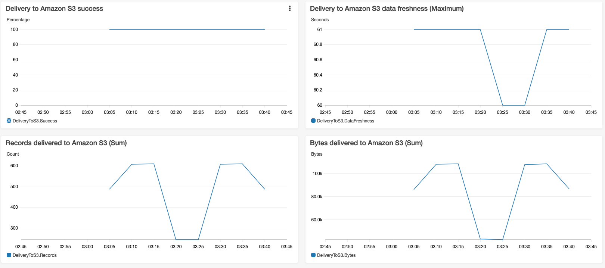

# Writing to Kinesis Data Firehose Using Kinesis Agent

[Sending Data to an Amazon Kinesis Data Firehose Delivery Stream](https://docs.aws.amazon.com/firehose/latest/dev/basic-write.html)

[Kinesis Agent for Microsoft Windows](https://docs.aws.amazon.com/kinesis-agent-windows/latest/userguide/what-is-kinesis-agent-windows.html)

- Case 1: Linux agent
- Case 2: Windows agent

# Case 1: Linux agent

## Prerequisites

1. Prepare your system follow the [prerequisites guide](https://docs.aws.amazon.com/firehose/latest/dev/writing-with-agents.html#prereqs). Here I use the EC2 running Amazon Linux as example

2. Credentials, follow up the [guide](https://docs.aws.amazon.com/firehose/latest/dev/writing-with-agents.html#agent-credentials) to set the AWS Credentials

```bash
aws sts get-caller-identity
```

3. Create the S3 bucket and Kiensis Firehose deliver stream
   [kinsis-firehose-s3](media/kinsis-firehose-s3.png)

- S3 bucket prefix

```bash
rawdata/iot_firehose/year=!{timestamp:yyyy}/month=!{timestamp:MM}/day=!{timestamp:dd}/
```

- S3 bucket error prefix

```bash
rawdata/iot_firehose/year=!{timestamp:yyyy}/month=!{timestamp:MM}/day=!{timestamp:dd}/!{firehose:error-output-type}
```

- buffer 5MB size or interval 60 seconds

## Install and configure the Agent

3. Download and Install the Agent

```bash
sudo yum install –y aws-kinesis-agent
```

4. Configure and Start the Agent

- Create or Edit `/etc/aws-kinesis/agent.json`, I use the Ningxia region cn-northwest-1 as example

```bash
{
  "cloudwatch.emitMetrics": true,
  "cloudwatch.endpoint": "monitoring.cn-northwest-1.amazonaws.com.cn",
  "firehose.endpoint": "firehose.cn-northwest-1.amazonaws.com.cn",

  "flows": [
    {
      "filePattern": "/tmp/iot-app.log*",
      "deliveryStream": "iot-data-collector"
    }
  ]
}
```

- Start the agent manually

```bash
sudo service aws-kinesis-agent start
```

Agent activity is logged in `/var/log/aws-kinesis-agent/aws-kinesis-agent.log`.

```bash
tail -f /var/log/aws-kinesis-agent/aws-kinesis-agent.log

2021-01-29 03:04:21.538+0000  (Agent STARTING) com.amazon.kinesis.streaming.agent.Agent [INFO] Agent: Starting tailer for file fh:iot-data-collector:/tmp/iot-app.log*
2021-01-29 03:04:21.561+0000  (FileTailer[fh:iot-data-collector:/tmp/iot-app.log*]) com.amazon.kinesis.streaming.agent.tailing.FirehoseParser [INFO] FirehoseParser[fh:iot-data-collector:/tmp/iot-app.log*]: Opening /tmp/iot-app.log for parsing.
2021-01-29 03:04:21.570+0000  (Agent STARTING) com.amazon.kinesis.streaming.agent.Agent [INFO] Agent: Startup completed in 37 ms.
2021-01-29 03:04:51.573+0000  (Agent.MetricsEmitter RUNNING) com.amazon.kinesis.streaming.agent.Agent [INFO] Agent: Progress: 30 records parsed (43790 bytes), and 0 records sent successfully to destinations. Uptime: 30041ms
.....
2021-01-29 03:05:51.574+0000  (cw-metrics-publisher) com.amazon.kinesis.streaming.agent.metrics.CWPublisherRunnable [INFO] Successfully published 5 datums.
2021-01-29 03:05:51.574+0000  (FileTailer[fh:iot-data-collector:/tmp/iot-app.log*].MetricsEmitter RUNNING) com.amazon.kinesis.streaming.agent.tailing.FileTailer [INFO] FileTailer[fh:iot-data-collector:/tmp/iot-app.log*]: Tailer Progress: Tailer has parsed 150 records (64840 bytes), transformed 0 records, skipped 0 records, and has successfully sent 122 records to destination.
2021-01-29 03:05:51.576+0000  (Agent.MetricsEmitter RUNNING) com.amazon.kinesis.streaming.agent.Agent [INFO] Agent: Progress: 150 records parsed (64840 bytes), and 122 records sent successfully to destinations. Uptime: 90040ms
```

(Optional) Configure the agent to start on system startup:

```bash
sudo chkconfig aws-kinesis-agent on
```

## Send test logs

Here use python3 generate the dummy logs

```bash
python scripts/dummy-logs.py
```

## Check the Firehose monitoring and S3 bucket




# Case 2: Windows agent

[Stream JSON Log Files to Amazon S3 Using Kinesis Agent for Windows ](https://docs.aws.amazon.com/kinesis-agent-windows/latest/userguide/directory-source-to-s3-tutorial.html)

## Prerequisites

1. Prepare your system follow the [prerequisites guide](https://docs.aws.amazon.com/kinesis-agent-windows/latest/userguide/getting-started.html#getting-started-prerequisites). Here I use the EC2 running Windows Server 2019 as example

Check the Microsoft .NET Framework >= 4.6

```bash
     [System.Version](
     (Get-ChildItem 'HKLM:\SOFTWARE\Microsoft\NET Framework Setup\NDP' -recurse `
     | Get-ItemProperty -Name Version -ErrorAction SilentlyContinue `
     | Where-Object { ($_.PSChildName -match 'Full') } `
     | Select-Object Version | Sort-Object -Property Version -Descending)[0]).Version
```

2. [Configure AWS Services](https://docs.aws.amazon.com/kinesis-agent-windows/latest/userguide/kaw-ds2s3-tutorial-step1.html). For China region, please change the `arn:aws` to `arn:aws-cn`

- Configure IAM Policies and Roles
- Create the Amazon S3 Bucket
- Create the Kinesis Data Firehose Delivery Stream
  - S3 bucket prefix
  ```bash
  rawdata/iot_firehose/year=!{timestamp:yyyy}/month=!{timestamp:MM}/day=!{timestamp:dd}/
  ```
  - S3 bucket error prefix
  ```bash
  rawdata/iot_firehose/year=!{timestamp:yyyy}/month=!{timestamp:MM}/day=!{timestamp:dd}/!{firehose:error-output-type}
  ```
  - buffer 5MB size or interval 60 seconds

## Install, Configure, and Run Kinesis Agent for Windows

1. On the instance, use Windows Server Manager to disable Microsoft Internet Explorer Enhanced Security Configuration for users and administrators. For more information, see [How To Turn Off Internet Explorer Enhanced Security Configuration](https://docs.microsoft.com/en-us/archive/blogs/chenley/how-to-turn-off-internet-explorer-enhanced-security-configuration) on the Microsoft TechNet website.

2. Installing Kinesis Agent for Windows

- Install from AWS Systems Manager - Global region
- Run a PowerShell script - China region as below

- Get [InstallKinesisAgent.ps1](https://s3-us-west-2.amazonaws.com/kinesis-agent-windows/downloads/index.html)

- Install, you can choice one of installation type

```PowerShell
# Install using MSI (Recommended)
Download from https://s3-us-west-2.amazonaws.com/kinesis-agent-windows/downloads/index.html
msiexec /i AWSKinesisTap.1.1.216.4.msi /q

# Install using PowerShell
Invoke-Expression ((New-Object System.Net.WebClient).DownloadString('https://s3-us-west-2.amazonaws.com/kinesis-agent-windows/downloads/InstallKinesisAgent.ps1'))

# Install locally
PowerShell.exe -File ".\InstallKinesisAgent.ps1"
PowerShell.exe -File ".\InstallKinesisAgent.ps1" -version "version"
```

- Configure `%PROGRAMFILES%\Amazon\AWSKinesisTap\appsettings.json`

```json
{
  "Sources": [
    {
      "Id": "JsonLogSource",
      "SourceType": "DirectorySource",
      "RecordParser": "SingleLineJson",
      "Directory": "C:\\LogSource\\",
      "FileNameFilter": "*.log",
      "InitialPosition": 0
    }
  ],
  "Sinks": [
    {
      "Id": "FirehoseLogStream",
      "SinkType": "KinesisFirehose",
      "StreamName": "iot-data-collector",
      "Region": "cn-northwest-1",
      "Format": "json",
      "ObjectDecoration": "ComputerName={ComputerName};DT={timestamp:yyyy-MM-dd HH:mm:ss}"
    }
  ],
  "Pipes": [
    {
      "Id": "JsonLogSourceToFirehoseLogStream",
      "SourceRef": "JsonLogSource",
      "SinkRef": "FirehoseLogStream"
    }
  ]
}
```

## Send test logs

- Create directory: `C:\LogSource` and create c:\LogSource\windows-iot-app.log

```bash
python scripts/dummy-logs-windows.py
```

- Start Agent

```PowerShell
# To start the agent:
Start-Service -Name AWSKinesisTap

# You can make sure the agent is running:
Get-Service -Name AWSKinesisTap

Status   Name               DisplayName
------   ----               -----------
Running  AWSKinesisTap      Amazon Kinesis Agent for Microsoft ...

# To stop the agent:
Stop-Service -Name AWSKinesisTap
```

- Viewing the Amazon Kinesis Agent for Windows log file

The agent writes its logs to C:\ProgramData\Amazon\AWSKinesisTap\logs\KinesisTap.log.

## Check the Firehose monitoring and S3 bucket


## Step 3: Query the Log Data in Amazon S3 by using Athena
```bash
CREATE EXTERNAL TABLE iotlogs (
  Critical int,
  AlertMessage string,
  AlertCount int,
  Device string,
  EventTime timestamp,
  ComputerName string,
  DT timestamp
)
PARTITIONED BY(year string, month string, day string)
ROW FORMAT SERDE 'org.openx.data.jsonserde.JsonSerDe'
LOCATION 's3://ray-datalake-lab/rawdata/iot_firehose/'

MSCK REPAIR TABLE iotlogs;
SELECT * FROM "blogdb"."iotlogs" limit 10;
SELECT * FROM "blogdb"."iotlogs" WHERE Critical = 1
```