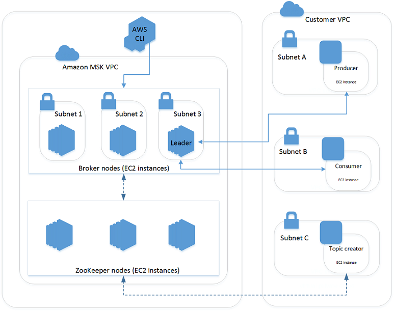

# Creation of an Amazon MSK Cluster

## Architecture


- Broker nodes - Amazon MSK offers a 3 AZ or a 2 AZ Apacke Kafka node layout. Currently, a 1 AZ (single AZ) Amazon MSK cluster is not available.
- ZooKeeper nodes - Amazon MSK creates the dedicated ZooKeeper nodes for each Amazon MSK cluster that is fully obfuscated and included with each cluster at no additional cost.
- Producers, consumers, and cluster admin - Amazon MSK lets you use Apache Kafka data-plane operations to create topics and to produce and consume data. The Producers, consumers connect to Broker nodes leader while cluster admin connec to ZooKeeper nodes

## VPC Prepare
- A VPC with 1 Public subnet and 3 Private subnets and the required plumbing including a NAT Gateway.
- A Cloud9 instance you will use as a Bastion
- 1 EC2 Apache KafkaClientInstance - Apache Kafka Client, AWS CLI v1, AWS CLI v2 (aws2), jq, docker, an Apache Kafka Clickstream producer and schema registry service installed.
- A security group for the Apache Kafka client instance to be given the security group for the Amazon MSK cluster.

## Create Kafka cluster
1. Security group `kafka-sg` and ingress rule
    - Protocol: TCP Port range: 9092
    - Protocol: TCP Port range: 9094
    - Protocol: TCP Port range: 2181
    - All traffic to `kafka-sg` security group or VPC CIDR range

2. Create Kafka (MSK) cluster on Console
    - Name: MSKWorkshopCluster
    - Apache Kafka version: 2.2.1 (2.6.2 can work as well?)
    - Configuration Section
      - auto.create.topics.enable - allow topics to be created automatically by producers and consumers. 
      - delete.topic.enable - enables topic deletion on the server. 
      - log.retention.hours - 8 hours for the lab.
    - Select VPC with 3 private subnet and which the same located with glue connector will created later
    - Select kafka.m5.large as the Broker Instance Type and 1 for the number of brokers per AZ
    - 100GiB Storage per Broker
    - Un-check Enable encryption within the cluster
    - Select Both TLS encrypted and plaintext traffic allowed.
    - Select Use AWS managed CMK.
    - Leave Enable TLS client authentication blank.
    - Select Enhanced topic-level monitoring. This let you troubleshoot and understand your traffic better.
    - Select Enable open monitoring with Prometheus
    - Broker log delivery to CloudWatch logs
    - Select Customize Settings, then in the drop down box select the `kafka-sg` security group

3. Optional, create by CLI

- Create configuration 
```bash
aws kafka create-configuration --name "WorkshopMSKConfig" \
--description "Configuration used for MSK workshop - Auto topic creation; topic deletion; 8hrs retention" \
--kafka-versions "2.3.1" "2.2.1" --server-properties file://cluster_config.txt

cat cluster_config.txt

 auto.create.topics.enable = true
 delete.topic.enable = true
 log.retention.hours = 8

```

- clusterinfo.json

```json
{
    "BrokerNodeGroupInfo": {
        "BrokerAZDistribution": "DEFAULT",
        "InstanceType": "kafka.m5.large",
        "ClientSubnets": [
            "subnet-09bbd8a628bc40e07", "subnet-0c9da7354a25eed7e"
        ],
        "SecurityGroups": [
            "sg-0ced57eee818d3811"
        ],
        "StorageInfo": {
            "EbsStorageInfo": {
                "VolumeSize": 100
            }
        }
    },
    "ClusterName": "MSKWorkshopCluster",
    "ConfigurationInfo": {
        "Arn": "arn:aws:kafka:us-west-2:<accont-id>:configuration/WorkshopMSKConfig/4fbefc4f-dc0b-4174-9bb7-a0b52632b712-4",
        "Revision": 1
    },
    "EncryptionInfo": {
        "EncryptionAtRest": {
            "DataVolumeKMSKeyId": ""
        },
        "EncryptionInTransit": {
            "InCluster": false,
            "ClientBroker": "TLS_PLAINTEXT"
        }
    },
    "EnhancedMonitoring": "PER_TOPIC_PER_BROKER",
    "KafkaVersion": "2.3.1",
    "NumberOfBrokerNodes": 2,
    "OpenMonitoring": {
        "Prometheus": {
            "JmxExporter": {
                "EnabledInBroker": true
            },
            "NodeExporter": {
                "EnabledInBroker": true
            }
        }
    }
}
```

- Create cluster
```bash
aws kafka create-cluster --cli-input-json file://clusterinfo.json

# copy and create vairable for ClusterArn
aws kafka describe-cluster --cluster-arn $ClusterArn | grep -i state
```

## Create the Topic and produce data
1. login to EC2 or Cloud9 IDE

2. install client and create topic

```bash
sudo yum install java-1.8.0
wget https://archive.apache.org/dist/kafka/2.2.1/kafka_2.12-2.2.1.tgz
tar -xzf kafka_2.12-2.2.1.tgz
cd kafka_2.12-2.2.1/

ClusterArn=<YOUR_MSK_ARN>
ZookeeperConnectString=$(aws kafka describe-cluster --cluster-arn $ClusterArn --region us-west-2 | jq .ClusterInfo.ZookeeperConnectString | sed 's/"//g' )
echo ${ZookeeperConnectString}

# replacing ZookeeperConnectString with the value that after you ran the describe-cluster command. 
bin/kafka-topics.sh --create --zookeeper $ZookeeperConnectString --replication-factor 2 --partitions 1 --topic AWSKafkaTutorialTopic
```

3. Produce and consume data, verify the data can be produced and consumed correctly
```bash
cp $JAVA_HOME/jre/lib/security/cacerts /tmp/kafka.client.truststore.jks
# create client.properties
cat kafka_2.12-2.2.1/config/client.properties
security.protocol=SSL
ssl.truststore.location=/tmp/kafka.client.truststore.jks

BootstrapBrokerString=$(aws kafka get-bootstrap-brokers --region us-west-2 --cluster-arn $ClusterArn | jq .BootstrapBrokerString | sed 's/"//g' )
echo ${BootstrapBrokerString}

BootstrapBrokerStringTls=$(aws kafka get-bootstrap-brokers --region us-west-2 --cluster-arn $ClusterArn | jq .BootstrapBrokerStringTls | sed 's/"//g' )
echo ${BootstrapBrokerStringTls}

# Producer
cd kafka_2.12-2.2.1/
bin/kafka-console-producer.sh --broker-list $BootstrapBrokerStringTLS --producer.config config/client.properties --topic AWSKafkaTutorialTopic
OR
bin/kafka-console-producer.sh --broker-list $BootstrapBrokerString --topic AWSKafkaTutorialTopic

# Consumer
bin/kafka-console-consumer.sh --bootstrap-server $BootstrapBrokerStringTLS --consumer.config config/client.properties --topic AWSKafkaTutorialTopic --from-beginning
OR
bin/kafka-console-consumer.sh --bootstrap-server $BootstrapBrokerString --topic AWSKafkaTutorialTopic --from-beginning
```

4. Python producer code
```bash
# Install dependency
pip install -r scripts/requirements.txt

# Run code to send, once per second, a JSON message with sensor data to the `AWSKafkaTutorialTopic` Kafka topic.
cd scripts
python scripts/iot-kafka-producer.py

# Check the consumer terminal can get the message
bin/kafka-console-consumer.sh --bootstrap-server $BootstrapBrokerStringTLS --consumer.config config/client.properties --topic AWSKafkaTutorialTopic --from-beginning
```