# SAML Authentication for Kibana

When you authentication for Kibana, you can
1. Authenticating through Amazon Cognito
2. Authenticating through the Fine-grained access control [internal user database](https://docs.amazonaws.cn/en_us/elasticsearch-service/latest/developerguide/fgac.html#fgac-kibana)
**3. SAML authentication for Kibana lets you use your existing identity provider to offer single sign-on (SSO) for Kibana on domains running `Elasticsearch 6.7 or later`. To use this feature, you must enable `fine-grained access control`.**


## SAML Authentication for Kibana - Active Directory as the identity provider

Follow up the guide: [Amazon ElasticSearch SAML Authentication for Kibana](https://docs.amazonaws.cn/en_us/elasticsearch-service/latest/developerguide/saml.html)

The Kibana login flow can take one of two forms:

- Service provider (SP) initiated: You navigate to Kibana (for example, https://<es-domain>/_plugin/kibana), which redirects you to the login screen. After you log in, the identity provider redirects you to Kibana.

- Identity provider (IdP) initiated: You navigate to your identity provider, log in, and choose Kibana from an application directory.

Amazon ES provides two single sign-on URLs, `SP-initiated` and `IdP-initiated`, you can choice any of them

1. Enabling SAML Authentication
- `You domain`->`Actions`->`Modify authentication` -> `Check Enable SAML authentication`.
- Note the service provider entity ID and the two SSO URLs, you only need one of the SSO URLs
```bash
Service provider entity ID: https://<es-domain>

IdP-initiated SSO URL: https://<es-domain>/_plugin/kibana/_opendistro/_security/saml/acs/idpinitiated

SP-initiated SSO URL: https://<es-domain>/_plugin/kibana/_opendistro/_security/saml/acs 
```

2. Configure the Active Directory
- Go to the `ADFS Management` console and select `Relying Party Trusts`, right-click on it and select `Add Relying Party Trust`
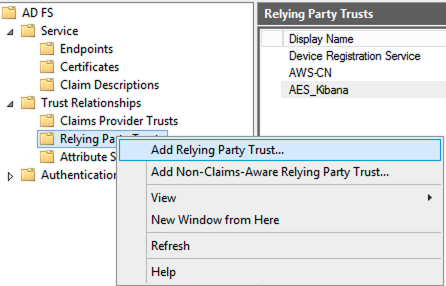

- Select `Data Source` step, select the last option: `Enter data about the relying party manually`. 
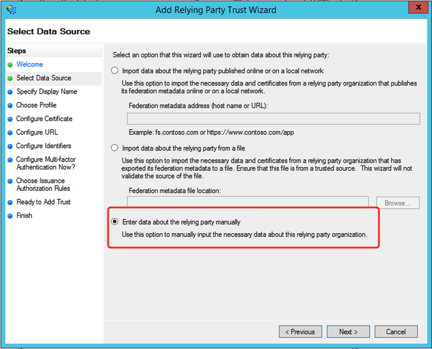

- Enter a `Display name`
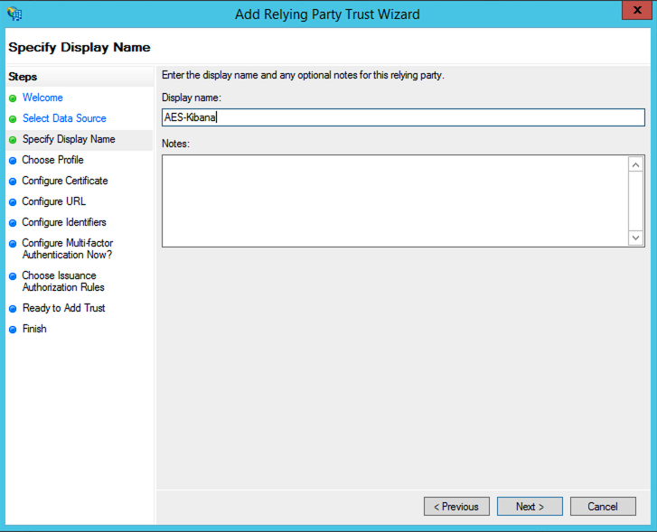

- Select `AD FS profile`
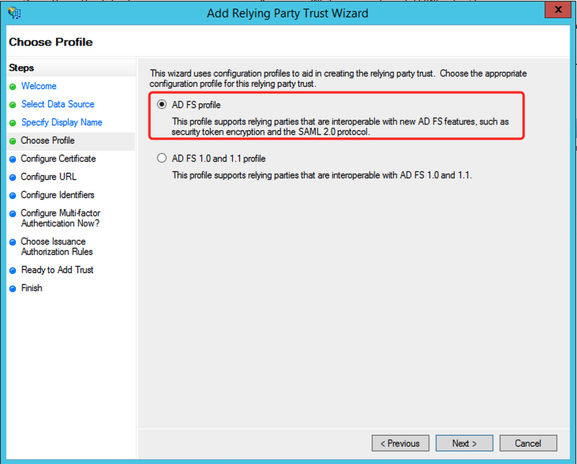

- Leave the default values for `Configure Certificate`


- `Configure URL`, select `Enable support for the SAML 2.0 WebSSO protocol.`
Enter the value of `SP-initiated SSO URL` on Kibana console
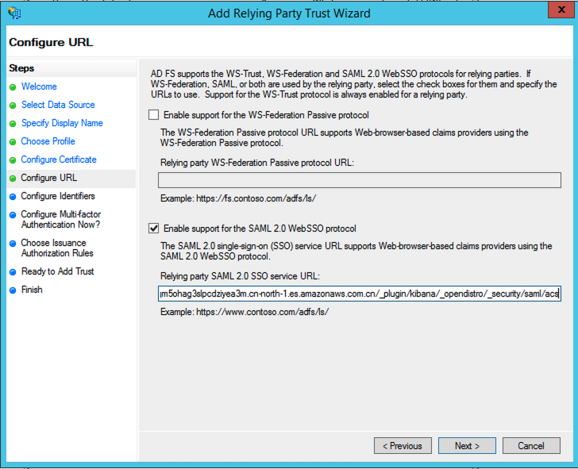

- `Add Relying party trust identifier` with the value of `Service provider entity ID` on Kibana console
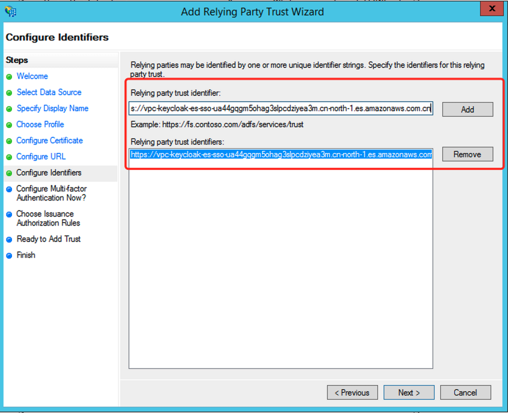

- `Do not enable MFA`
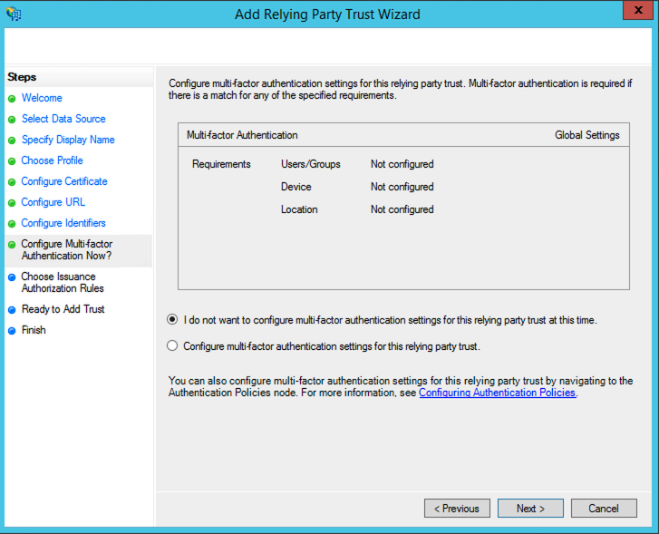

- Next， Choose `Permit all users to access this relying party`
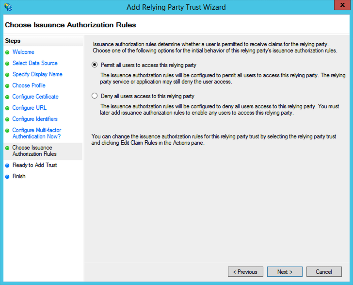

- Next, Leave the default values
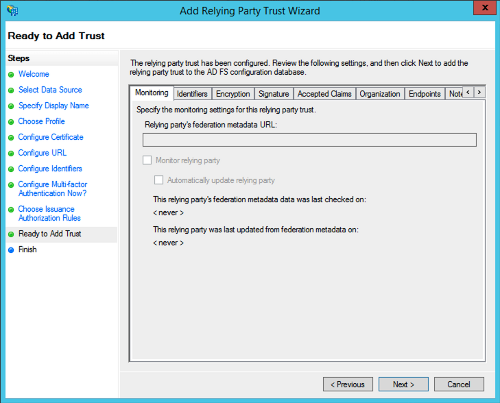

- On the final screen, Select `Open the Edit Claim Rules dialog` and use the `Close` button to exit.
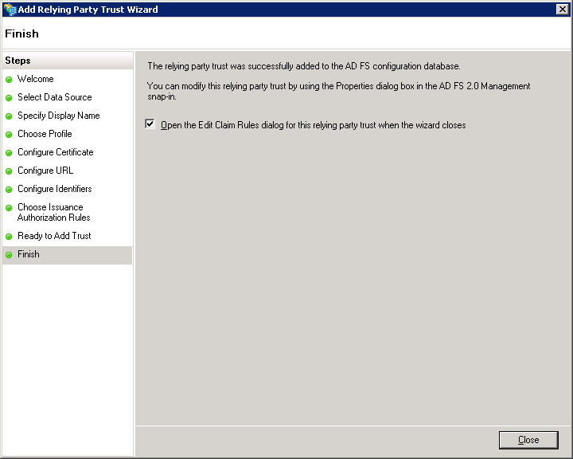

3. Creating Claims Rules

- Add the first rule as `Email`, Select `Send LDAP Attributes as Claims`
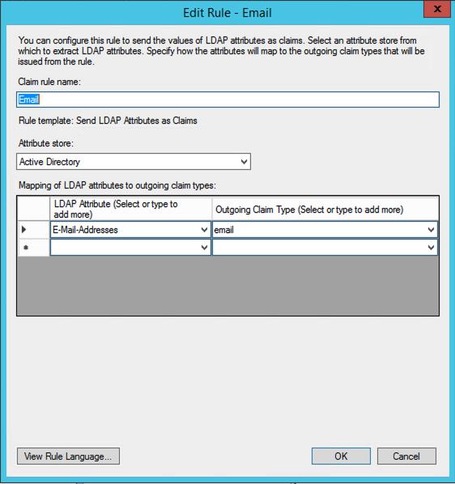

- Add the second rule as `NameId`, Select `Transform an Incoming Claim`
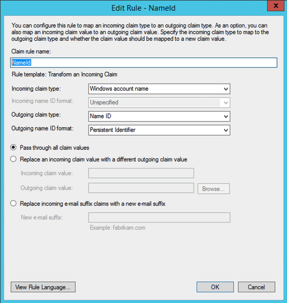

- Add the third rule as `Role`, Select `Send LDAP Attributes as Claims`
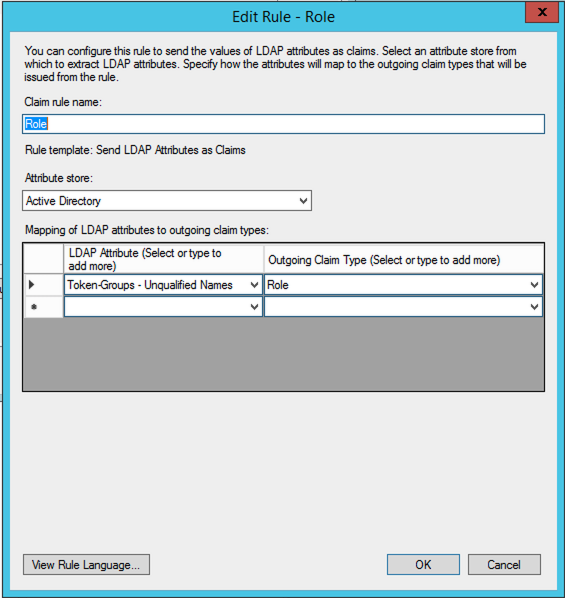

4. Restart Active Directory Federation Service


5. Create Active Directory
- Group `ESAdmin`
- User `esadminuser@tsp.example.com` belong to `ESAdmin`
- Group `ESRead`
- Login user `esreader@tsp.example.com` belong to `ESRead` 

6. After you configure your identity provider, it generates an IdP metadata file.

Export SAML Metadata Document from https://adfs.tsp.example.com/FederationMetadata/2007-06/FederationMetadata.xml

- `Import from XML file` button to import `IdP metadata file`
- Copy and paste the `entityID` property from your metadata file into the `IDP entity ID`
- Provide a `SAML master username` (only that user receives full permissions) and/or a `SAML master backend role` (any user who belongs to the group receives full permissions).


- Leave the `Subject key` field `empty` to use the `NameID` element of the SAML assertion for the username, you can check the SAML preview to get correct `attribute name`
- Specify `http://schemas.microsoft.com/ws/2008/06/identity/claims/role` from the assertion in the `Role key` field, you can check the SAML preview to get correct `attribute name`


- Choose `Submit`. The domain enters a `processing` state for approximately one minute and change to `Active` state

4. Access to kibana via https://<es-domain>/_plugin/kibana, the Active Directory SAML login window will shown up


Login user `esadminuser@tsp.example.com` belong to `ESAdmin`

Tips: view a sample assertion during the process, and tools like [SAML-tracer](https://addons.mozilla.org/en-US/firefox/addon/saml-tracer/)

A [sample of saml assertion](ad-saml.xml) get from [SAML-tracer](https://addons.mozilla.org/en-US/firefox/addon/saml-tracer/)

5. After Kibana loads, choose `Security` and `Roles`.
`Map` roles to allow other users to access Kibana with different permission


- Login user `esreader@tsp.example.com` belong to `ESRead` to verify the read only access to the Kibana

# Reference
[Steps to configure SAML 2.0 SSO with Microsoft Active Directory Federation Services](https://www.ispringsolutions.com/articles/ispring-learn-sso-with-microsoft-active-directory-federation-services)

[SAML Authentication for Kibana](https://docs.amazonaws.cn/en_us/elasticsearch-service/latest/developerguide/saml.html)

