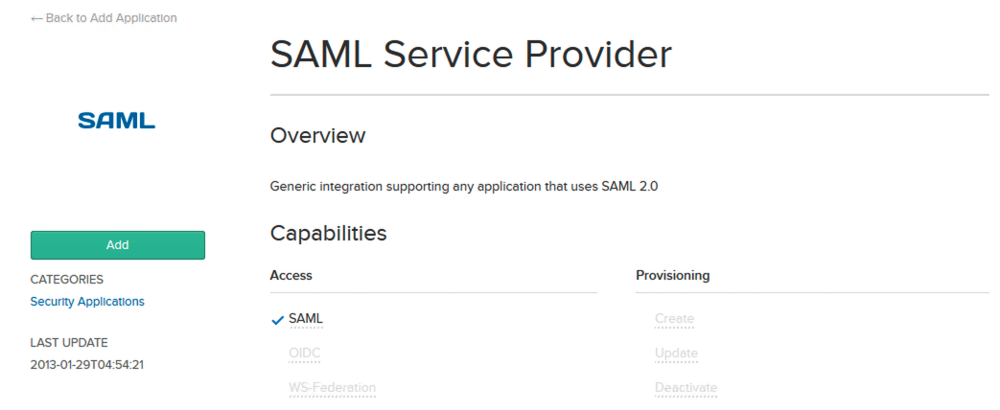
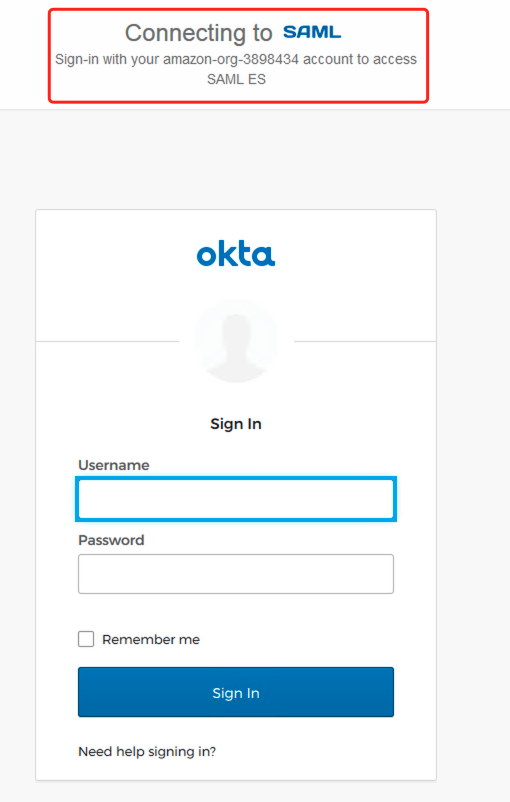
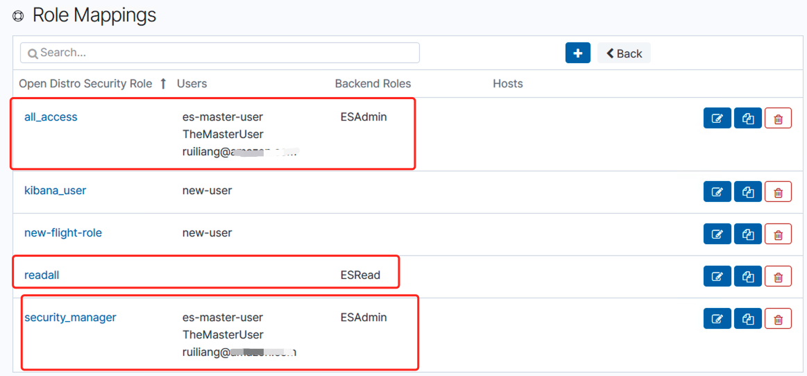

# SAML Authentication for Kibana

When you authentication for Kibana, you can
1. Authenticating through Amazon Cognito
2. Authenticating through the Fine-grained access control [internal user database](https://docs.amazonaws.cn/en_us/elasticsearch-service/latest/developerguide/fgac.html#fgac-kibana)
**3. SAML authentication for Kibana lets you use your existing identity provider to offer single sign-on (SSO) for Kibana on domains running `Elasticsearch 6.7 or later`. To use this feature, you must enable `fine-grained access control`.**


## SAML Authentication for Kibana - Okta as the identity provider

Follow up the guide: [Amazon ElasticSearch SAML Authentication for Kibana](https://docs.amazonaws.cn/en_us/elasticsearch-service/latest/developerguide/saml.html)

The Kibana login flow can take one of two forms:

- Service provider (SP) initiated: You navigate to Kibana (for example, https://<es-domain>/_plugin/kibana), which redirects you to the login screen. After you log in, the identity provider redirects you to Kibana.

- Identity provider (IdP) initiated: You navigate to your identity provider, log in, and choose Kibana from an application directory.

Amazon ES provides two single sign-on URLs, `SP-initiated` and `IdP-initiated`, you can choice any of them

1. Enabling SAML Authentication
- `You domain`->`Actions`->`Modify authentication` -> `Check Enable SAML authentication`.
- Note the service provider entity ID and the two SSO URLs, you only need one of the SSO URLs
```bash
Service provider entity ID: https://<es-domain>

IdP-initiated SSO URL: https://<es-domain>/_plugin/kibana/_opendistro/_security/saml/acs/idpinitiated

SP-initiated SSO URL: https://<es-domain>/_plugin/kibana/_opendistro/_security/saml/acs 
```

2. Configure the Okta
- In Okta, for example, you create a "SAML 2.0 application." 


  - For Single sign on URL, specify the SSO URL that you chose in step 1. 
  - For Audience URI (SP Entity ID), specify the SP entity ID.


  For Group Attribute Statements, we recommend adding `role` to the Name field and the `regular expression` as `.+` to the Filter field. 


3. After you configure your identity provider, it generates an IdP metadata file.


- `Import from XML file` button to import `IdP metadata file`
- Copy and paste the `entityID` property from your metadata file into the `IDP entity ID`
- Provide a `SAML master username` (only that user receives full permissions) and/or a `SAML master backend role` (any user who belongs to the group receives full permissions).


- Leave the `Subject key` field `empty` to use the `NameID` element of the SAML assertion for the username, you can check the SAML preview to get correct `attribute name`
- Specify `role` from the assertion in the `Role key` field, you can check the SAML preview to get correct `attribute name`


- Choose `Submit`. The domain enters a `processing` state for approximately one minute and change to `Active` state

4. Access to kibana via https://<es-domain>/_plugin/kibana, the Okta SAML login window will shown up


Tips: view a sample assertion during the process, and tools like [SAML-tracer](https://addons.mozilla.org/en-US/firefox/addon/saml-tracer/)

A [sample of saml assertion](saml.xml) get from [SAML-tracer](https://addons.mozilla.org/en-US/firefox/addon/saml-tracer/)

5. After Kibana loads, choose `Security` and `Roles`.
`Map` roles to allow other users to access Kibana with different permission



- Login user belong to `ESAmin` to verify the full access to the Kibana
- Login user belong to `ESRead` to verify the read only access to the Kibana

# Reference
[OKTA Apps_App_Integration_Wizard_SAML](https://help.okta.com/en/prod/Content/Topics/Apps/Apps_App_Integration_Wizard_SAML.htm)

[SAML Authentication for Kibana](https://docs.amazonaws.cn/en_us/elasticsearch-service/latest/developerguide/saml.html)