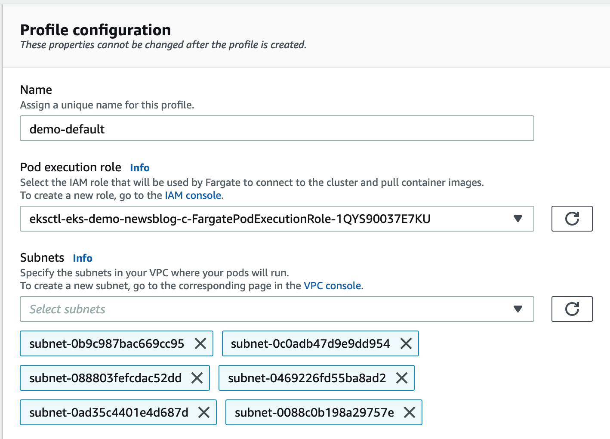
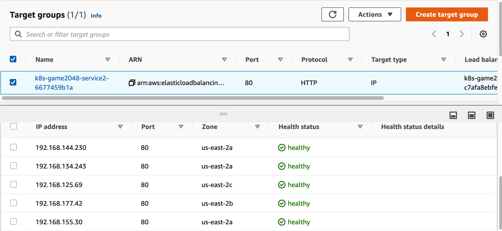
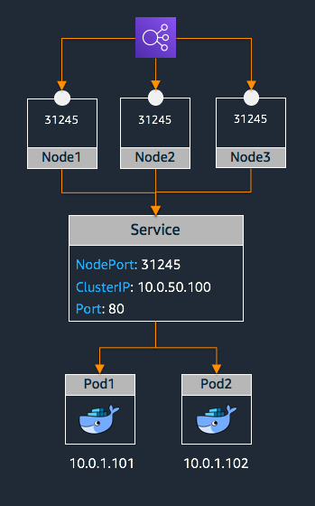

# EKS on Fargate QuickStart
- [EKS on Fargate QuickStart](#eks-on-fargate-quickstart)
  - [Prerequest](#prerequest)
  - [Create cluster with default Fargate profile testing](#create-cluster-with-default-fargate-profile-testing)
    - [Create cluster with Fargate profile by using eksctl](#create-cluster-with-fargate-profile-by-using-eksctl)
    - [Deploy a container to EKS Fargate cluster](#deploy-a-container-to-eks-fargate-cluster)
    - [Clean up](#clean-up)
  - [Create cluter without default Fargate profile testing](#create-cluter-without-default-fargate-profile-testing)
    - [Create cluster by using eksctl](#create-cluster-by-using-eksctl)
    - [Create Fargate Profile](#create-fargate-profile)
    - [Deploy micro-services to EKS on Fargate](#deploy-micro-services-to-eks-on-fargate)
  - [Clean up](#clean-up-1)
  - [Reference](#reference)
  
## Prerequest
1. Install and update the `eksctl` and `kubectl`

2. Verify the toolkits have been installed
```bash
for command in kubectl eksctl jq envsubst aws
  do
    which $command &>/dev/null && echo "$command in path" || echo "$command NOT FOUND"
  done
```

3. Enable kubectl bash_completion
```bash
kubectl completion bash >>  ~/.bash_completion
. /etc/profile.d/bash_completion.sh
. ~/.bash_completion
```

4. Install the Helm

```bash
#curl -sSL https://raw.githubusercontent.com/helm/helm/master/scripts/get-helm-3 | bash
curl -fsSL -o get_helm.sh https://raw.githubusercontent.com/helm/helm/main/scripts/get-helm-3
chmod 700 get_helm.sh
./get_helm.sh
helm version --short

helm repo add stable https://charts.helm.sh/stable
helm search repo stable

helm completion bash >> ~/.bash_completion
. /etc/profile.d/bash_completion.sh
. ~/.bash_completion
source <(helm completion bash)
```

5. upgrade the aws cli to 2.7.1+ to avoid issue https://github.com/helm/helm/issues/10975
```
curl "https://awscli.amazonaws.com/awscli-exe-linux-x86_64.zip" -o "awscliv2.zip"
unzip awscliv2.zip
sudo ./aws/install
aws eks --region cn-north-1 update-kubeconfig --name my-cluster-name
```
   
## Create cluster with default Fargate profile testing

### Create cluster with Fargate profile by using eksctl

It created a EKS cluster and also created a Fargate profile. A Fargate profile, lets user specify which Kubernetes pods user want to run on Fargate, which subnets user pods run in, and provides the IAM execution role used by the Kubernetes agent to download container images to the pod and perform other actions on user behalf.

```bash
eksctl create cluster --name my-cluster --region cn-north-1 --fargate

kubectl get svc
NAME         TYPE        CLUSTER-IP   EXTERNAL-IP   PORT(S)   AGE
kubernetes   ClusterIP   10.100.0.1   <none>        443/TCP   33m
```

You can delete the Fargate profile that was automatically created by above command and recreate it manually.

### Deploy a container to EKS Fargate cluster
1. Deploy pod
```bash
kubectl create deployment demo-app --image=nginx
deployment.apps/demo-app created
```

2. Check the state of pods
```bash
kubectl get pods
NAME                       READY   STATUS    RESTARTS   AGE
demo-app-7786c6655-7nm9w   1/1     Running   0          100s

kubectl get pods --all-namespaces
NAMESPACE     NAME                       READY   STATUS    RESTARTS   AGE
default       demo-app-7786c6655-7nm9w   1/1     Running   0          12m
kube-system   coredns-74d687599b-ptbl5   1/1     Running   0          21m
kube-system   coredns-74d687599b-qn5sc   1/1     Running   0          21m


kubectl get nodes
NAME                                                     STATUS   ROLES    AGE   VERSION
fargate-ip-192-168-119-143.cn-north-1.compute.internal   Ready    <none>   21m   v1.22.6-eks-14c7a48
fargate-ip-192-168-123-202.cn-north-1.compute.internal   Ready    <none>   21m   v1.22.6-eks-14c7a48
fargate-ip-192-168-64-52.cn-north-1.compute.internal     Ready    <none>   12m   v1.22.6-eks-7d68063
```

### Clean up
```bash
kubectl delete deployment demo-app
eksctl delete cluster --name my-cluster --region cn-north-1
```

## Create cluter without default Fargate profile testing
### Create cluster by using eksctl
1. Create cluster
```
eksctl create cluster --name eks-demo-newsblog --region cn-north-1

kubectl get svc
```

### Create Fargate Profile

To create a Fargate profile, go to EKS console and choose the cluster demo-newsblog. On the `Compute`, Under `Fargate profiles`, choose `Add Fargate profile`.


To create a Fargate profile by CLI
```bash
eksctl create fargateprofile \
  --cluster eks-demo-newsblog --name game-2048 --namespace game-2048 \
  --region cn-north-1

eksctl get fargateprofile 
  --cluster eks-demo-newsblog -o yaml \
  --region cn-north-1
```

Notice that the profile includes the private subnets in your EKS cluster. Pods running on Fargate are not assigned public IP addresses, so only private subnets (with no direct route to an Internet Gateway) are supported when you create a Fargate profile. 




Add `default` as namespace, meaning that any pods that are created in the default Kubernetes namespace to run on Fargate. User no need to modify my Kubernetes app to get the pods running on Fargate, you just need a Fargate Profile – if a pod of your Kubernetes app matches the namespace defined in the Fargate Profile, that pod will run on Fargate.

You can also use the `Match labels feature ` allowing you to specify the labels of the pods that you want to select, so you can get even more specific with which pods run on this profile.


Fargate profiles are immutable. However, you can create a new updated profile to replace an existing profile and then delete the original after the updated profile has finished creating

3. (optional) Make everything to run on Fargate

To make everything to run on Fargate, including the CoreDNS pods, you can add a second Fargate profile for everything in the kube-system namespace. 

```bash
aws eks create-fargate-profile --cli-input-json file://demo-kube-system-profile.json --region us-east-2
```

### Deploy micro-services to EKS on Fargate

1. Setting up the LB controllerAWS Load Balancer Controller

    “AWS Load Balancer Controller” is a controller to help manage Elastic Load Balancers for a Kubernetes cluster.

    - It satisfies Kubernetes Ingress resources by provisioning Application Load Balancers.
    - It satisfies Kubernetes Service resources by provisioning Network Load Balancers.


  - Create IAM OIDC provider

    This step is required to give IAM permissions to a Fargate pod running in the cluster using the IAM for Service Accounts feature.

    ```bash
    eksctl utils associate-iam-oidc-provider \
        --cluster eks-demo-newsblog --approve --region cn-north-1
    ```

  - Create an IAM policy
  
    This step create the IAM policy that will be used by the AWS Load Balancer Controller. This policy will be later associated to the Kubernetes Service Account and will allow the controller pods to create and manage the ELB’s resources in your AWS account for you.

    ```bash
    ## Download the https://raw.githubusercontent.com/kubernetes-sigs/aws-load-balancer-controller/main/docs/install/iam_policy.json

    ## Modify the iam_policy.json from arn:aws: to arn:aws-cn: China regions

    ## Create the policy
    aws iam create-policy \
        --policy-name AWSLoadBalancerControllerIAMPolicy \
        --policy-document iam_policy.json --region cn-north-1
    ```

   - Create a IAM role and ServiceAccount for the Load Balancer controller
      ```bash
      eksctl create iamserviceaccount --cluster eks-demo-newsblog \
        --namespace kube-system \
        --name aws-load-balancer-controller \
        --attach-policy-arn arn:aws-cn:iam::${ACCOUNT_ID}:policy/AWSLoadBalancerControllerIAMPolicy \
        --override-existing-serviceaccounts \
        --approve --region cn-north-1

      # Check status and result
      kubectl get sa aws-load-balancer-controller -n kube-system -o yaml
      ```

   - Install the TargetGroupBinding CRDs
      ```bash
      kubectl apply -k "github.com/aws/eks-charts/stable/aws-load-balancer-controller//crds?ref=master"
      ```

   -  Deploy the Helm chart from the Amazon EKS charts repo
      ```bash
      helm repo add eks https://aws.github.io/eks-charts

      helm upgrade -i aws-load-balancer-controller eks/aws-load-balancer-controller \
      -n kube-system \
      --set clusterName=eks-demo-newsblog  \
      --set serviceAccount.create=false \
      --set serviceAccount.name=aws-load-balancer-controller \
      --set enableShield=false \
      --set enableWaf=false \
      --set enableWafv2=false \
      --set region=cn-north-1

      ## Or you sepecified image tag and VPC ID
      export VPC_ID=$(aws eks describe-cluster --name eks-demo-newsblog \
                      --query "cluster.resourcesVpcConfig.vpcId" --region cn-north-1 \
                      --output text)
      helm upgrade -i aws-load-balancer-controller \
          eks/aws-load-balancer-controller \
          -n kube-system \
          --set clusterName=eks-demo-newsblog \
          --set serviceAccount.create=false \
          --set serviceAccount.name=aws-load-balancer-controller \
          --set enableShield=false \
          --set enableWaf=false \
          --set enableWafv2=false \
          --set image.tag=v2.2.0 \
          --set region=cn-north-1 \
          --set vpcId=${VPC_ID}
      ```

   - Check deployment status
      ```bash
      kubectl -n kube-system rollout status deployment aws-load-balancer-controller
      #deployment "aws-load-balancer-controller" successfully rolled out
      ```

2. Deploy the sample application to Fargate Pod
   - Deploy micro services
      ```bash
      kubectl apply -f https://raw.githubusercontent.com/kubernetes-sigs/aws-load-balancer-controller/main/docs/examples/2048/2048_full.yaml
      #ingress.networking.k8s.io/ingress-2048 created

      kubectl -n game-2048 rollout status deployment deployment-2048
      #deployment "deployment-2048" successfully rolled out

      kubectl get nodes
      NAME                                                    STATUS   ROLES    AGE     VERSION
      fargate-ip-192-168-101-43.us-east-2.compute.internal    Ready    <none>   4m16s   v1.20.7-eks-135321
      fargate-ip-192-168-125-69.us-east-2.compute.internal    Ready    <none>   34s     v1.20.7-eks-135321
      fargate-ip-192-168-134-243.us-east-2.compute.internal   Ready    <none>   32s     v1.20.7-eks-135321
      fargate-ip-192-168-136-46.us-east-2.compute.internal    Ready    <none>   11h     v1.20.7-eks-135321
      fargate-ip-192-168-144-230.us-east-2.compute.internal   Ready    <none>   35s     v1.20.7-eks-135321
      fargate-ip-192-168-146-246.us-east-2.compute.internal   Ready    <none>   61m     v1.20.7-eks-135321
      fargate-ip-192-168-155-30.us-east-2.compute.internal    Ready    <none>   38s     v1.20.7-eks-135321
      fargate-ip-192-168-177-42.us-east-2.compute.internal    Ready    <none>   35s     v1.20.7-eks-135321
      fargate-ip-192-168-180-14.us-east-2.compute.internal    Ready    <none>   11h     v1.20.7-eks-135321
      fargate-ip-192-168-187-38.us-east-2.compute.internal    Ready    <none>   4m18s   v1.20.7-eks-135321
      ```

3. Check the ingress
```bash
kubectl get ingress/ingress-2048 -n game-2048
NAME           CLASS    HOSTS   ADDRESS                                                                  PORTS   AGE
ingress-2048   <none>   *       k8s-game2048-ingress2-c7afa8ebfe-692664347.us-east-2.elb.amazonaws.com   80      106s
```

Navigate to the EC2 console -> Load Balancers. Check the details of the ALB instance and targat group. 



The request routing from an AWS Application Load Balancer to Pods on EC2 worker nodes



The request routing from an AWS Application Load Balancer to Fargate Pods in IP mode


Access the 2048 game

```bash
export FARGATE_GAME_2048=$(kubectl get ingress/ingress-2048 -n game-2048 -o jsonpath='{.status.loadBalancer.ingress[0].hostname}')

echo "http://${FARGATE_GAME_2048}"

```

5. clean up
```
kubectl delete -f https://raw.githubusercontent.com/kubernetes-sigs/aws-load-balancer-controller/main/docs/examples/2048/2048_full.yaml

helm uninstall aws-load-balancer-controller -n kube-system

eksctl delete iamserviceaccount \
    --cluster eks-demo-newsblog --region us-east-2 \
    --name aws-load-balancer-controller \
    --namespace kube-system \
    --wait

aws iam delete-policy \
    --policy-arn arn:aws:iam::${ACCOUNT_ID}:policy/AWSLoadBalancerControllerIAMPolicy \
    --region us-east-2


kubectl delete -k github.com/aws/eks-charts/stable/aws-load-balancer-controller//crds?ref=master

eksctl delete fargateprofile \
  --name game-2048 \
  --cluster eks-demo-newsblog --region us-east-2
```

## Clean up
```bash
eksctl delete fargateprofile --name demo-default \
  --cluster eks-demo-newsblog --region us-east-2

eksctl delete cluster --name eks-demo-newsblog --region us-east-2
```

## Reference
[Amazon EKS on AWS Fargate Announcement](https://aws.amazon.com/blogs/aws/amazon-eks-on-aws-fargate-now-generally-available/)