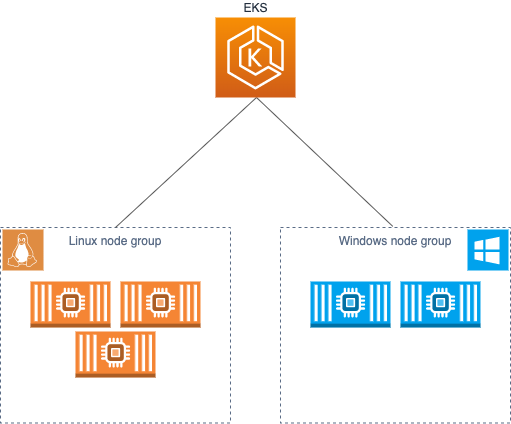

# Windows pod in EKS

[Overview of Windows support in EKS](https://docs.aws.amazon.com/eks/latest/userguide/windows-support.html):

Note: **Before deploying Windows nodes, be aware of [the considerations](https://docs.aws.amazon.com/eks/latest/userguide/windows-support.html#considerations) such as networking, security and DNS.**



[EKS workshop for Windows containers](https://www.eksworkshop.com/beginner/300_windows/)

## Enabling Windows support
1. Check the eksctl version must be 0.24.0 or later. Here assumes that your eksctl version is 0.36.0 or later
```bash
eksctl version
brew install weaveworks/tap/eksctl
```

2. Deploys the VPC resource controller and VPC admission controller webhook that are required on Amazon EKS clusters to run Windows workloads
```bash
eksctl utils install-vpc-controllers --cluster eksworkshop --approve --region cn-northwest-1
```

## Launching self-managed Windows nodes.

After you add Windows support to your cluster, you must specify node selectors on your applications so that the pods land on a node with the appropriate operating system. For Linux pods, use the following node selector text in your manifests.

```yaml
nodeSelector:
        kubernetes.io/os: linux
        kubernetes.io/arch: amd64
```

For Windows pods, use the following node selector text in your manifests.

```yaml
nodeSelector:
        kubernetes.io/os: windows
        kubernetes.io/arch: amd64
```

1. Configuring the VPC CNI plugin to use IAM roles for service accounts 
```bash
eksctl create iamserviceaccount \
    --name aws-node \
    --namespace kube-system \
    --cluster eksworkshop \
    --attach-policy-arn arn:aws-cn:iam::aws:policy/AmazonEKS_CNI_Policy \
    --approve \
    --override-existing-serviceaccounts --region=cn-northwest-1

kubectl get pods -n kube-system | grep aws-node

#verify that the AWS_WEB_IDENTITY_TOKEN_FILE and AWS_ROLE_ARN environment variables exist
kubectl exec -n kube-system 'aws-node-gtp2r' env | grep AWS

```

2. To launch self-managed Windows nodes using eksctl
```bash
eksctl create nodegroup \
  --region cn-northwest-1 \
  --cluster eksworkshop \
  --name eksworkshop-ng-windows-medium \
  --node-type t2.medium \
  --nodes 1 \
  --nodes-min 1 \
  --nodes-max 3 \
  --node-ami-family WindowsServer2019FullContainer

kubectl get nodes -L kubernetes.io/os \
  --sort-by=".status.conditions[?(@.reason == 'KubeletReady' )].lastTransitionTime"

NAME                                                STATUS   ROLES    AGE   VERSION              OS
ip-192-168-63-228.cn-northwest-1.compute.internal   Ready    <none>   33h   v1.18.9-eks-d1db3c   linux
ip-192-168-72-134.cn-northwest-1.compute.internal   Ready    <none>   33h   v1.18.9-eks-d1db3c   linux
ip-192-168-49-85.cn-northwest-1.compute.internal    Ready    <none>   12m   v1.18.9-eks-d1db3c   windows
```

3. To enable nodes to join your cluster

```bash
curl -o aws-auth-cm-windows.yaml https://s3.cn-north-1.amazonaws.com.cn/amazon-eks/cloudformation/2020-10-29/aws-auth-cm-windows.yaml

# Replace the <ARN of instance role (not instance profile) of **Linux** node> and <ARN of instance role (not instance profile) of **Windows** node> snippets with the NodeInstanceRole values that you recorded for your Linux and Windows nodes (you can find in CloudFormation outputs)

kubectl apply -f aws-auth-cm-windows.yaml
kubectl get nodes -L kubernetes.io/os
```

## Deploy a Windows sample application
1. Deploy our Windows IIS container
```bash
kubectl create namespace windows

kubectl apply -f script/windows_server_iis.yaml

kubectl get pods -o wide --watch

kubectl -n windows get svc,deploy,pods

```

2. Testing
```bash
export WINDOWS_IIS_SVC=$(kubectl -n windows get svc -o jsonpath='{.items[].status.loadBalancer.ingress[].hostname}')

echo http://${WINDOWS_IIS_SVC}
```