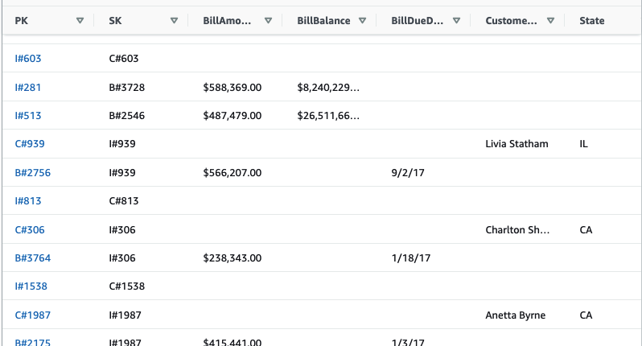

# Adjacency Lists

When different entities of an application have a `many-to-many relationship` between them, it is easier to model the relationship as an `adjacency list`. Such as Player and Game; customer, invoice and bill

In this model, all top-level entities (nodes in the graph model) are represented as the partition key. Any relationship with other entities (edges in a graph) are represented as an item within the partition by setting the value of the sort key to the target entity ID (target node).

The `InvoiceAndBills` example, 
- 1-to-many relationship between a customer ID and an invoice ID: a customer can have multiple invoices.
- many-to-many relationship between invoice ID and bill ID: An invoice contains many bills, and a bill can be broken up and associated with multiple invoices.
- 1-to-many relationship between a customer ID and an bill ID: a customer can have multiple bills.
- The partition key attribute is either an invoice ID, bill ID, or customer ID.

Access pattern:
- Using the invoice ID, retrieve the top-level invoice details, customer, and associated bill details.
- Retrieve all invoice IDs for a customer.
- Using the bill ID, retrieve the top-level bill details and the associated invoice details.

Table `InvoiceAndBills` design
| Attribute Name (Type) | Special Attribute? | Attribute Use Case | Sample Attribute Value | 
| -- | -- | -- | -- |
| PK (STRING) | Partition key | Holds the ID of the entity, either a bill, invoice, or customer | B#3392 or I#506 or C#1317 | 
| SK (STRING) | Sort key, GSI_1 partition key | Holds the related ID: either a bill, invoice, or customer | I#1721 or C#506 or I#1317 |

## Create the table
1. Create the table
```bash
aws dynamodb create-table --table-name InvoiceAndBills \
--attribute-definitions AttributeName=PK,AttributeType=S AttributeName=SK,AttributeType=S \
--key-schema AttributeName=PK,KeyType=HASH AttributeName=SK,KeyType=RANGE \
--provisioned-throughput ReadCapacityUnits=100,WriteCapacityUnits=100 \
--tags Key=workshop-design-patterns,Value=targeted-for-cleanup \
--global-secondary-indexes "IndexName=GSI_1,\
KeySchema=[{AttributeName=SK,KeyType=HASH}],\
Projection={ProjectionType=ALL},\
ProvisionedThroughput={ReadCapacityUnits=100,WriteCapacityUnits=100}"

aws dynamodb wait table-exists --table-name InvoiceAndBills

```

2. Load the data
```bash
python load_invoice.py InvoiceAndBills ./data/invoice-data.csv
```
- load code
```python
      Invoice = {}
      Invoice['PK'] = row[0]
      Invoice['SK'] ='root'
      Invoice['InvoiceDate'] = row[1]
      Invoice['InvoiceBalance'] = row[2]
      Invoice['InvoiceStatus'] = row[3]
      Invoice['InvoiceDueDate']= row[4]
      Invoice_item = dynamodb_table.put_item(Item=Invoice)

      Invoice_Customer = {}
      Invoice_Customer['PK'] = row[0]
      Invoice_Customer['SK'] = row[9]
      Invoice_Customer_item = dynamodb_table.put_item(Item=Invoice_Customer)

      Bill_Invoice = {}
      Bill_Invoice['PK'] = row[0]
      Bill_Invoice['SK'] = row[5]
      Bill_Invoice['BillAmount'] = row[7]
      Bill_Invoice['BillBalance'] = row[8]
      Bill_Invoice_item = dynamodb_table.put_item(Item=Bill_Invoice)

      Customer={}
      Customer['PK'] = row[9]
      Customer['SK'] = row[0]
      Customer['CustomerName'] = row[10]
      Customer['State'] = row[11]
      Customer_item = dynamodb_table.put_item(Item=Customer)

      Bill = {}
      Bill['PK'] = row[5]
      Bill['SK'] = row[0]
      Bill['BillDueDate'] = row[6]
      Bill['BillAmount'] = row[7]
      Bill_item = dynamodb_table.put_item(Item=Bill)
```

```sql
SELECT * FROM "InvoiceAndBills"."GSI_1"
```


3. Query the table's invoice details
```python
    table = dynamodb.Table(tablename)

    if(value.startswith("I#")):
        KCE = Key('PK').eq(value)
        response = table.query(KeyConditionExpression=KCE)
        return(response['Items'])
```

```bash
python query_invoiceandbilling.py InvoiceAndBills 'I#1420'

==============================================================================================================================


 Invoice ID:I#1420, BillID:B#2485, BillAmount:$135,986.00 , BillBalance:$28,322,352.00

 Invoice ID:I#1420, BillID:B#2823, BillAmount:$592,769.00 , BillBalance:$8,382,270.00

 Invoice ID:I#1420, Customer ID:C#1420

 Invoice ID:I#1420, InvoiceStatus:Cancelled, InvoiceBalance:$28,458,338.00 , InvoiceDate:10/31/17, InvoiceDueDate:11/20/17

 ==============================================================================================================================


 Results Retuned in : 0.11666631698608398

python query_invoiceandbilling.py InvoiceAndBills 'B#2485'

==============================================================================================================================


 No records found for B#2485. Please use the query_index_invoiceandbilling.py script for querying Customer and Billing details.


 ==============================================================================================================================


python query_invoiceandbilling.py InvoiceAndBills 'C#1420'


 ==============================================================================================================================


 No records found for C#1420. Please use the query_index_invoiceandbilling.py script for querying Customer and Billing details.


 ==============================================================================================================================
```

4. Query the Customer details and Bill details using the Index
```python
if(value.startswith("C#")):
        KCE = Key('SK').eq(value)
        response = table.query(IndexName='GSI_1',KeyConditionExpression=KCE)

    elif(value.startswith("B#")):
        KCE = Key('SK').eq(value)
        response = table.query(IndexName='GSI_1',KeyConditionExpression=KCE)
    return(response['Items'])
```
```bash
python query_index_invoiceandbilling.py InvoiceAndBills 'C#1249'

===============================================================================================================


 Invoice ID: I#661, Customer ID: C#1249


 Invoice ID: I#1249, Customer ID: C#1249


 ===============================================================================================================


 Results Retuned in : 0.15592455863952637


python query_index_invoiceandbilling.py InvoiceAndBills 'B#3392'


 ===============================================================================================================


 Invoice ID: I#506, Bill ID: B#3392, BillAmount: $383,572.00 , BillBalance: $5,345,699.00


 Invoice ID: I#1721, Bill ID: B#3392, BillAmount: $401,844.00 , BillBalance: $25,408,787.00


 Invoice ID: I#390, Bill ID: B#3392, BillAmount: $581,765.00 , BillBalance: $11,588,362.00


 ===============================================================================================================


 Results Retuned in : 0.1690356731414795

```
