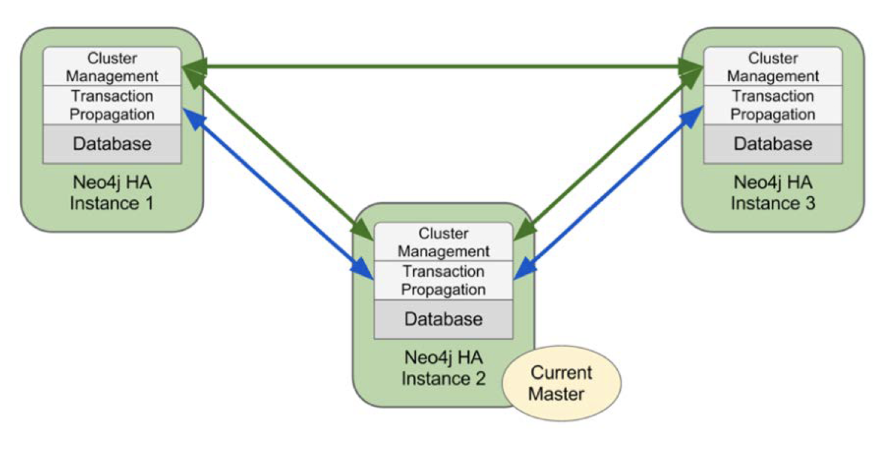

# Neo4j on AWS

## Deployment quick start guide:
[Neo4j-On-AWS-Global](database/neo4j/Neo4j-On-AWS-Global.md)

[Neo4j-On-AWS-China](database/neo4j/Neo4j-On-AWS-China.md)

[Neo4j-quick-start](database/neo4j/Neo4j-quick-start.md)


## Deployment consideration

[Running Neo4j Graph Databases on AWS whitepaper](https://d0.awsstatic.com/whitepapers/Database/neo4j-graph-databases-aws.pdf)

### Networking

1. Deploying your Neo4j cluster into a VPC with a private subnet and configuring your security group to permit ingress port

| Port | Process |
| :--- | :---    |
|7474  | The Neo4j HTTP REST API and web frontend are available at this port. |
|7473  | The Neo4j HTTPS REST API and web frontend are available at this port. |
|7687  | The binary protocol endpoint. Used by application drivers to query and transact with the database. |

2. To optimize network performance, we suggest using EC2 instances that support enhanced networking.

3. Neo4j HA clusters cross multi-Availability Zone (AZ)



4. Advanced: Two load balancers for Master and Slave Rest endpoints
Neo4j advertises separate REST endpoints for both the master node and the slave nodes so that the load balancers can determine what role each instance in a cluster plays. By creating two load balancers and adding all of the Neo4j instances to both load balancers, it can ensure that during an election the master node load balancer will properly redirect requests to the proper nodes.


5. Consistent routing
- Session affinity of ELB
- Route based on the characteristics of the data set, such as geography, username, or other application-specific feature.

### Scaling
1. Neo4j is a shared-nothing architecture and can therefore happily consume instance-based storage.

2. Data Consistency

Neo4j is an ACID transactional database. Any abrupt shutdown of an instance, such as when an EC2 instance unexpectedly dies, will leave the database files in an inconsistent but repairable state. Hence, when booting the new Neo4j instance using files on the existing EBS volume, the database will first have to recover to a consistent state before joining the cluster.

3. Scaling for Volume

Neo4j uses an HA cluster with a pattern called "Cache Sharding" to maintain high performance traversals with a dataset that substantially exceeds main memory space.

4. Horizental scaling

Scaling for performance is simplified by adding more instances
Cache Sharding: characteristics of the data set such as username work well with this scheme, and sticky sessions with round-robin load balancing work in almost all domains.

### Monitoring
- Use the CloudWatch logs with Neo4j /etc/awslogs/awslogs.conf
```bash
[Neo4j .log]
datetime_format = %Y-%m-%d %H:%M:%S%f%z
file = /home/ec2-user/Neo4j 3/Neo4j -enterprise-3.0.0-RC1/logs/Neo4j .log
log_stream_name = {instance_id}
initial_position = start_of_file
log_group_name = /Neo4j /logs
```

### Online Backup
- Daily full backups and hourly incremental backups
- Weekly full backups with daily incremental backups

