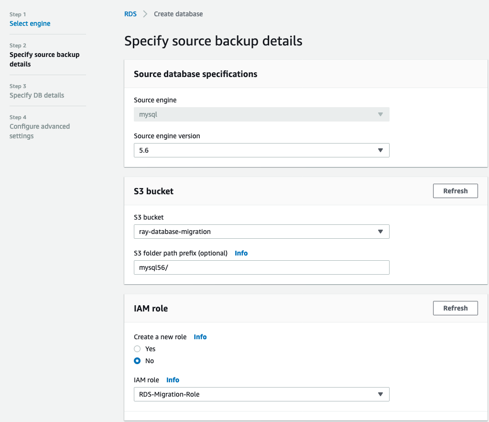
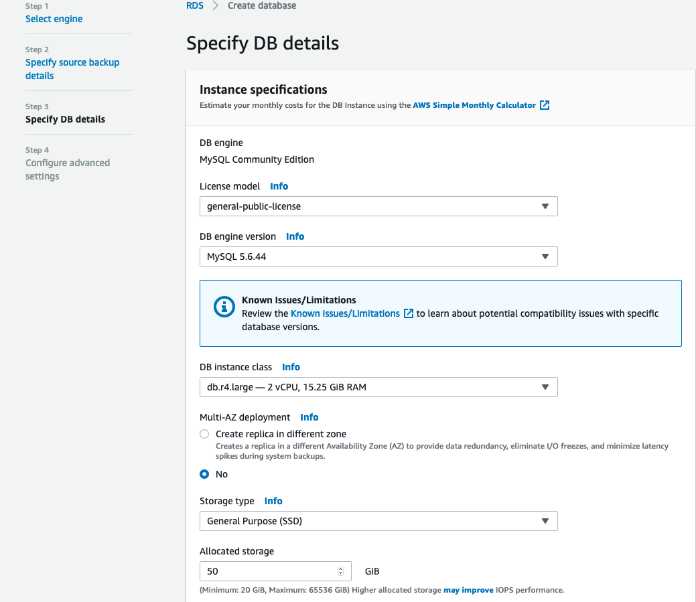
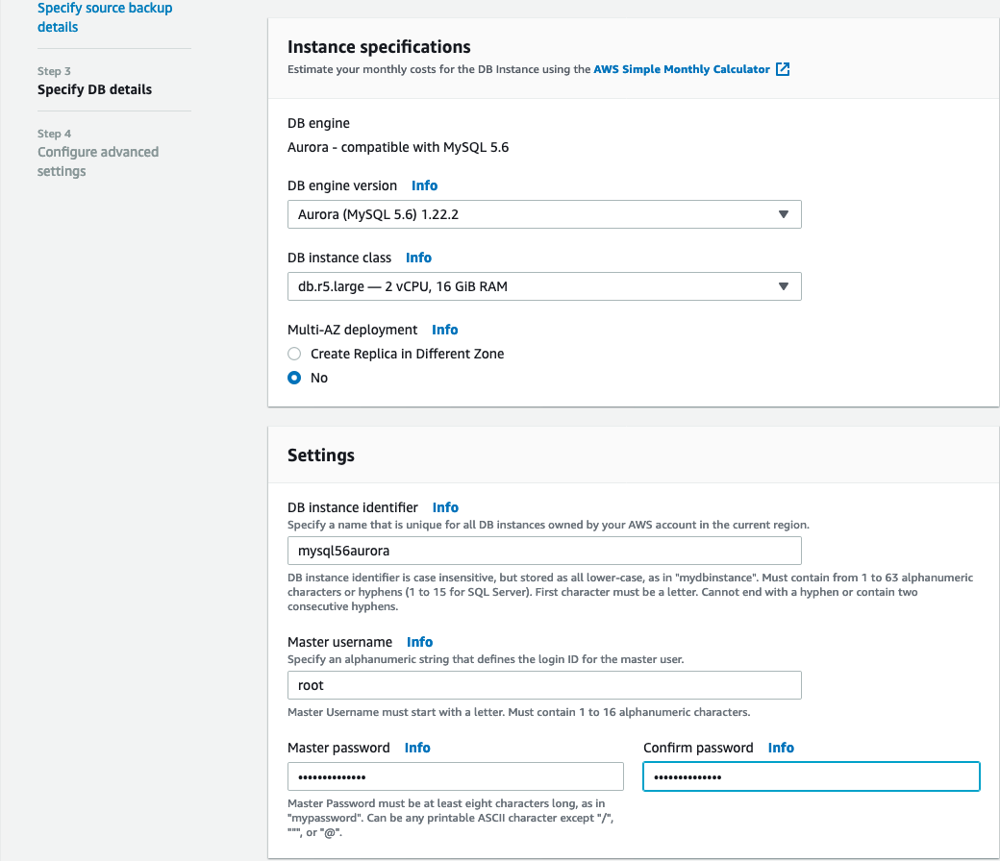
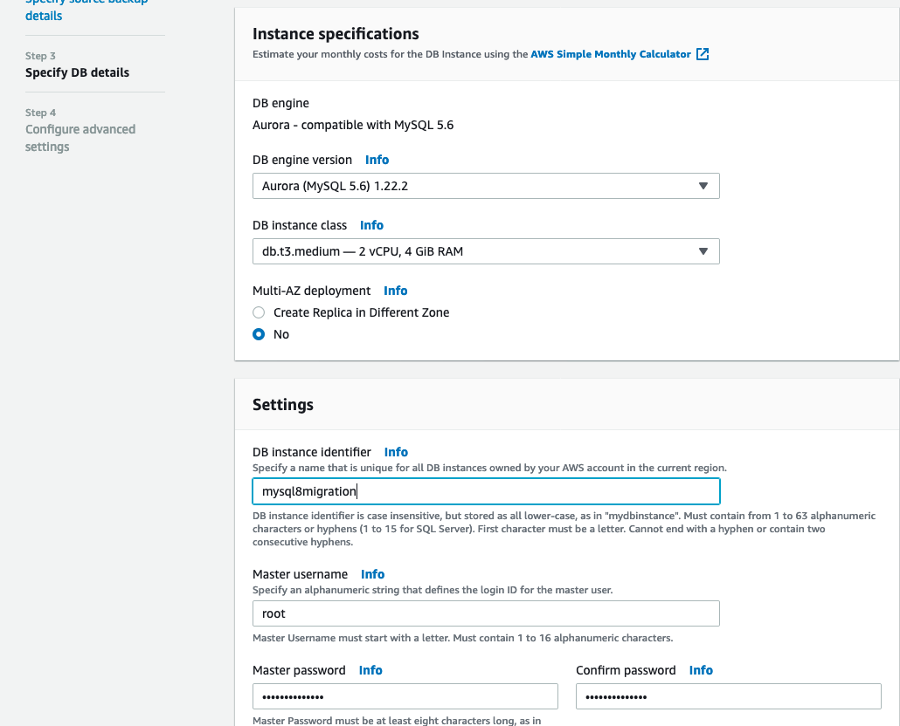

# Migrate a self-built MySQL database to Amazon Aurora with sufficient downtime

## Case 1: Source database is MySQL 5.6

### Install the MySQL5.6 on EC2 Amazon Linux2

```bash
# Install MySQL 5.6 on Amazon Linux 2
## Option 1
wget http://repo.mysql.com/mysql-community-release-el6-5.noarch.rpm
sudo rpm -ivh mysql-community-release-el6-5.noarch.rpm
ls /etc/yum.repos.d
amzn2-core.repo  amzn2-extras.repo  mysql-community.repo  mysql-community-source.repo
sudo yum install mysql-community-server

# Option 2
wget https://downloads.mysql.com/archives/get/p/23/file/MySQL-5.6.44-1.el7.x86_64.rpm-bundle.tar
tar -xvf MySQL-5.6.44-1.el7.x86_64.rpm-bundle.tar
sudo rpm -ivh *.rpm (common、libs、libs-compat、client、server)

sudo systemctl status mysql
sudo systemctl enable mysql  or sudo chkconfig mysql on
sudo systemctl start mysql

# Start and Configure MySQL 56 on Amazon Linux 2
sudo cat /root/.mysql_secret
# The random password set for the root user at Mon Aug 31 07:59:19 2020 (local time): HqxI_ZwuMNBqDP_A
sudo mysql_secure_installation

# Create sample testdb database and load the data
mysql -h 127.0.0.1 -uroot -p 
>source mysqlsampledatabase.sql;
>show tables;
+-------------------------+
| Tables_in_classicmodels |
+-------------------------+
| customers               |
| employees               |
| offices                 |
| orderdetails            |
| orders                  |
| payments                |
| productlines            |
| products                |
+-------------------------+
8 rows in set (0.00 sec)
>SELECT count(1) FROM orderdetails;
+----------+
| count(1) |
+----------+
|     2996 |
+----------+
1 row in set (0.02 sec)
```

### Use the XtraBackup to backup the data

1. Donwload the Percona XtraBackup from website，here we can use the

```bash
# version 2.4（https://www.percona.com/downloads/Percona-XtraBackup-2.4/LATEST/） for MySQL 5.1, 5.5, 5.6 and 5.7 servers
wget https://www.percona.com/downloads/Percona-XtraBackup-2.4/Percona-XtraBackup-2.4.1/binary/tarball/percona-xtrabackup-2.4.1-Linux-x86_64.tar.gz
tar -xzvf percona-xtrabackup-2.4.1-Linux-x86_64.tar.gz
cd percona-xtrabackup-2.4.1-Linux-x86_64/bin

```

2. Execute Percona XtraBackup command to create the backup

- Permissions and Privileges

```bash
mysql> GRANT RELOAD, LOCK TABLES, PROCESS, REPLICATION CLIENT ON *.* TO 'root'@'%';
mysql> FLUSH PRIVILEGES;
```

- Backup

```bash
sudo su
# XtraBackup 2.4
#./innobackupex --host=127.0.0.1 --user=root --password=youpassword --database=classicmodels --stream=tar /tmp/s3-restore/backup2 | split -d –bytes=512000000 – /tmp/s3-restore/backup.tar
./innobackupex --host=127.0.0.1 --user=root --password=youpassword --database=classicmodels --stream=tar /tmp/s3-restore/backup2 | gzip > /tmp/s3-restore/backup56.tar.gz

ls /tmp/s3-restore
backup2  backup56.tar.gz
```

3. Copy the database backup to S3 bucket（In this sample, it is backup.tar such as backup.tar00 and backup.tar01. The tar package include the database backup files generated by xtrabackup)

```bash
cd /tmp/s3-restore
aws s3 cp backup56.tar.gz s3://ray-database-migration/mysql56/ --region cn-north-1
```

4. Restore the backup from S3 bucket to Amazon RDS MySQL or Amazon Aurora MySQL database

- Select Restore from S3

  

- Set the S3 bucket which contain the backup files

  

- Amazon RDS MySQL setting

RDS MySQL now support 5.6.44 import

  


- Amazon Aurora MySQL setting

  


5. Once the Aurora database restore finished, run the database and business verification
```bash
mysql> show databases;
+--------------------+
| Database           |
+--------------------+
| information_schema |
| classicmodels      |
| mysql              |
| performance_schema |
+--------------------+
4 rows in set (0.00 sec)

mysql> use classicmodels;
mysql> show tables;
+-------------------------+
| Tables_in_classicmodels |
+-------------------------+
| customers               |
| employees               |
| offices                 |
| orderdetails            |
| orders                  |
| payments                |
| productlines            |
| products                |
+-------------------------+
8 rows in set (0.02 sec)

mysql> SELECT count(1) FROM orderdetails;
+----------+
| count(1) |
+----------+
|     2996 |
+----------+
1 row in set (0.01 sec)
```

## Case 2: Source database is MySQL 8

According to document https://docs.aws.amazon.com/AmazonRDS/latest/AuroraUserGuide/AuroraMySQL.Migrating.ExtMySQL.html

You can copy the full and incremental backup files from your source MySQL version 5.5, 5.6, or 5.7 database to an Amazon S3 bucket, and then restore an Amazon Aurora MySQL DB cluster from those files. MySQL 8 is not supported.

Let's verify it

### Install the MySQL8.0 on EC2 Amazon Linux2

```bash
# Install MySQL 8 on Amazon Linux 2
## Option 1
wget https://dev.mysql.com/get/mysql80-community-release-el7-1.noarch.rpm
sudo rpm -ivh mysql80-community-release-el7-1.noarch.rpm
ls /etc/yum.repos.d
amzn2-core.repo  amzn2-extras.repo  mysql-community.repo  mysql-community-source.repo
sudo yum install mysql-community-server

# Option 2
wget https://downloads.mysql.com/archives/get/p/23/file/mysql-8.0.11-1.el7.x86_64.rpm-bundle.tar
tar -xvf mysql-8.0.11-1.el7.x86_64.rpm-bundle.tar
sudo rpm -ivh *.rpm (common、libs、libs-compat、client、server)

sudo systemctl status mysqld
sudo systemctl enable mysqld.service
sudo systemctl start mysqld.service

# Start and Configure MySQL 8 on Amazon Linux 2
sudo grep 'temporary password' /var/log/mysqld.log
##2020-08-25T08:30:24.428566Z 5 [Note] [MY-010454] [Server] A temporary password is generated for root@localhost: strNpkt)k8tO

sudo mysql_secure_installation -p'strNpkt)k8tO'
mysql -uroot -p
>use mysql;
# Enable the remote login and alter password
>ALTER user 'root'@'localhost' IDENTIFIED by 'youpassword';
>ALTER USER 'root'@'localhost' IDENTIFIED WITH mysql_native_password BY 'youpassword';
>update user set host = '%' where user = 'root';
# refresh privileges table
>flush privileges;

# Create sample testdb database and load the data
mysql -uroot -p
>source mysqlsampledatabase.sql;
>show tables;
+-------------------------+
| Tables_in_classicmodels |
+-------------------------+
| customers               |
| employees               |
| offices                 |
| orderdetails            |
| orders                  |
| payments                |
| productlines            |
| products                |
+-------------------------+
8 rows in set (0.00 sec)
>SELECT count(1) FROM orderdetails;
+----------+
| count(1) |
+----------+
|     2996 |
+----------+
1 row in set (0.02 sec)
```

### Use the XtraBackup to backup the data

1. Donwload the Percona XtraBackup from website，here we can use the

```bash
# version 8.0, up to version 8.0.11, is not compatible with MySQL version 8.0.20 or higher
sudo yum install https://repo.percona.com/yum/percona-release-latest.noarch.rpm
percona-release enable-only tools release
sudo yum install percona-xtrabackup-80
```

2. Execute Percona XtraBackup command to create the backup

- Permissions and Privileges

```bash
mysql> GRANT BACKUP_ADMIN, PROCESS, RELOAD, LOCK TABLES, REPLICATION CLIENT ON *.* TO 'root'@'%';
mysql> GRANT SELECT ON performance_schema.log_status TO 'root'@'%';
mysql> FLUSH PRIVILEGES;
```

- Backup

```bash
sudo su
# XtraBackup 8.0
#xtrabackup --backup --user=root --password=youpassword --databases=classicmodels --target-dir=/tmp/mysqlbackups/
xtrabackup --backup --user=root --password=youpassword --databases=classicmodels --stream=xbstream --target-dir=/tmp/s3-restore/backup2 --extra-lsndir=/tmp | split -d --bytes=512MB - /tmp/s3-restore/backup.tar
.....
xtrabackup: Transaction log of lsn (19753609) to (19753609) was copied.
200825 09:57:23 completed OK!

ls /tmp/s3-restore
backup2  backup.tar00
```

3. Copy the database backup to S3 bucket（In this sample, it is backup.tar such as backup.tar00 and backup.tar01. The tar package include the database backup files generated by xtrabackup)

```bash
aws s3 cp backup.tar00 s3://ray-database-migration/mysql8/ --region cn-north-1
```

4. Restore the backup from S3 bucket to Amazon RDS MySQL or Amazon Aurora MySQL database

- Select Restore from S3
  

- Set the S3 bucket which contain the backup files
  

- Amazon RDS MySQL setting

  

Failed with `Database instance put into incompatible-restore. Unable to extract the backup files of type TAR. Please verify that your backup files in ray-database-migration/mysql8 are in a valid format`

- Amazon Aurora MySQL setting

  

Failed with `DB instance put into incompatible-restore state. RDS recommends that you initiate a point-in-time-restore.`

## Clean up

```
# Delete the Aurora instance and RDS MySQL instance

# Uninstall MySQL
sudo service mysqld stop
sudo yum remove mysql mysql-server mysql-client mysql-common mysql-devel
sudo rm -rf /var/lib/mysql
sudo rf /etc/mysql /etc/mysql_old_backup

# Terminate EC2 for mysql56 and mysql8.0
```
