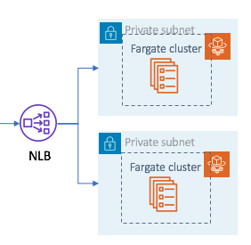
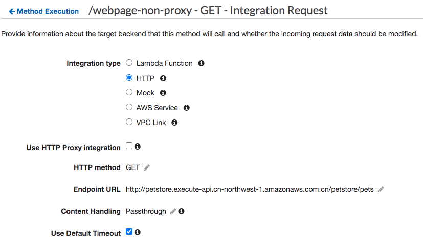
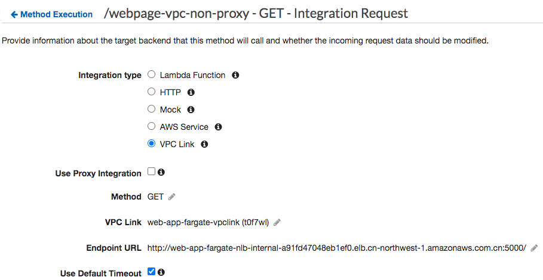

# Build Private API with API Gateway and integrate with VPC resource via API Gateway private integration

1. Create Internal NLB route traffic to Fargate in private subnet

    

    SSH to jumpserver to verify the api work properly

    ```bash
    [ec2-user@ip-10-0-2-83 workspace]$ curl http://web-app-fargate-nlb-internal-a91fd47048eb1ef0.elb.cn-northwest-1.amazonaws.com.cn
    <html><h1>Hello World From Ray Webpage!</h1></html>
    [ec2-user@ip-10-0-2-83 workspace]$ curl http://web-app-fargate-nlb-internal-a91fd47048eb1ef0.elb.cn-northwest-1.amazonaws.com.cn:5000
    <html><h1>Hello World From Ray Webpage!</h1></html>
    ```

2. Build a Regional REST API with API Gateway private integration

    [Quick start Step by Step guide](https://docs.aws.amazon.com/apigateway/latest/developerguide/getting-started-with-private-integration.html)

    [Set up API Gateway private integrations guide for different scenario](https://docs.aws.amazon.com/apigateway/latest/developerguide/set-up-private-integration.html)

    

- On API Gateway console creat the VPC link for REST APIs

    

- Choice a API to use (1) VPC Link for Integration type; (2) Choose Use Proxy Integration; (3)From the VPC Link drop-down list, select the VpcLink created in previous step.

    

- From the Actions drop-down menu, choose Deploy API

- Testing new REST API from VPC (The VPC without API GW VPC endpoint) or destop via public internet

    

    ```bash
    curl https://iyh6euenkb.execute-api.cn-northwest-1.amazonaws.com.cn/dev/webpage-vpc
    <html><h1>Hello World From Ray Webpage!</h1></html>
    ```

3. Build a Private REST API with API Gateway private integration

    Create a REST API that is only accessible from within a VPC. [Step by Step guide](https://docs.aws.amazon.com/apigateway/latest/developerguide/apigateway-private-apis.html)

    

- Create an interface VPC endpoint for API Gateway execute-api

    

    - For Enable Private DNS Name, leave the check box selected. Private DNS is enabled by default. 
    
        When private DNS is enabled, you're able to access your API via private or public DNS. However, you cannot access public APIs from a VPC by using an API Gateway VPC endpoint with private DNS enabled. 

    - The security group you choose must be set to allow TCP Port 443 inbound HTTPS traffic from either an IP range in your VPC or another security group in your VPC. 
    - VPCE Policy in here is Full Access - Allow access by any user or service within the VPC using credentials from any AWS accounts.
    ```json
    {
    "Statement": [
            {
                "Action": "*",
                "Effect": "Allow",
                "Resource": "*",
                "Principal": "*"
            }
        ]
    }
    ```

- Create a private API using the API Gateway console

    

    ```bash
    aws apigateway create-rest-api --name Fargate-webpage-private \
    --endpoint-configuration '{ "types": ["PRIVATE"], "vpcEndpointIds" : ["vpce-0d4d61b31cecd49fc"] }' \
    --region cn-northwest-1
    ```

- Set up a resource policy for a private API only allow specified VPC to acess this private API
    ```json
    {
    "Version": "2012-10-17",
    "Statement": [
        {
            "Effect": "Allow",
            "Principal": "*",
            "Action": "execute-api:Invoke",
            "Resource": "arn:aws-cn:execute-api:cn-northwest-1:{account_id}:{apigw_id}/*/*/*"
        },
        {
            "Effect": "Deny",
            "Principal": "*",
            "Action": "execute-api:Invoke",
            "Resource": "arn:aws-cn:execute-api:cn-northwest-1:{account_id}:{apigw_id}/*/*/*",
            "Condition" : {
                "StringNotEquals": {
                   "aws:SourceVpc": "{vpc_id}"
                }
            }
        }
    ]
    }
    ```

- Create the Resource and Method for 
    - HTTP Integration with Proxy Mode

    

    - Private Integration VPCLink with Proxy Mode
    
    

    - HTTP Integration without Proxy Mode

    

    - Private Integration VPCLink without Proxy Mode
    
    

- Deploy a private API using the API Gateway console as stage set to `dev`

    

- Invoking your private API using private DNS names

    ```bash
    # HTTP Integration with Proxy Mode
    [ec2-user@ip-10-0-2-83 workspace]$ curl https://3i95y1yx06.execute-api.cn-northwest-1.amazonaws.com.cn/dev/webpage
    
    # Private Integration VPCLink with Proxy Mode
    [ec2-user@ip-10-0-2-83 workspace]$ curl https://3i95y1yx06.execute-api.cn-northwest-1.amazonaws.com.cn/dev/webpage-vpc

    # HTTP Integration without Proxy Mode
    [ec2-user@ip-10-0-2-83 workspace]$ curl https://3i95y1yx06.execute-api.cn-northwest-1.amazonaws.com.cn/dev/webpage-non-proxy

    # Private Integration VPCLink without Proxy Mode
    [ec2-user@ip-10-0-2-83 workspace]$ curl https://3i95y1yx06.execute-api.cn-northwest-1.amazonaws.com.cn/dev/webpage-vpc-non-proxy
    ```

- Invoking your private API using endpoint-specific public DNS hostnames
    
    You can access your private API using endpoint-specific DNS hostnames. These are public DNS hostnames containing the VPC endpoint ID or API ID for your private API as following format:
    `https://{public-dns-hostname}.execute-api.{region}.vpce.amazonaws.com/{stage}` or `https://{public-dns-hostname}.execute-api.{cn-region}.vpce.amazonaws.com.cn/{stage}`
    
    ```bash
    # HTTP Integration with Proxy Mode
    curl -v https://vpce-0d4d61b31cecd49fc-rsnonbkv.execute-api.cn-northwest-1.vpce.amazonaws.com.cn/dev/webpage -H 'Host: 3i95y1yx06.execute-api.cn-northwest-1.amazonaws.com.cn'
    curl -v https://vpce-0d4d61b31cecd49fc-rsnonbkv.execute-api.cn-northwest-1.vpce.amazonaws.com.cn/dev/webpage -H'x-apigw-api-id:3i95y1yx06'
    
    # Private Integration VPCLink with Proxy Mode
    curl -v https://vpce-0d4d61b31cecd49fc-rsnonbkv.execute-api.cn-northwest-1.vpce.amazonaws.com.cn/dev/webpage-vpc -H 'Host: 3i95y1yx06.execute-api.cn-northwest-1.amazonaws.com.cn'
    curl -v https://vpce-0d4d61b31cecd49fc-rsnonbkv.execute-api.cn-northwest-1.vpce.amazonaws.com.cn/dev/webpage-vpc -H'x-apigw-api-id:3i95y1yx06'

    # HTTP Integration without Proxy Mode
    curl -v https://vpce-0d4d61b31cecd49fc-rsnonbkv.execute-api.cn-northwest-1.vpce.amazonaws.com.cn/dev/webpage-non-proxy -H 'Host: 3i95y1yx06.execute-api.cn-northwest-1.amazonaws.com.cn'
    curl -v https://vpce-0d4d61b31cecd49fc-rsnonbkv.execute-api.cn-northwest-1.vpce.amazonaws.com.cn/dev/webpage-non-proxy -H'x-apigw-api-id:3i95y1yx06'

    # Private Integration VPCLink without Proxy Mode
    curl -v https://vpce-0d4d61b31cecd49fc-rsnonbkv.execute-api.cn-northwest-1.vpce.amazonaws.com.cn/dev/webpage-vpc-non-proxy -H 'Host: 3i95y1yx06.execute-api.cn-northwest-1.amazonaws.com.cn'
    curl -v https://vpce-0d4d61b31cecd49fc-rsnonbkv.execute-api.cn-northwest-1.vpce.amazonaws.com.cn/dev/webpage-vpc-non-proxy -H'x-apigw-api-id:3i95y1yx06'
    ```

# Trouble shooting:
1. [How do I troubleshoot issues connecting to an API Gateway private API endpoint?](https://aws.amazon.com/premiumsupport/knowledge-center/api-gateway-private-endpoint-connection/)

2. [How to invoke a private API ](https://docs.aws.amazon.com/apigateway/latest/developerguide/apigateway-private-api-test-invoke-url.html)

How you access your private API will depend upon whether or not you have enabled private DNS on the VPC endpoint.

For example, while accessing private API from on-premises network via AWS Direct Connect, you will have private DNS enabled on the VPC endpoint. In such a case, follow the steps outlined in [Invoking Your Private API Using Endpoint-Specific Public DNS Hostnames](https://docs.aws.amazon.com/apigateway/latest/developerguide/apigateway-private-api-test-invoke-url.html#apigateway-private-api-public-dns). You cannot use private DNS names to access your private API from an on-premises network. 