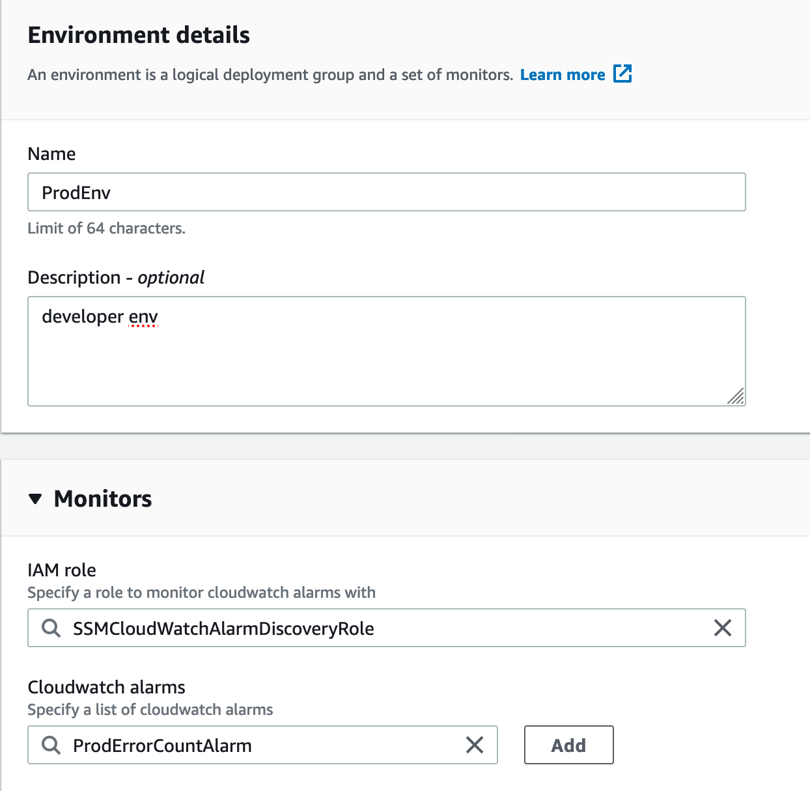
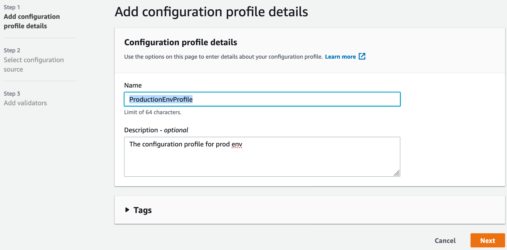
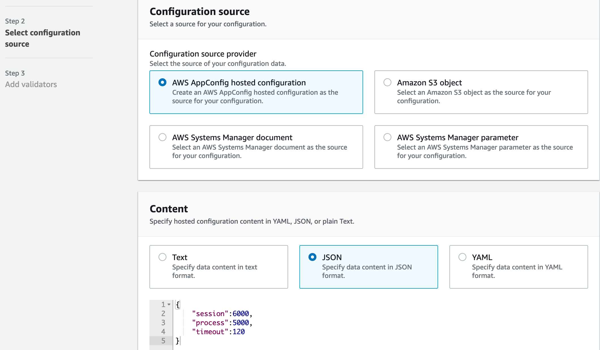
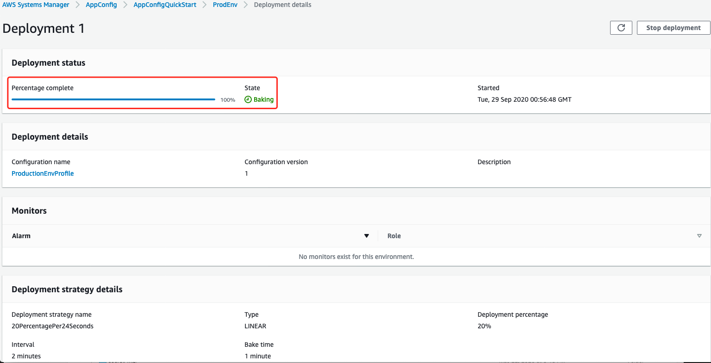
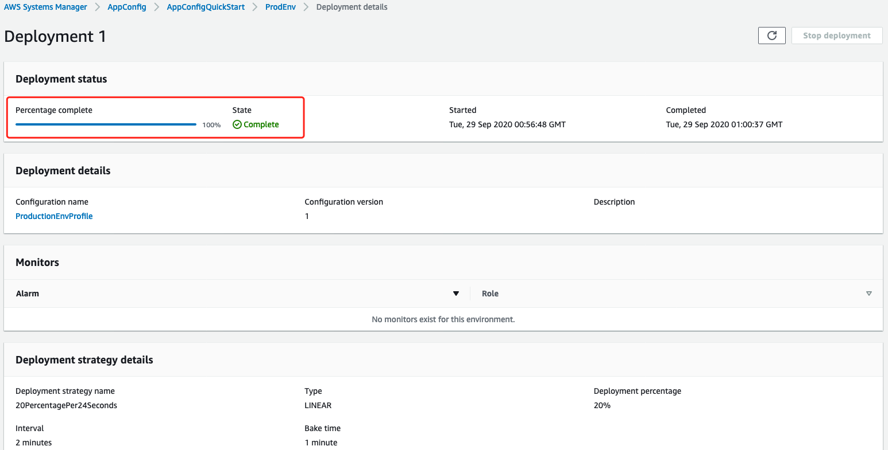
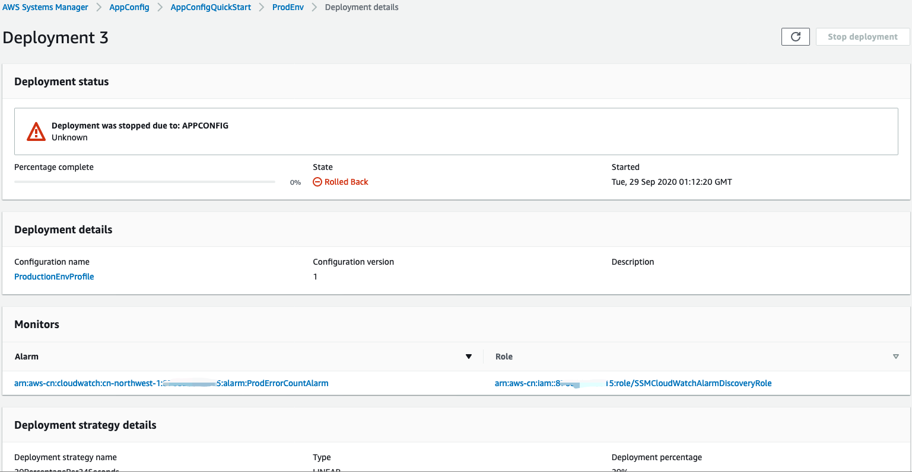
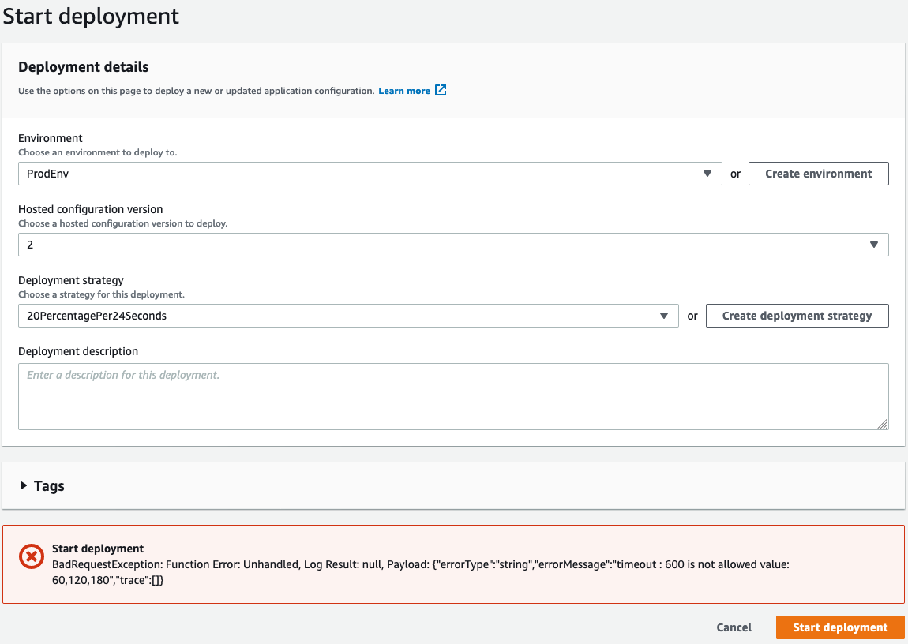
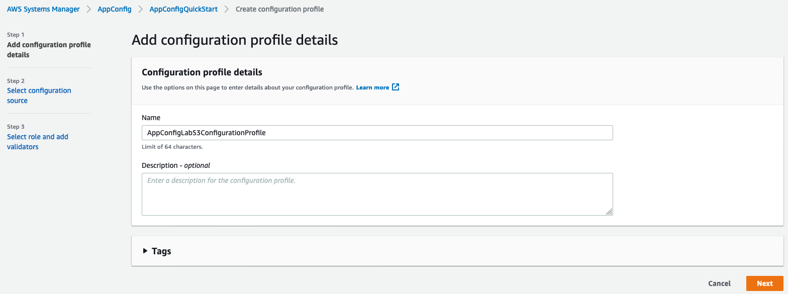
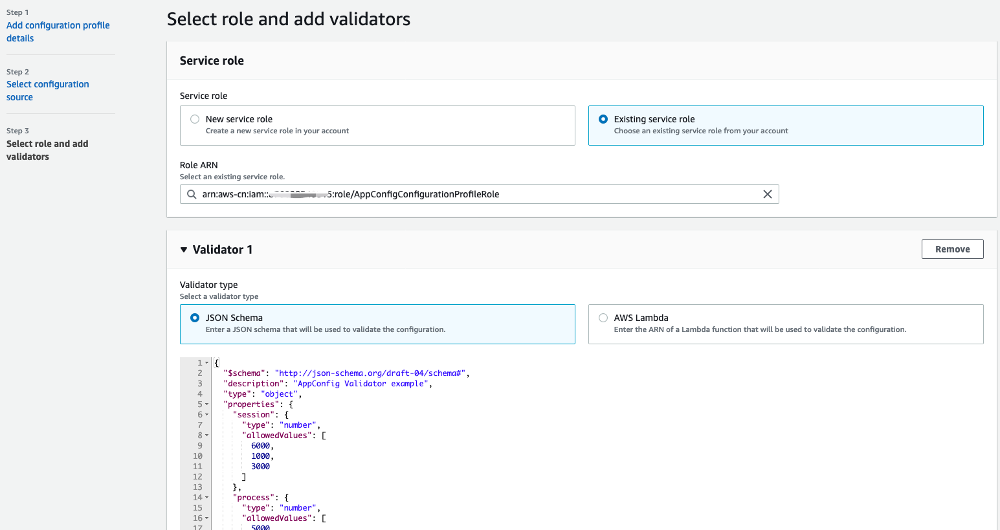

# Simplify application configuration with AWS AppConfig

AWS AppConfig makes it easy for customers to quickly roll out application configurations across applications hosted on EC2 instances, containers, Lambdas, mobile apps, IoT devices, and on-premise servers in a validated, controlled and monitored way. 

AWS AppConfig enable customer to manage configuration changes, similar to the way they manage code. Additional AWS AppConfig provide valuable features: 

1. **Validate application’s configuration data against a schema or validate via a Lambda function**. This ensure your configuration data is syntactically and semantically correct before making it available to your application
2. Rolling out configuration changes over a defined time period while **monitoring the application to catch any errors and rollback the changes** if in case any errors occur
3. **Store and manage your configuration content similar to the way they manage code**. 

    The type can be either as Systems Manager Parameters or Systems Manager Documents
    - Systems Manager Parameters: configuration parameters such as URLs, certificates, accounts, and names
    - Systems Manager Documents: typed configuration data in structured formats such as JSON or YAML.  
    - AWS AppConfig hosted configuration store: YAML, JSON, or text documents
    - Amazon S3 bucket: Objects

You can also [integrate the AWS AppConfig in your CICD pipeline](https://aws.amazon.com/cn/blogs/mt/automating-feature-release-using-aws-appconfig-integration-with-aws-codepipeline/)

![AppConfig-pipeline.png)

Now let's build the QuickStart demo!

## Create the AppConfig quickstart application

1. Prepare the AppConfig ReadOnly permission

- AppConfigReadOnlyPolicy
```json
{
  "Version": "2012-10-17",
  "Statement": [
    {
      "Effect": "Allow",
      "Action": [
        "ssm:GetDocument",
        "ssm:ListDocuments",
        "ssm:GetParameter",
        "appconfig:ListApplications",
        "appconfig:GetApplication",
        "appconfig:ListEnvironments",
        "appconfig:GetEnvironment",
        "appconfig:ListConfigurationProfiles",
        "appconfig:GetConfigurationProfile",
        "appconfig:ListDeploymentStrategies",
        "appconfig:GetDeploymentStrategy",
        "appconfig:GetConfiguration",
        "appconfig:ListDeployments"
               
      ],
      "Resource": "*"
    }
  ]
}
```

- Permission for configuration rollback based on CloudWatch alarms

  SSMCloudWatchAlarmDiscoveryRole with policy

  ```json
  {
        "Version": "2012-10-17",
        "Statement": [
            {
                "Effect": "Allow",
                "Action": [
                    "cloudwatch:DescribeAlarms"
                ],
                "Resource": "*"
            }
        ]
    }
  ```

  And trusted entity as `appconfig.amazonaws.com`
  ```json
    {
        "Version": "2012-10-17",
        "Statement": [
            {
            "Effect": "Allow",
            "Principal": {
                "Service": "appconfig.amazonaws.com"
            },
            "Action": "sts:AssumeRole"
            }
        ]
    }
  ```


2. Create configuration application

Navigate to AWS AppConfig console, Clicking `Create configuration data` to create a new application configuration


3. Create environment

- Create sample test metrics

```bash
aws cloudwatch put-metric-data --metric-name production-error-count --namespace "Custom" \
--value 2 --region cn-northwest-1
```

- Create sample alarm `ProdErrorCountAlarm` for `production-error-count` metrics


- Create the environment



4. Create the configuration profile

- Create the AppConfigConfigurationProfileRole with policy
```json
{
    "Version": "2012-10-17",
    "Statement": [
        {
            "Effect": "Allow",
            "Action": [
                "ssm:GetDocument",
                "ssm:GetParameter",
                "s3:GetObject",
                "s3:GetObjectVersion",
                "s3:GetBucketLocation",
                "s3:GetBucketVersioning",
                "s3:ListBucketVersions",
                "s3:ListBucket",
                "s3:ListAllMyBuckets"
            ],
            "Resource": "*"
        }
    ]
}
```

And trusted entity as `appconfig.amazonaws.com`
```json
    {
        "Version": "2012-10-17",
        "Statement": [
            {
            "Effect": "Allow",
            "Principal": {
                "Service": "appconfig.amazonaws.com"
            },
            "Action": "sts:AssumeRole"
            }
        ]
    }
```

- Add configuration profile details

Create the `ProductionEnvProfile`



- Select configuration source

If you choice the `AWS AppConfig hosted configuration`, then input below `JSON` content
```json
{
    "session":6000,
    "process":5000,
    "timeout":120,
    "poolsize":300
}
```



If you choice the `AWS Systems Manager document`, then `New document`

## Deploy a configuration

An AWS AppConfig deployment strategy defines
- Deployment type: Linear (uses a step percentage increments of the growth factor evenly distributed over the deployment time) or Exponential (processes the deployment exponentially using the following formula: `G*(2^N)`)
- Step percentage (growth factor)
- Deployment time
- Bake time (The amount of time AWS AppConfig monitors for Amazon CloudWatch alarms before proceeding to the next step of a deployment or before considering the deployment to be complete)

**Predefined deployment strategies**:

- AppConfig.AllAtOnce
- AppConfig.Linear50PercentEvery30Seconds
- AppConfig.Canary10Percent20Minutes

1. Creating a deployment strategy 

Here we define: deployment of 20% to the hosts every 24 seconds (total 2mins). Additionally, we will configure a Bake time of 1min.


2. Start deployment






3. Simulate the alarm for rollback

Start a new deployment

- Trigger sample alarm `ProdErrorCountAlarm`, execute below comand 30 times

```bash
aws cloudwatch put-metric-data --metric-name production-error-count --namespace "Custom" \
--value 15 --region cn-northwest-1
```



- Make Alarm status back to `OK`
```bash
aws cloudwatch put-metric-data --metric-name production-error-count --namespace "Custom" \
--value 0 --region cn-northwest-1
```

## Testing the validator

AWS AppConfig calls your validation Lambda when calling the StartDeployment and ValidateConfigurationActivity API actions. 

1. Prepare validators

- Json Validator
```json
{
  "$schema": "http://json-schema.org/draft-04/schema#",
  "description": "AppConfig Validator example",
  "type": "object",
  "properties": {
    "session": {
      "type": "number",
      "allowedValues": [
        6000,
        1000,
        3000
      ]
    },
    "process": {
      "type": "number",
      "allowedValues": [
        5000,
        2500,
        1000
      ]
    },
    "timeout": {
      "type": "number",
      "allowedValues": [
        60,
        120,
        180
      ]
    }
  },
  "minProperties": 3,
  "required": [
    "session",
    "process",
    "timeout"
  ]
}
```

- Lambda Validator
    - Function Name: AppConfigLabLambdaValidator 
    - Runtime: Node.js 12.x
    - Grant permission
        ```bash
        aws lambda add-permission --function-name AppConfigLabLambdaValidator --action lambda:InvokeFunction --statement-id appconfig --principal appconfig.amazonaws.com --output json --region cn-northwest-1
        ```
    - Lambda Code
    ```js
    function isPrime(value) {
        if (value < 2) {
            return false;
        }
        for (i = 2; i < value; i++) {
            if (value % i === 0) {
                return false;
            }
        }
        return true;
    }

    exports.handler = async (event, context) => {
    try {
        console.log('Received event:', JSON.stringify(event, null, 2));
        const data = JSON.parse(Buffer.from(event.content, 'base64').toString('ascii'));
        console.log('Configuration Data: ', data);
        Object.keys(data).forEach(function (item) {
        console.log('key: ',item); // key
        console.log('value: ', data[item]); // value
        const dataType = typeof data[item];
        console.log('Data type: ', dataType);
            
        if ((item === 'poolsize' || item === 'timeout' ) && dataType !== 'number')
            throw new TypeError(`Configuration property ${item} configured as type ${dataType}; expecting type number`);
        if (item === 'poolsize'){
            const prime = isPrime(data[item]);
            console.log('RESULT: ' + item + 'value: ' + data[item] + (prime ? ' is' : ' is not') + ' prime');
            if (!prime) {
                throw item + "is not prime";
            }
        }
        if (item === 'timeout'){
            var timeout_range = [60, 120, 180];
            var a = timeout_range.indexOf(data[item]);
            var timeout_check = true
            if (a < 0){
  	            timeout_check = false
            }
            console.log('RESULT: ' + item + 'value: ' + data[item] + ' allow value check: ' + timeout_check);
            if (!timeout_check) {
                throw item + " : " + data[item] + " is not allowed value: " + timeout_range;
            }
        }
        });
    } catch(err) {
        throw err;
    }
    };
    ```

    - Test lambda with data
    ```json
        # success
        {
        "content": "ewogICAgInNlc3Npb24iOjYwMDAsCiAgICAicHJvY2VzcyI6NTAwMCwKICAgICJ0aW1lb3V0IjoxMjAsCiAgICAicG9vbHNpemUiOjMwMAp9",
        "uri": "arn:aws-cn:lambda:cn-northwest-1:xxxxx:function:AppConfigLabLambdaValidator"
        }
        # failed type
        {
        "content": "ewogICAgInNlc3Npb24iOjYwMDAsCiAgICAicHJvY2VzcyI6NTAwMCwKICAgICJ0aW1lb3V0IjoxMjAsCiAgICAicG9vbHNpemUiOiJmYWlsZWQgY2FzZSIKfQ==",
        "uri": "arn:aws-cn:lambda:cn-northwest-1:xxxxx:function:AppConfigLabLambdaValidator"
        }
        # failed prime
        {
            "content": "ewogICAgInNlc3Npb24iOjYwMDAsCiAgICAicHJvY2VzcyI6NTAwMCwKICAgICJ0aW1lb3V0IjoxMjAsCiAgICAicG9vbHNpemUiOjk5Cn0=",
            "uri": "arn:aws-cn:lambda:cn-northwest-1:xxxxx:function:AppConfigLabLambdaValidator"
        }
    ```

    - Test on AppConfig Deployment
      - Update configuration profile to add Lambda Validator: 
      
      input the arn of Lambda Validator. **Important!** Do not make a selection from the Function version dropdown list. Leave it blank.

      

      - Start a new deployment, check the lambda_validator report validation error

      


- Create S3 file `AppConfigLabS3ConfigurationDocument.json` We can see the `timeout` is not in the allowed type
```json
{
  "session": 6000,
  "process": 5000,
  "timeout": "invalid",
  "poolsize": 300
}
```

- Create new configuration profile `AppConfigLabS3ConfigurationProfile`



**Make sure your S3 bucket enable versioning**


- Add the Json Validator content



- Start deploy, check the validation error


- System Manager Document json schema validator example

```json
    {
      "$schema": "http://json-schema.org/draft-04/schema#",
      "title": "$id$",
      "description": "BasicFeatureToggle-1",
      "type": "object",
      "additionalProperties": false,
      "patternProperties": {
          "[^\\s]+$": {
              "type": "boolean"
          }
      },
      "minProperties": 1
    }
```

## Receiving the configuration

1. Using the CLI
```bash
aws appconfig get-configuration \
    --application AppConfigQuickStart --environment ProdEnv \
    --configuration ProductionEnvProfile --client-id AppConfigQuickStartCLIClient \
    configuration.json --region cn-northwest-1

cat devops/appconfig/configuration.json                                                                                          ✔ 
{
    "session":6000,
    "process":5000,
    "timeout":120,
    "poolsize":300
}
```

2. Using Application Code - Here we use the lambda as example

- Permission

```json
{
"Effect": "Allow",
"Action": "appconfig:GetConfiguration",
"Resource": "arn:aws-cn:appconfig:cn-northwest-1:YOUR_ACCOUNT_NUMBER:*"
}
```

- **NodeJS Example AppConfigLabAPILambdaNodeJS**

```js
const AWS = require('aws-sdk');
const appconfig = new AWS.AppConfig({apiVersion: '2019-10-09'});

// add params and cache constants code here
const constParams = {
    Application: 'AppConfigQuickStart', /* required */
    Configuration: 'ProductionEnvProfile', /* required */
    Environment: 'ProdEnv', /* required */
};

let cachedParams = {};
let cachedConfigData = {};

exports.handler = async (event) => {
  /* 
  checks if ClientId is present in cachedParams and, if not, 
  adds the ClientId property to the cachedParams object
  using the value returned for the create_UUID function call
  */
  if (!cachedParams.ClientId) {
    cachedParams.ClientId = create_UUID();
    console.log('ClientId: ', cachedParams.ClientId);
  }

  /* 
  merges constParams and cachedParams into 
  a new params constant using spread operator
  and outputs params to the console 
  */
  const params = {...constParams, ...cachedParams};
  console.log('params: ', params);

  /* 
  calls GetConfiguration API and output response to the console  
  */
  const appConfigResponse = await appconfig.getConfiguration(params).promise();
  console.log('appConfigResponse: ', appConfigResponse);

  /* 
  decode the configuration content from the appconfigResponse and output decoded value to the console
  */
  const configData = Buffer.from(appConfigResponse.Content, 'base64').toString('utf-8');
  console.log('configData: ', configData);

  /* 
  checks if configData (appConfigResponse.Content) is present, if true, 
  adds the ClientConfigurationVersion property to cachedParams
  and updates the cached version of the configuration data for use on subsequent calls
  */
  if (configData) {    
    cachedParams.ClientConfigurationVersion = appConfigResponse.ConfigurationVersion;
    cachedConfigData = JSON.parse(configData);
  }
  console.log('cachedConfigData: ', cachedConfigData);

  let result = getServices();

  const response = {
    statusCode: 200,
    body: cachedConfigData,
  };
  return response;
};

function getServices() {
  return [
    {
      name: 'AWS AppConfig'
    },
    {
      name: 'Amazon SageMaker Studio'
    },
    {
      name: 'Amazon EKS'
    },
    {
      name: 'AWS Transit Gateway'
    }
  ];
}

function create_UUID(){
    let dt = new Date().getTime();
    const uuid = 'xxxxxxxx-xxxx-4xxx-yxxx-xxxxxxxxxxxx'.replace(/[xy]/g, function(c) {
        var r = (dt + Math.random()*16)%16 | 0;
        dt = Math.floor(dt/16);
        return (c=='x' ? r :(r&0x3|0x8)).toString(16);
    });
    return uuid;
}
```

Testing Output: 

```json
Response:
{
  "statusCode": 200,
  "body": {
    "session": 6000,
    "process": 5000,
    "timeout": 120,
    "poolsize": 300
  }
}
```
- first run
```
2020-09-29T01:50:47.389Z	cebbc51a-8217-4ab5-b8ce-0834e6dd3e29	INFO	ClientId:  546bd173-51fa-4c87-878a-08dae085f875
2020-09-29T01:50:47.397Z	cebbc51a-8217-4ab5-b8ce-0834e6dd3e29	INFO	params:  {
  Application: 'AppConfigQuickStart',
  Configuration: 'ProductionEnvProfile',
  Environment: 'ProdEnv',
  ClientId: '546bd173-51fa-4c87-878a-08dae085f875'
}
2020-09-29T01:50:48.135Z	cebbc51a-8217-4ab5-b8ce-0834e6dd3e29	INFO	appConfigResponse:  {
  ConfigurationVersion: '1',
  ContentType: 'application/json',
  Content: <Buffer 7b 0a 20 20 20 20 22 73 65 73 73 69 6f 6e 22 3a 36 30 30 30 2c 0a 20 20 20 20 22 70 72 6f 63 65 73 73 22 3a 35 30 30 30 2c 0a 20 20 20 20 22 74 69 6d ... 31 more bytes>
}
2020-09-29T01:50:48.155Z	cebbc51a-8217-4ab5-b8ce-0834e6dd3e29	INFO	configData:  {
    "session":6000,
    "process":5000,
    "timeout":120,
    "poolsize":300
}
2020-09-29T01:50:48.156Z	cebbc51a-8217-4ab5-b8ce-0834e6dd3e29	INFO	cachedConfigData:  { session: 6000, process: 5000, timeout: 120, poolsize: 300 }
```

- Second Run get config from cache

After the second execution, observe that the <Buffer> is empty. This is because AppConfig will only send updates in subsequent calls for a given ClientId and ConfigurationVersion.

```
2020-09-29T01:52:05.903Z	c9500d5f-aad8-4a5f-8c4d-a8654d81986e	INFO	params:  {
  Application: 'AppConfigQuickStart',
  Configuration: 'ProductionEnvProfile',
  Environment: 'ProdEnv',
  ClientId: '546bd173-51fa-4c87-878a-08dae085f875',
  ClientConfigurationVersion: '1'
}
2020-09-29T01:52:06.287Z	c9500d5f-aad8-4a5f-8c4d-a8654d81986e	INFO	appConfigResponse:  {
  ConfigurationVersion: '1',
  ContentType: 'application/json',
  Content: <Buffer >
}
2020-09-29T01:52:06.287Z	c9500d5f-aad8-4a5f-8c4d-a8654d81986e	INFO	configData:  
2020-09-29T01:52:06.287Z	c9500d5f-aad8-4a5f-8c4d-a8654d81986e	INFO	cachedConfigData:  { session: 6000, process: 5000, timeout: 120, poolsize: 300 }
```

- **Python Example AppConfigLabAPILambdaPython**

```python
import boto3
import os
client = boto3.client('appconfig')

constParams = {
    'Application': 'AppConfigQuickStart', 
    'Configuration': 'ProductionEnvProfile',
    'Environment': 'ProdEnv'
}

def lambda_handler(event, context):
  print(constParams)
  response = client.list_applications(
    MaxResults=10
  )
  print(response)
  config = client.get_configuration(
    Application=constParams['Application'],
    Environment=constParams['Environment'],
    Configuration=constParams['Configuration'],
    ClientId=context.function_name
  )

  return {
    "statusCode": 200,
    "data": config['Content'].read().decode("utf-8") 
  }

```

# Reference
[AWS AppConfig Announce leter](https://aws.amazon.com/about-aws/whats-new/2019/11/simplify-application-configuration-with-aws-appconfig/)

[aws-management.tools workshop - appconfig](https://workshop.aws-management.tools/appconfig/)