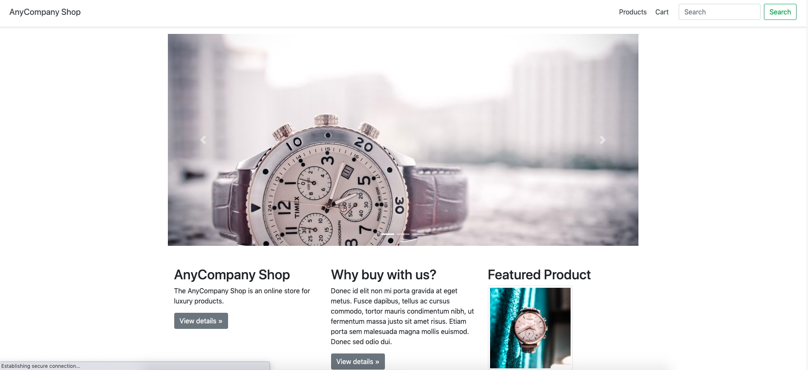

# Configure an EKS micro-service application
## Create EKS Cluster

```bash
eksctl create cluster \
--name observability-workshop \
--version 1.17 \
--region eu-west-1 \
--nodegroup-name linux-nodes \
--nodes 4 --nodes-min 1 --nodes-max 4 \
--ssh-access --ssh-public-key my-keypair-eu-west1 \
--managed

kubectl get nodes
NAME                                           STATUS   ROLES    AGE   VERSION
ip-192-168-20-121.eu-west-1.compute.internal   Ready    <none>   66m   v1.14.8-eks-b8860f
ip-192-168-52-200.eu-west-1.compute.internal   Ready    <none>   66m   v1.14.8-eks-b8860f
ip-192-168-54-32.eu-west-1.compute.internal    Ready    <none>   66m   v1.14.8-eks-b8860f
ip-192-168-68-139.eu-west-1.compute.internal   Ready    <none>   66m   v1.14.8-eks-b8860f
```

## Deploy “AnyCompany Shop” microservices application

1. Deploy Resources
```bash
# aws cloudformation create-stack \
# --stack-name observability-workshop \
# --template-url https://s3.amazonaws.com/aws-tracing-workshop-artifacts/cloudformation.yaml --capabilities CAPABILITY_NAMED_IAM --region eu-west-1

# aws cloudformation wait stack-create-complete --stack-name observability-workshop

git clone https://github.com/aws-samples/reinvent2018-dev303-code.git

cd reinvent2018-dev303-code/
sed -i 's/us-west-2/eu-west-1/g' deploy/eks/prep.yaml
kubectl create -f deploy/eks/prep.yaml
```

2. Prepare and deploy credentials
```bash
AWS_REGION=eu-west-1
# Get the nodegroup (assuming there is only 1 nodegroup at this point)
NODEGROUP=$(eksctl get nodegroups --cluster=observability-workshop --region=$AWS_REGION | awk '{print $2}' | tail -n1)
echo $NODEGROUP
# Get EKS worker node IAM instance role ARN
PROFILE=$(aws ec2 describe-instances --filters Name=tag:Name,Values=observability-workshop-$NODEGROUP-Node --query 'Reservations[0].Instances[0].IamInstanceProfile.Arn' --output text --region=$AWS_REGION | cut -d '/' -f 2)
echo $PROFILE
# Fetch IAM instance role name
ROLE=$(aws iam get-instance-profile --instance-profile-name $PROFILE --query "InstanceProfile.Roles[0].RoleName" --output text --region=$AWS_REGION)
echo $ROLE # Print role name

# Attach IAM policy for Orderservice
ARN=$(aws iam list-policies --query "Policies[?PolicyName=='AmazonSQSFullAccess'].Arn" --output text --region=$AWS_REGION)
echo $ARN
aws iam attach-role-policy --role-name $ROLE --policy-arn $ARN --region=$AWS_REGION

# Attach IAM policy for Catalogservice
ARN=$(aws iam list-policies --query "Policies[?PolicyName=='AmazonDynamoDBFullAccess'].Arn" --output text --region=$AWS_REGION)
echo $ARN
aws iam attach-role-policy --role-name $ROLE --policy-arn $ARN  --region=$AWS_REGION
```

3. Deploy “AnyCompany Shop” and loadgen Pod which is generating traffic to simplify the next two labs.
```bash
kubectl create -f deploy/services
kubectl get pods -n microservices-aws

NAME                                  READY   STATUS    RESTARTS   AGE
cartservice-c6f8c5c77-75rmt           1/1     Running   0          83s
cartservice-c6f8c5c77-gh8gv           1/1     Running   0          83s
catalogservice-576c5cf68b-cmt75       1/1     Running   0          83s
catalogservice-576c5cf68b-k72pb       1/1     Running   0          83s
frontend-644bf55b4b-dgxqt             1/1     Running   0          82s
frontend-644bf55b4b-l69pn             1/1     Running   0          82s
imageservice-64ccb8b9b8-2txbv         1/1     Running   0          82s
imageservice-64ccb8b9b8-ntzg9         1/1     Running   0          82s
loadgen-5d8cdd54c9-wmq9r              1/1     Running   0          82s
orderservice-79dcc56ccf-lxjwp         1/1     Running   0          82s
orderservice-79dcc56ccf-rgt8f         1/1     Running   0          82s
recommenderservice-7d96c7d44c-459t8   1/1     Running   0          81s
recommenderservice-7d96c7d44c-lv7t4   1/1     Running   0          81s
redis-6d8d9b9869-hvjgm                1/1     Running   0          81s
```

4. Get Frontend endpoint
```bash
kubectl get svc -o jsonpath='{.items[?(@.metadata.name == "frontend-external")].status.loadBalancer.ingress[0].hostname}' -n microservices-aws
```
Copy the URL into your browser and explore the "AnyCompany Shop". Add a product to your cart and proceed to checkout.

