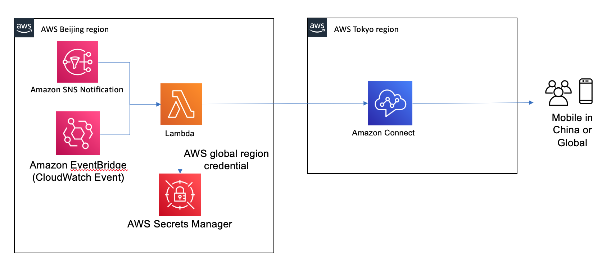
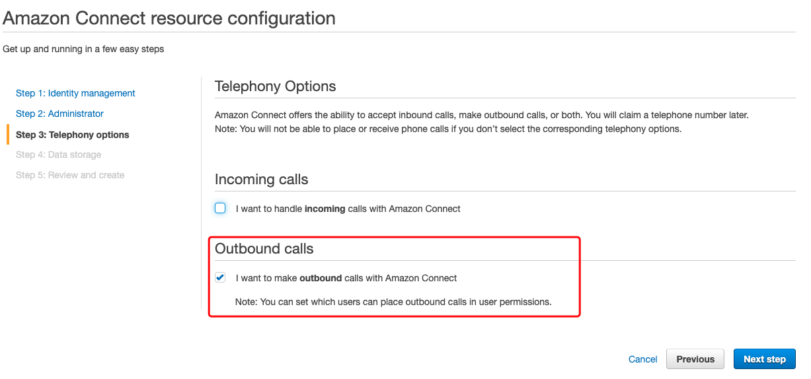
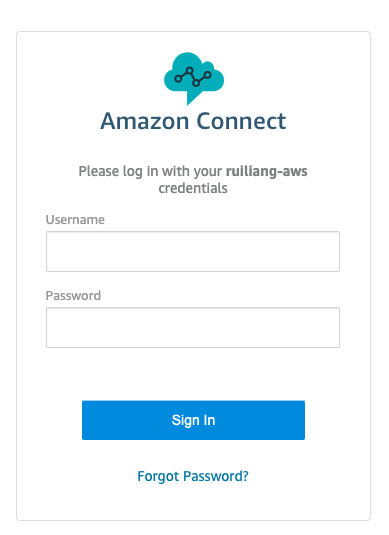
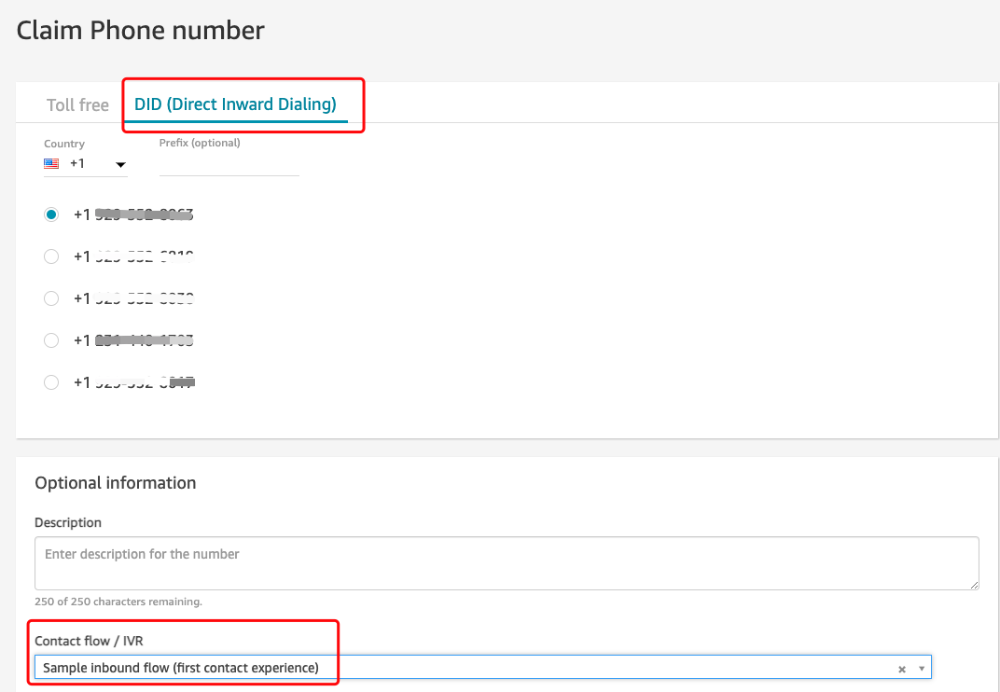
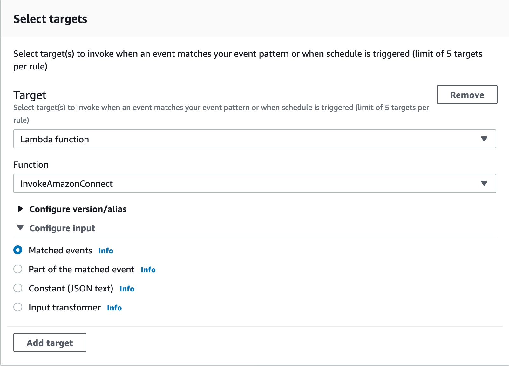
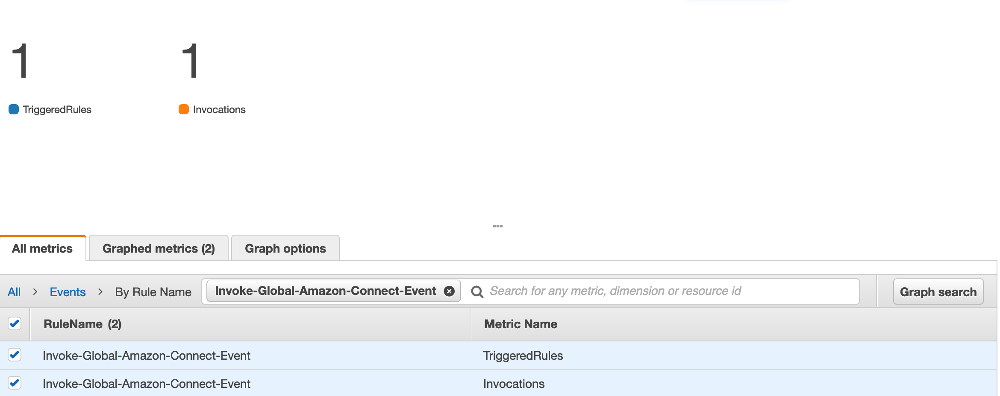
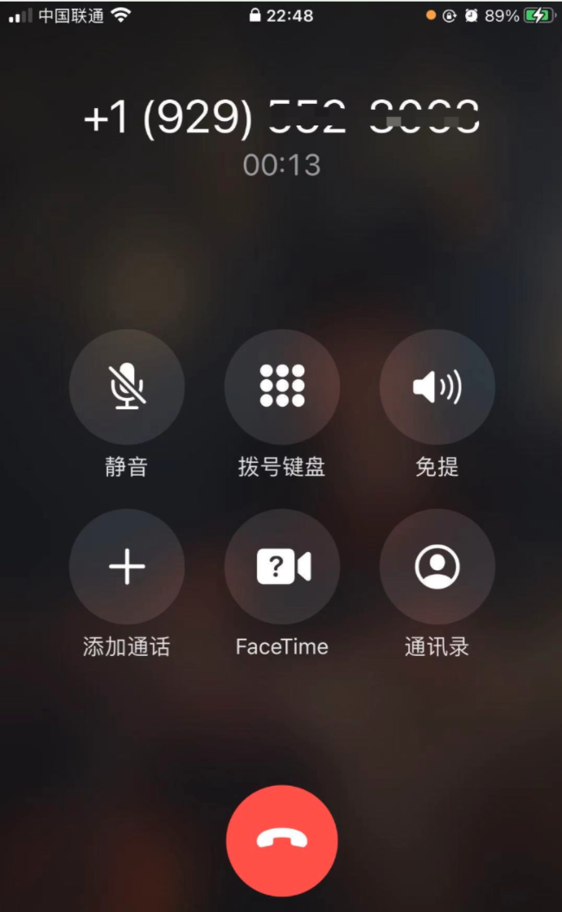

# Use the Amazon Connect to call out the mobile phone

Amazon Connect is an easy to use omnichannel cloud contact center, which provides a seamless experience across voice and chat for your customers and agents. 

This demo will use the Amazon Connect to call out the mobile phone which invoked by lambda. The lambda can be trigged by different event source wuch as CloudWatch, SNS, etc.



## Configuration
1. Enable the Amazon Connect outbound calls, here I use the Tokyo region (ap-northeast-1) for demo.


2. Login your Amazon Connect dashboard with `Login URL` to configure the callout phone number and contact flow


3. Claim Phone number



4. Create the Lambda `InvokeAmazonConnect` with code [connect.py](scripts/connect.py)
- Python 3.8 runtime
- 30s timeout
- 128M memory
- In this demo, I use the AWS Secret Manager to store the AWS Global region credential with name `/prod/global/credential`. You need define it in China region with 2 key/value pair
  - `AWS_ACCESS_KEY_ID`
  - `AWS_SECRET_ACCESS_KEY`
- Update the [connect.py](scripts/connect.py) with your Amazon Connect instance setting and call-out number. Please replace the values of `replace-with-*` parameters

  At the top-left of your contact flow, under the `Name`, see the `Additional Information` section. 

  - `DestinationPhoneNumber` = The phone number which you want to call out
  - `ContactFlowId` = The contact flow ID is after the `contact-flow/` in the ARN string.
  - `InstanceId` = The instance ID is the unique ID after `instance/` and before `contact-flow/` in the ARN string
  - `SourcePhoneNumber` = The claimed phone number which used to place the call


5. Configure the Lambda function trigger event
- Event Bridge Event rule `Invoke-Global-Amazon-Connect-Event`

  ```json
  {
    "source": [
      "ConnectEvent.alert"
    ]
  }
  ```
- Set the Target as Lambda function `InvokeAmazonConnect`



- Fire sample Event, when `{"customEvent": {"ConnectEvent": "alert"}}`, the lambda will be triggered, then invoke the Amazon Connect to drop a call to `Destination Phone Number`
  ```bash
  python scripts/put-sample-event.py
  [ec2-user@ip-10-0-2-83 scripts]$ python put-sample-event.py 
  {"customEvent": {"ConnectEvent": "ok"}}
  {'FailedEntryCount': 0, 'Entries': [{'EventId': '89426ab5-7b1e-50aa-3628-8c7a3fce7df6'}], 'ResponseMetadata': {'RequestId': '34e3f738-56dd-4721-916b-796bcf0bd6fd', 'HTTPStatusCode': 200, 'HTTPHeaders': {'x-amzn-requestid': '34e3f738-56dd-4721-916b-796bcf0bd6fd', 'content-type': 'application/x-amz-json-1.1', 'content-length': '85', 'date': 'Mon, 21 Dec 2020 15:31:05 GMT'}, 'RetryAttempts': 0}}
  [ec2-user@ip-10-0-2-83 scripts]$ python put-sample-event.py 
  {"customEvent": {"ConnectEvent": "alert"}}
  {'FailedEntryCount': 0, 'Entries': [{'EventId': '7b42cd9e-7971-79cb-d29a-f09d7b4faacc'}], 'ResponseMetadata': {'RequestId': 'ec345be1-cae7-4d00-8bdd-d35109da74ae', 'HTTPStatusCode': 200, 'HTTPHeaders': {'x-amzn-requestid': 'ec345be1-cae7-4d00-8bdd-d35109da74ae', 'content-type': 'application/x-amz-json-1.1', 'content-length': '85', 'date': 'Mon, 21 Dec 2020 15:35:31 GMT'}, 'RetryAttempts': 0}}
  ```
  

6. Verify the call-out can be reach to your `Destination Phone Number`



# Reference
[Using amazon-connect-callout github repo](https://github.com/forhead/amazon-connect-callout)

[Automating outbound calling to customers using Amazon Connect](https://aws.amazon.com/blogs/contact-center/automating-outbound-calling-to-customers-using-amazon-connect/)

[Amazon Connect](https://aws.amazon.com/connect/)