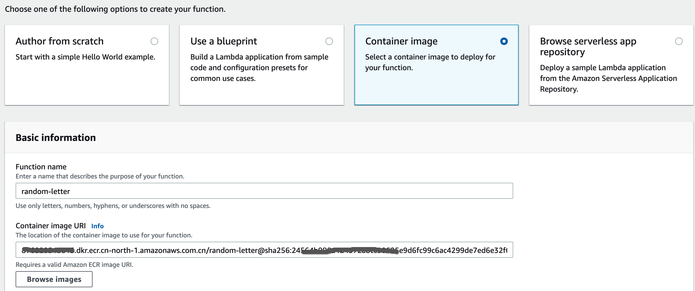
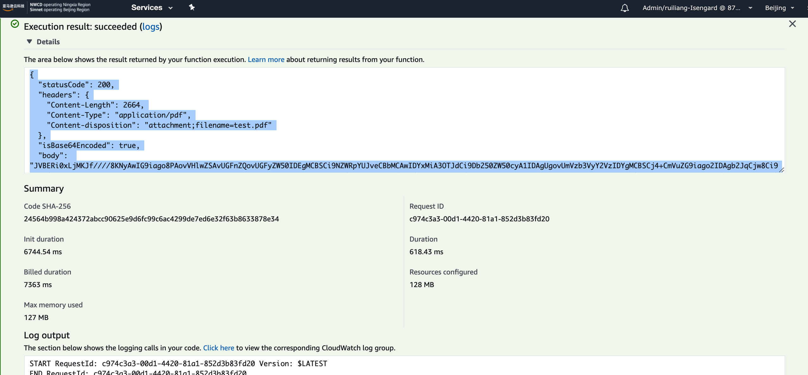

# AWS Lambda – Container Image Support

Now Customer can package and deploy Lambda functions as container images of up to 10 GB in size. It is useful for building and deploying larger workloads that rely on sizable dependencies, such as machine learning or data intensive workloads on Lambda

We are providing base images for all the supported Lambda runtimes (Python, Node.js, Java, .NET, Go, Ruby) and base images for custom runtimes based on Amazon Linux that you can extend to include your own runtime implementing the Lambda Runtime API. You can deploy your own arbitrary base images to Lambda, for example images based on Alpine or Debian Linux. To work with Lambda, these images must implement the Lambda Runtime API. 

There is a Lambda Runtime Interface Emulator that enables you to perform local testing of the container image and check that it will run when deployed to Lambda. It is open source project.

Here is common workflow to use the lambda container image


# Example of AWS-Provided base image
## generating a PDF file using the PDFKit module based on Node.js lambda runtime

1. Create the [app.js](scripts/lambda_container/app.js) as lambda function code
```bash
mkdir lambda-container
cd lambda-container
touch app.js
```
2. Intial the package
    ```bash
    curl -o- https://raw.githubusercontent.com/nvm-sh/nvm/v0.34.0/install.sh | bash
    . ~/.nvm/nvm.sh
    nvm install node or nvm install 12.22
    node -e "console.log('Running Node.js ' + process.version)"

    npm init
    {
    "name": "pdfkit-demo",
    "version": "1.0.0",
    "description": "lambda container pdfkit demo",
    "main": "app.js",
    "scripts": {
        "test": "echo \"Error: no test specified\" && exit 1"
    },
    "author": "ruiliang",
    "license": "ISC"
    }

    ```

3. Create the package.json and package-lock.json files
    ```bash
    npm install pdfkit
    npm install faker
    npm install get-stream
    ```

4. Build the docker image
- [Dockerfile](scripts/lambda_container/Dockerfile)
    ```
    FROM amazon/aws-lambda-nodejs:12
    COPY app.js package*.json ./
    RUN npm install
    CMD [ "app.lambdaHandler" ]
    ```

- Build the random-letter container image
    ```bash
    docker build -t random-letter .
    ```

- Test locally
    ```bash
    docker run -p 9000:8080 random-letter:latest

    curl -XPOST "http://localhost:9000/2015-03-31/functions/function/invocations" -d '{}'
    ```

5. upload the container image to ECR
    ```bash
    aws ecr create-repository --repository-name random-letter --image-scanning-configuration scanOnPush=true --profile china --region cn-north-1
    docker tag random-letter:latest YOUR_ACCOUNT_ID.dkr.ecr.cn-north-1.amazonaws.com.cn/random-letter:latest
    aws ecr get-login-password --profile china --region cn-north-1 | docker login --username AWS --password-stdin YOUR_ACCOUNT_ID.dkr.ecr.cn-north-1.amazonaws.com.cn
    docker push YOUR_ACCOUNT_ID.dkr.ecr.cn-north-1.amazonaws.com.cn/random-letter:latest
    ```

6. Create the Lambda Functions for container
- Create the function and select `container image`


- Testing function


7. Create a HTTP API with the API Gateway which backend is Lambda


8. Testing: access the API endpoint to generate the PDF file
    ```bash
    wget -O test.pdf https://kqw3bd0dtg.execute-api.cn-north-1.amazonaws.com.cn/default/random-letter
    ......
    HTTP request sent, awaiting response... 200 OK
    Length: 1926 (1.9K) [application/pdf]
    Saving to: ‘test.pdf’

    test.pdf                                100%[===============================================================================>]   1.88K  --.-KB/s    in 0s

    2021-09-15 19:30:25 (612 MB/s) - ‘test.pdf’ saved [1926/1926]
    ```

## Building a Custom base image 

Build an iamge based on python 3.9

1. Create the [app.py](scripts/lambda-container-custom/app.py) as lambda function
```bash
mkdir lambda-container-custom
cd lambda-container-custom
mkdir app && cd app
touch app.py
```

2. Create the [Dockerfile](scripts/lambda-container-custom/Dockerfile)
Here use the open source implementations of the [Lambda Runtime Interface Clients](https://docs.aws.amazon.com/lambda/latest/dg/runtimes-images.html) (which implement the Runtime API) for all the supported runtimes. 

3. Create the entry point script [entry.sh](scripts/lambda-container-custom/entry.sh)

4. Build the lambda-container-custom container image
    ```bash
    docker build -t lambda-container-custom .
    ```

5. Test locally

    The AWS Lambda Runtime Interface Emulator (RIE) is a proxy for the Lambda Runtime API that allows you to locally test your Lambda function packaged as a container image. The AWS base images for Lambda include the runtime interface emulator. You can also follow these steps if you built the RIE into your custom base image. 

    ```bash
    docker run -p 9000:8080 lambda-container-custom:latest 

    curl -XPOST "http://localhost:9000/2015-03-31/functions/function/invocations" -d '{}'

    "Hello from AWS Lambda using Python3.9.5 (default, May  4 2021, 18:42:26) \n[GCC 9.3.0]!"
    ```

6. upload the container image to ECR
    ```bash
    aws ecr create-repository --repository-name lambda-container-custom --image-scanning-configuration scanOnPush=true --profile china --region cn-north-1
    docker tag lambda-container-custom:latest YOUR_ACCOUNT_ID.dkr.ecr.cn-north-1.amazonaws.com.cn/lambda-container-custom:latest
    aws ecr get-login-password --profile china --region cn-north-1 | docker login --username AWS --password-stdin YOUR_ACCOUNT_ID.dkr.ecr.cn-north-1.amazonaws.com.cn
    docker push YOUR_ACCOUNT_ID.dkr.ecr.cn-north-1.amazonaws.com.cn/lambda-container-custom:latest
    ```

7. Create the Lambda Functions for container
- Create the function and select `container image`


- Testing function


## Using container image support for AWS Lambda with AWS SAM
1. Install [SAM CLI](https://docs.aws.amazon.com/serverless-application-model/latest/developerguide/serverless-sam-cli-install.html)

2. Create the application
```bash
mkdir lambda-container-sam && cd lambda-container-sam
sam init

Which template source would you like to use?
        1 - AWS Quick Start Templates
        2 - Custom Template Location
Choice: 1
What package type would you like to use?
        1 - Zip (artifact is a zip uploaded to S3)
        2 - Image (artifact is an image uploaded to an ECR image repository)
Package type: 2

Which base image would you like to use?
        1 - amazon/nodejs14.x-base
        2 - amazon/nodejs12.x-base
        3 - amazon/nodejs10.x-base
        4 - amazon/python3.8-base
        5 - amazon/python3.7-base
        6 - amazon/python3.6-base
        7 - amazon/python2.7-base
        8 - amazon/ruby2.7-base
        9 - amazon/ruby2.5-base
        10 - amazon/go1.x-base
        11 - amazon/java11-base
        12 - amazon/java8.al2-base
        13 - amazon/java8-base
        14 - amazon/dotnet5.0-base
        15 - amazon/dotnetcore3.1-base
        16 - amazon/dotnetcore2.1-base
Base image: 2

Project name [sam-app]: lambda-contaimer-sam-app

Cloning app templates from https://github.com/aws/aws-sam-cli-app-templates

    -----------------------
    Generating application:
    -----------------------
    Name: lambda-contaimer-sam-app
    Base Image: amazon/nodejs12.x-base
    Dependency Manager: npm
    Output Directory: .

    Next steps can be found in the README file at ./lambda-contaimer-sam-app/README.md
        

SAM CLI update available (1.31.0); (1.19.0 installed)
To download: https://docs.aws.amazon.com/serverless-application-model/latest/developerguide/serverless-sam-cli-install.html
```

3. Exploring the application template.yaml
- `PackageType: Image` tells AWS SAM that this function is using container images
- `Metadata` section that helps AWS SAM manage the container images
```yaml
    Properties:
      PackageType: Image
    ....
    Metadata:
      DockerTag: nodejs12.x-v1
      DockerContext: ./hello-world
      Dockerfile: Dockerfile
```
- Update the API endpoint to china region format
```yaml
HelloWorldApi:
    Description: "API Gateway endpoint URL for Prod stage for Hello World function"
    Value: !Sub "https://${ServerlessRestApi}.execute-api.${AWS::Region}.amazonaws.com.cn/Prod/hello/"
```

4. Local development of the application
```bash
cd lambda-contaimer-sam-app/
sam build

sam local invoke HelloWorldFunction

Invoking Container created from helloworldfunction:nodejs12.x-v1
Building image.................
Skip pulling image and use local one: helloworldfunction:rapid-1.19.0.

START RequestId: 911022c1-737a-48d2-8ccd-35e1bdb98e9d Version: $LATEST
END RequestId: 911022c1-737a-48d2-8ccd-35e1bdb98e9d
REPORT RequestId: 911022c1-737a-48d2-8ccd-35e1bdb98e9d  Init Duration: 0.40 ms  Duration: 77.58 ms      Billed Duration: 100 ms Memory Size: 128 MB     Max Memory Used: 128 MB
{"statusCode":200,"body":"{\"message\":\"hello world from lambda container sam demo\"}"}
```

OR You can also combine these commands and `add flags for cached and parallel builds`:

```bash
sam build --cached --parallel && sam local invoke HelloWorldFunction
```

5. Deploying the application

There are two ways to deploy container-based Lambda functions with AWS SAM.
- `sam deploy` command. The deploy command tags the local container image, uploads it to ECR, and then creates or updates your Lambda function. 
- `sam package` command used in CI/CD pipelines, where the deployment process is separate from the artifact creation process.

Here we use the `sam deploy`

- Create the ECR repository
```bash
aws ecr create-repository --repository-name lambda-contaimer-sam-app --image-tag-mutability IMMUTABLE \
--image-scanning-configuration scanOnPush=true --profile china --region cn-north-1

aws ecr get-login-password --profile china --region cn-north-1 | docker login --username AWS --password-stdin YOUR_ACCOUNT_ID.dkr.ecr.cn-north-1.amazonaws.com.cn
```

- Deploy
```bash
sam deploy -g --profile china

Configuring SAM deploy
======================

        Looking for config file [samconfig.toml] :  Not found

        Setting default arguments for 'sam deploy'
        =========================================
        Stack Name [sam-app]: lambda-contaimer-sam-app
        AWS Region [us-east-1]: cn-north-1
        Image Repository for HelloWorldFunction: YOUR_ACCOUNT_ID.dkr.ecr.cn-north-1.amazonaws.com.cn/lambda-contaimer-sam-app
          helloworldfunction:nodejs12.x-v1 to be pushed to YOUR_ACCOUNT_ID.dkr.ecr.cn-north-1.amazonaws.com.cn/lambda-contaimer-sam-app:helloworldfunction-70ec1299901b-nodejs12.x-v1

        #Shows you resources changes to be deployed and require a 'Y' to initiate deploy
        Confirm changes before deploy [y/N]: y
        #SAM needs permission to be able to create roles to connect to the resources in your template
        Allow SAM CLI IAM role creation [Y/n]: y
        HelloWorldFunction may not have authorization defined, Is this okay? [y/N]: y
        Save arguments to configuration file [Y/n]: y
        SAM configuration file [samconfig.toml]: 
        SAM configuration environment [default]: 

        ....

        CloudFormation stack changeset
-------------------------------------------------------------------------------------------
Operation   LogicalResourceId     ResourceType   Replacement         
-------------------------------------------------------------------------------------------
+ Add  HelloWorldFunctionHelloWorldPermissionProd AWS::Lambda::Permission  N/A    
+ Add  HelloWorldFunctionRole  AWS::IAM::Role   N/A   
+ Add  HelloWorldFunction AWS::Lambda::Function  N/A    
+ Add  ServerlessRestApiDeployment47a75decb5 AWS::ApiGateway::Deployment   N/A 
+ Add  ServerlessRestApiProdStage  AWS::ApiGateway::Stage   N/A  
+ Add  ServerlessRestApi  AWS::ApiGateway::RestApi     N/A 
-------------------------------------------------------

...
Successfully created/updated stack - lambda-contaimer-sam-app in cn-north-1

curl https://lk4qizrw6e.execute-api.cn-north-1.amazonaws.com.cn/Prod/hello/
{"message":"hello world from lambda container sam demo"}

```

- Multiple lambda functions deployment
```bash
cd lambda-contaimer-sam-app
cp -R hello-world hola-world
cp template.yaml template.yaml.singlefunction
modify the template.yaml to support multiple functions
modify hola-world/app.js 

aws ecr create-repository --repository-name lambda-contaimer-sam-app-multifunction --image-tag-mutability IMMUTABLE \
--image-scanning-configuration scanOnPush=true --profile china --region cn-north-1

sam build 

sam deploy -g --profile china
    Keep the same stack name, Region, and Image Repository for HelloWorldFunction.
    Use the new repository for HolaWorldFunction.
    For the remaining steps, use the same values from before. For Lambda functions not to have authorization defined, enter Y.

Configuring SAM deploy
======================

        Looking for config file [samconfig.toml] :  Found
        Reading default arguments  :  Success

        Setting default arguments for 'sam deploy'
        =========================================
        Stack Name [lambda-contaimer-sam-app]: 
        AWS Region [cn-north-1]: 
        Image Repository for HelloWorldFunction [YOUR_ACCOUNT_ID.dkr.ecr.cn-north-1.amazonaws.com.cn/lambda-contaimer-sam-app-multifunction]: YOUR_ACCOUNT_ID.dkr.ecr.cn-north-1.amazonaws.com.cn/lambda-contaimer-sam-app
        Image Repository for HolaWorldFunction []: YOUR_ACCOUNT_ID.dkr.ecr.cn-north-1.amazonaws.com.cn/lambda-contaimer-sam-app-multifunction
          helloworldfunction:nodejs12.x-v1 to be pushed to YOUR_ACCOUNT_ID.dkr.ecr.cn-north-1.amazonaws.com.cn/lambda-contaimer-sam-app:helloworldfunction-70ec1299901b-nodejs12.x-v1
          holaworldfunction:nodejs12.x-v1 to be pushed to YOUR_ACCOUNT_ID.dkr.ecr.cn-north-1.amazonaws.com.cn/lambda-contaimer-sam-app-multifunction:holaworldfunction-db1056b2d0af-nodejs12.x-v1

        #Shows you resources changes to be deployed and require a 'Y' to initiate deploy
        Confirm changes before deploy [Y/n]: y
        #SAM needs permission to be able to create roles to connect to the resources in your template
        Allow SAM CLI IAM role creation [Y/n]: y
        HelloWorldFunction may not have authorization defined, Is this okay? [y/N]: y
        HolaWorldFunction may not have authorization defined, Is this okay? [y/N]: y
        Save arguments to configuration file [Y/n]: y
        SAM configuration file [samconfig.toml]:  
        SAM configuration environment [default]: 

CloudFormation stack changeset
-------------------------------------------------------
Operation  LogicalResourceId  ResourceType   Replacement    
-------------------------------------------------------
+ Add   HolaWorldFunctionHolaWorldPermissionProd    AWS::Lambda::Permission     N/A      
+ Add   HolaWorldFunctionRole                       AWS::IAM::Role            N/A     
+ Add   HolaWorldFunction                      AWS::Lambda::Function   N/A  
+ Add   ServerlessRestApiDeployment4304ff0872  AWS::ApiGateway::Deployment   N/A  
* Modify  HelloWorldFunction  AWS::Lambda::Function  False      
* Modify  ServerlessRestApiProdStage  AWS::ApiGateway::Stage   False   
* Modify ServerlessRestApi   AWS::ApiGateway::RestApi  False 
- Delete ServerlessRestApiDeployment47a75decb5    AWS::ApiGateway::Deployment   N/A      
-------------------------------------------------------------------------------------------------------------------------------------------------------------------------------------------------------------------------------------------------------------------------------------------------------------


Successfully created/updated stack - lambda-contaimer-sam-app in cn-north-1

curl https://lk4qizrw6e.execute-api.cn-north-1.amazonaws.com.cn/Prod/hola/ 
{"message":"hola world from lambda container sam demo in the second lambda function"}

curl https://lk4qizrw6e.execute-api.cn-north-1.amazonaws.com.cn/Prod/hello/ 
{"message":"hello world from lambda container sam demo"}
```

# Cleanup
```bash
sam delete --profile china

aws lambda delete-function --function-name random-letter --profile china --region cn-north-1
aws lambda delete-function --function-name lambda-container-custom --profile china --region cn-north-1

aws ecr batch-delete-image --repository-name random-letter --image-ids imageTag=latest --profile china --region cn-north-1
aws ecr delete-repository --repository-name random-letter --profile china --region cn-north-1

aws ecr batch-delete-image --repository-name lambda-container-custom --image-ids imageTag=latest --profile china --region cn-north-1
aws ecr delete-repository --repository-name lambda-container-custom --profile china --region cn-north-1
aws ecr delete-repository --repository-name lambda-contaimer-sam-app --profile china --region cn-north-1
aws ecr delete-repository --repository-name lambda-contaimer-sam-app-multifunction --profile china --region cn-north-1
```

# Reference
[AWS Lambda – Container Image Support Announcement](https://aws.amazon.com/blogs/aws/new-for-aws-lambda-container-image-support/)

[Lambda images guide](https://docs.aws.amazon.com/lambda/latest/dg/lambda-images.html)

[Using container image support for AWS Lambda with AWS SAM](https://aws.amazon.com/blogs/compute/using-container-image-support-for-aws-lambda-with-aws-sam/)