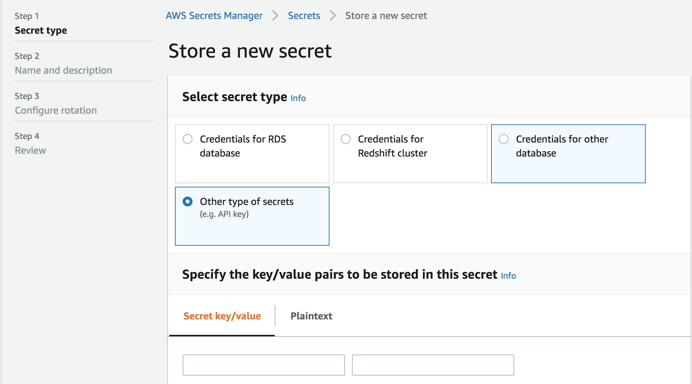
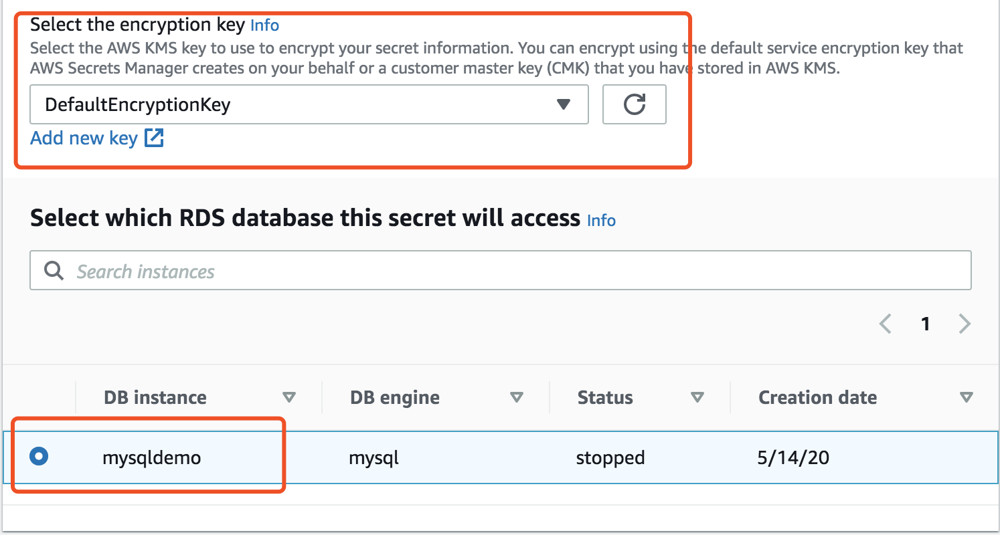

# AWS Secrets Manager Quick Start Tutorials

[Offical Secrets Manager Tutorials doc](https://docs.aws.amazon.com/secretsmanager/latest/userguide/tutorials.html)

## Customer type secret
1. Create new Secrets from AWS Secrets Manager Console

Navigate to AWS Secrets Manager->Secrets



Then Run the [secret-mgr-demo](secret-mgr-demo.py) on EC2 or Lambda

2. Create new AWS Secrets by AWS CLI under 444455556666 account and use the CMK created above.
  ```bash
  aws secretsmanager create-secret --name MyTestDatabaseMasterSecret --description "Test secret for RDS" \
    --kms-key-id {cmk-arn} --secret-string file://mycreds.json \
    --region cn-north-1 --profile cn-north-1
  ```
Then Run the [rds-secret-mgr-demo](rds-secret-mgr-demo.py) on EC2 or Lambda

## Secret for AWS RDS / AWS Redshift
1. Create new Secrets from AWS Secrets Manager Console

Select the RDS connection


Select the RDS instance



Then Run the [rds-secret-mgr-demo.py](rds-secret-mgr-demo.py) on EC2 or Lambda

## How do I share AWS Secrets Manager secrets between AWS accounts?

The Security_Account user manages your credentials, and the Dev_Account application retrieves secrets in the Security_Account user account.

A secret named quickstart/ExternalCMKSecret in your Security_Account is encrypted using a customer master key (CMK) DevSecretCMK. Then the secret is shared with your Dev_Account.

Follow the guide https://aws.amazon.com/premiumsupport/knowledge-center/secrets-manager-share-between-accounts/

Then run the [secret-mgr-demo-external-account](secret-mgr-demo-external-account.py) on EC2 or Lambda

