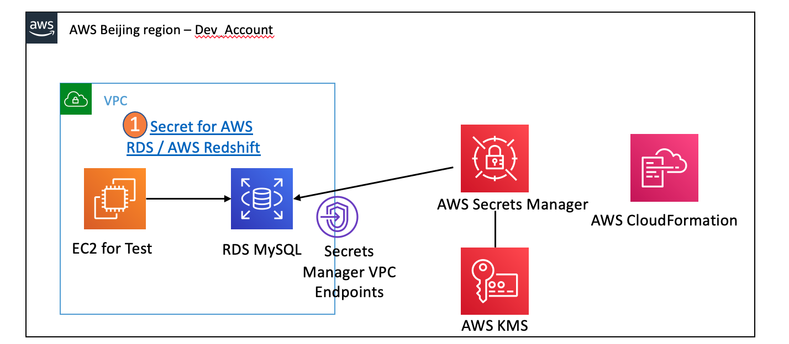

# Automating secret creation in AWS CloudFormation

[Official guide for Automating secret creation in AWS CloudFormation](https://docs.aws.amazon.com/secretsmanager/latest/userguide/integrating_cloudformation.html)

## Example: Using CloudFormation templates create an Amazon RDS MySQL DB instance using the credentials stored in the Secrets Manager as the master user and password. 



The secret has a resource-based policy attached that specifies access to the secret. The template also creates a Lambda rotation function and configures the secret to automatically rotate every 30 days. 

1. Deploy [CloudFormation Template](scripts/secrets-mgr-rds.yaml)

- If you need CloudFormation create the secret for you and enable rotation, then you select `EnableRotation` as `true`.
- If you need use the existed secret and disable rotation, then you select `EnableRotation` as `true`.
- `TestEC2SecurityGroupId` is Security group of EC2 which connect to RDS MySQL
- `TestSecretArn` is the existed secret in your account or other account
- `TestSubnet01`, `TestSubnet02` and `TestVpcId` are IDs hosted new created RDS MySQL

2. Connect the RDS with credentials stored in the Secrets Manager as the master user and password.

    The RDS endpoint and port can get from CloudFormation stack `Outputs`

    In my demo, I use the existed secret named `quickstart/MyCustomTypeSecret`

    ```bash
    # Check the secret
    aws secretsmanager describe-secret --secret-id quickstart/MyCustomTypeSecret --region cn-north-1

    # Get the value of master user and password
    masterUser=$(aws secretsmanager get-secret-value --secret-id quickstart/MyCustomTypeSecret --version-stage AWSCURRENT --output json --region cn-north-1 | jq -r .SecretString | jq -r .username )
    echo $masterUser
    masterPassword=$(aws secretsmanager get-secret-value --secret-id quickstart/MyCustomTypeSecret --version-stage AWSCURRENT --output json --region cn-north-1 | jq -r .SecretString | jq -r .password )
    echo $masterPassword

    # Get the RDS MySQL endpoint
    dbEndPoint=$(aws cloudformation describe-stacks --region cn-north-1 --stack-name Screte-Mgr-RDS --query 'Stacks[0].Outputs[?OutputKey==`dbEndPoint`].OutputValue' --output json | jq -r '.[0]')

    # Connect the RDS MySQL
    mysql -h $dbEndPoint -u $masterUser -p
    ```


## Example: RDS MySQL DB instance using the credentials stored in the Secrets Manager as the master user and password. The Secrets is created by other account


1. Finish the steps for [Access Secrets from other Account](https://aws.amazon.com/premiumsupport/knowledge-center/secrets-manager-share-between-accounts/)

- Step 1: Create and attach a resource policy for Security_Account

    Security_Account is the owner of Secrets and policy allow 

    ```json
    {
    "Version" : "2012-10-17",
    "Statement" : [ {
        "Effect" : "Allow",
        "Principal" : {
        "AWS" : ["arn:aws-cn:iam::Dev_Account:role/ec2-secrets-role","arn:aws-cn:iam::Dev_Account:role/cloudformation-role"]
        },
        "Action" : ["secretsmanager:GetSecretValue","secretsmanager:DescribeSecret"],
        "Resource" : "*"
    }
    ]
    }
    ```

- Step 2: Update the KMS key policy in your Security_Account account

    Allow Dev_Account role to use the KMS key to decrypt secrets of Security_Account when retrieve the them

    ```json
    {
                "Sid": "Allow use of the key",
                "Effect": "Allow",
                "Principal": {
                    "AWS": [
                        "arn:aws-cn:iam::Security_Account:role/Admin",
                        "arn:aws-cn:iam::Dev_Account:role/ec2-secrets-role",
                        "arn:aws-cn:iam::Dev_Account:role/cloudformation-role"
                    ]
                },
                "Action": [
                    "kms:Decrypt",
                    "kms:GenerateDataKey*",
                    "kms:DescribeKey"
                ],
                "Resource": "arn:aws-cn:kms:cn-north-1:Security_Account:key/SECETES_CMK"
            }
    ```

- Step 3: Grant the Dev_Account IAM role permission to retrieve the secret
    ```json
    {
        "Version": "2012-10-17",
        "Statement": [
            {
                "Effect": "Allow",
                "Action": ["secretsmanager:GetSecretValue","secretsmanager::DescribeSecret"],
                "Resource": " arn:aws-cn:secretsmanager:cn-north-1:Security_Account:secret:SecurityAcount/SharedSecrets/RDSMySQL"
            },
            {
                "Effect": "Allow",
                "Action": [
                    "kms:Decrypt",
                    "kms:DescribeKey"
                ],
                "Resource": "arn:aws-cn:kms:cn-north-1:Security_Account:key/SECETES_CMK"
            }
        ]
    }
    ```

- Step 4: Test access to the SECURITY_SECRET from the Dev_Account account

    ```bash
    aws sts get-caller-identity --region cn-north-1
    aws secretsmanager describe-secret --secret-id "arn:aws-cn:secretsmanager:cn-north-1:Security_Account:secret:SecurityAcount/SharedSecrets/RDSMySQL" --region cn-north-1

    aws secretsmanager get-secret-value --secret-id "arn:aws-cn:secretsmanager:cn-north-1:Security_Account:secret:SecurityAcount/SharedSecrets/RDSMySQL" --version-stage AWSCURRENT --region cn-north-1
    ```

2. Deploy [CloudFormation Template](scripts/secrets-mgr-rds.yaml) from Dev_Account

- `EnableRotation` as `true`.
- `TestEC2SecurityGroupId` is Security group of EC2 which connect to RDS MySQL
- `TestSecretArn` is the existed secret in Security_Account `SecurityAcount/SharedSecrets/RDSMySQL`
- `TestSubnet01`, `TestSubnet02` and `TestVpcId` are IDs hosted new created RDS MySQL
- Make sure your IAM role `cloudformation-role` to create the CloudFormation have below policy
    ```json
    {
        "Version": "2012-10-17",
        "Statement": [
            {
                "Effect": "Allow",
                "Action": ["secretsmanager:GetSecretValue","secretsmanager::DescribeSecret"],
                "Resource": " arn:aws-cn:secretsmanager:cn-north-1:Security_Account:secret:SecurityAcount/SharedSecrets/RDSMySQL"
            },
            {
                "Effect": "Allow",
                "Action": [
                    "kms:Decrypt",
                    "kms:DescribeKey"
                ],
                "Resource": "arn:aws-cn:kms:cn-north-1:Security_Account:key/SECETES_CMK"
            }
        ]
    }
    ```

3. Connect the RDS with credentials stored in the Secrets Manager as the master user and password.

    The RDS endpoint and port can get from CloudFormation stack `Outputs`

    In my demo, I use the existed secret named `SecurityAcount/SharedSecrets/RDSMySQL`

    ```bash
    sudo yum localinstall -y https://dev.mysql.com/get/mysql80-community-release-el7-3.noarch.rpm
    sudo yum install -y mysql-community-client
    sudo yum install -y jq

    # Get the value of master user and password
    masterUser=$(aws secretsmanager get-secret-value --secret-id "arn:aws-cn:secretsmanager:cn-north-1:SecurityAcount:secret:SecurityAcount/SharedSecrets/RDSMySQL" --version-stage AWSCURRENT --output json --region cn-north-1 | jq -r .SecretString | jq -r .username )
    echo $masterUser
    masterPassword=$(aws secretsmanager get-secret-value --secret-id "arn:aws-cn:secretsmanager:cn-north-1:SecurityAcount:secret:SecurityAcount/SharedSecrets/RDSMySQL" --version-stage AWSCURRENT --output json --region cn-north-1 | jq -r .SecretString | jq -r .password )
    echo $masterPassword

    # Get the RDS MySQL endpoint
    dbEndPoint=$(aws cloudformation describe-stacks --region cn-north-1 --stack-name Screte-Mgr-RDS --query 'Stacks[0].Outputs[?OutputKey==`dbEndPoint`].OutputValue' --output json | jq -r '.[0]')
    echo $dbEndPoint

    # Connect the RDS MySQL
    mysql -h $dbEndPoint -u $masterUser -p
    ```

## Cleanup
1. Delete the CloudFormation Stack
```bash
aws cloudformation delete-stack --stack-name Screte-Mgr-RDS --region cn-north-1
```

2. Delete your Testing EC2

3. Delete your secrets