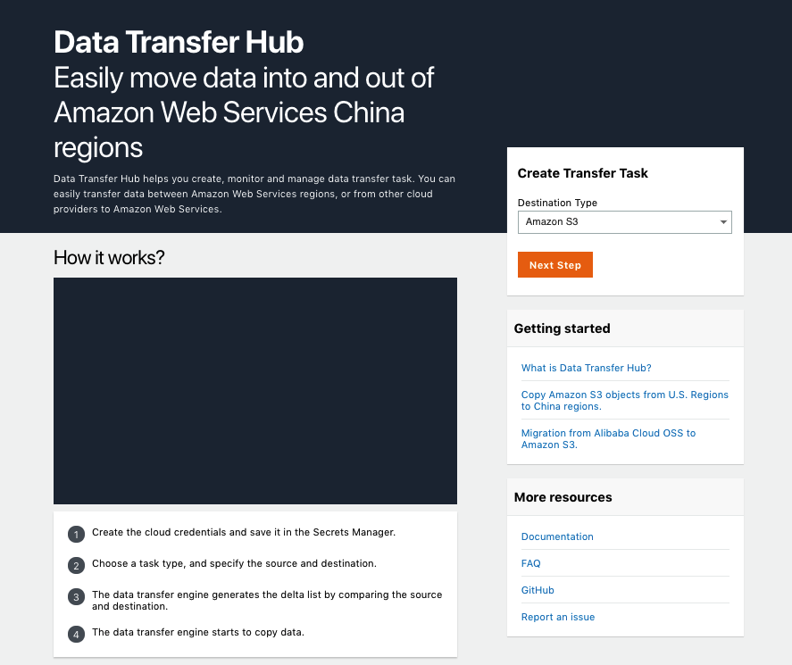
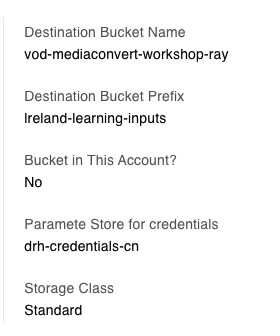

# Sync the public dataset s3 bucket to your bucket

# Option 1: Use the aws-data-replication-hub (Recommanded)

https://github.com/awslabs/aws-data-replication-hub

1. Deploy the [CloudFormation Stack](https://console.aws.amazon.com/cloudformation/home#/stacks/create/template?stackName=DataReplicationHub&templateURL=https://aws-gcr-solutions.s3.amazonaws.com/Aws-data-replication-hub/latest/AwsDataReplicationHub-cognito.template) in Global region, for example `eu-west-1 Ireland` region.

2. Login into the Data Replication Hub Portal
- Check the output of the CloudFormation stack. The `PortalUrl` is the link of the portal.
- An email containing the temporary password will be sent to the provided email address. 
- You will be asked to set a new password when you login the portal


3. Start to create your first replication task.

  Here I replicate source - `Ningxia (cn-northwest-1)` region S3 bucket data to destination - `Ireland (eu-west-1)` region S3 bucket as example

  For the completed user guide, please visit [User Guide](https://github.com/awslabs/aws-data-replication-hub/blob/master/docs/UserManual.md) for more information.

- Configure Credentials in Systems Manager Parameter Store for China region
  - `SecureString` as type
  - Input the credentials as text in Value, the credentials format should follow
  ```json
    {
      "access_key_id": "<Your Access Key ID>",
      "secret_access_key": "<Your Access Key Secret>",
      "region_name": "<Your Region>"
    }
  ```

- Destination Type: S3


- Source
！[S3-replicate-task-source](media/S3-replicate-task-source.png)

- Destination
！[S3-replicate-task-destination](media/S3-replicate-task-destination.png)

- Check status

    1. Source bucket data
    ```bash
    aws s3 ls s3://vod-mediaconvert-workshop-ray/inputs/ --region cn-northwest-1 --summarize --human-readable
    2019-10-17 00:42:07    0 Bytes 
    2019-10-17 00:50:07    5.0 MiB SampleVideo_1280x720_5mb.mp4
    2021-01-07 14:56:49   20.6 MiB TRAILER.mp4
    2021-01-07 14:56:49   88.6 MiB VANLIFE.m2ts
    2020-11-05 22:55:12    3.3 GiB beach_1h_1080p.mp4
    2020-11-05 20:58:39  215.9 MiB topgun_8m_1080p.mp4
    2020-11-05 21:34:15  964.6 MiB topgun_8m_2160p60.mp4

    Total Objects: 7
      Total Size: 4.5 GiB
    ```
  2. Destination data
    ```bash
    aws s3 ls s3://neptune-workshop-storage/cn-vod-inputs/inputs/ --region eu-west-1 --summarize --human-readable --profile us-east-1
    2021-02-01 13:36:03    0 Bytes
    2021-02-01 13:35:49    5.0 MiB SampleVideo_1280x720_5mb.mp4
    2021-02-01 13:35:46   20.6 MiB TRAILER.mp4
    2021-02-01 13:35:51   88.6 MiB VANLIFE.m2ts
    2021-02-01 13:35:46    3.3 GiB beach_1h_1080p.mp4
    2021-02-01 13:35:45  215.9 MiB topgun_8m_1080p.mp4
    2021-02-01 13:35:45  964.6 MiB topgun_8m_2160p60.mp4

    Total Objects: 7
      Total Size: 4.5 GiB
   ```

  3. CloudWatch
  

4. Start to create your second replication task.

    Here I replicate source - `Ireland (eu-west-1)` region S3 bucket data to destination - `Ningxia (cn-northwest-1)` region S3 bucket as example

    For the completed user guide, please visit [User Guide](https://github.com/awslabs/aws-data-replication-hub/blob/master/docs/UserManual.md) for more information.

- Configure Credentials in Systems Manager Parameter Store for China region
  - `SecureString` as type
  - Input the credentials as text in Value, the credentials format should follow
  ```json
    {
      "access_key_id": "<Your Access Key ID>",
      "secret_access_key": "<Your Access Key Secret>",
      "region_name": "<Your Region>"
    }
  ```

- Source

- Destination 

    

- Check status

    1. Source
    ```bash
    aws s3 ls s3://neptune-workshop-storage/learning_media/ --summarize --human-readable --region eu-west-1
    2021-02-01 13:39:43    0 Bytes
    2021-02-01 13:51:45  117.6 MiB Apach Kylin Introduction.mp4
    2021-02-01 13:43:18  333.0 MiB DynamoDB_Deep_Dive_1.mp4
    2021-02-01 13:44:37  313.8 MiB DynamoDB_Deep_Dive_2.mp4
    2021-02-01 13:50:55  150.5 MiB EMR Cost Optimization.mp4
    2021-02-01 13:55:00  177.3 MiB FreeRTOS_Demo.mov
    2021-02-01 13:40:34  373.5 MiB Prerequisite_Networking_knowledge_when_you_starting_your_AWS_networking_trip_Part_1.mp4
    2021-02-01 13:41:49  239.3 MiB Prerequisite_Networking_knowledge_when_you_starting_your_AWS_networking_trip_Part_2.mp4
    2021-02-01 13:52:27  233.8 MiB Redshift for new colleagues.mp4

    Total Objects: 9
      Total Size: 1.9 GiB
    ```

    2. Destination data
    ```bash
    aws s3 ls s3://vod-mediaconvert-workshop-ray/lreland-learning-inputs/learning_media/ --region cn-northwest-1 --summarize --human-readable
    2021-02-01 14:17:47    0 Bytes
    2021-02-01 14:17:46  117.6 MiB Apach Kylin Introduction.mp4
    2021-02-01 14:17:54  313.8 MiB DynamoDB_Deep_Dive_2.mp4
    2021-02-01 14:17:49  177.3 MiB FreeRTOS_Demo.mov
    2021-02-01 14:17:46  239.3 MiB Prerequisite_Networking_knowledge_when_you_starting_your_AWS_networking_trip_Part_2.mp4
    2021-02-01 14:17:52  233.8 MiB Redshift for new colleagues.mp4

    Total Objects: 6
      Total Size: 1.1 GiB
    ```


# Option 2: Directly copy using aws S3 CLI

```
aws s3 cp s3://frankfurt-demo-bucket/demo2ebc.zip - --region eu-central-1 | aws s3 cp - s3://ray-cross-region-sync-bjs/speed-test/demo2ebc.zip --profile china --region cn-north-1
```

# Option 3: Use the [amazon-s3-resumable-upload toolkit](https://github.com/aws-samples/amazon-s3-resumable-upload)

## Case 1: sync the file in the bucket created by [amazon-s3-resumable-upload toolkit](https://github.com/aws-samples/amazon-s3-resumable-upload)

```bash
git clone git@github.com:aws-samples/amazon-s3-resumable-upload.git

# Deploy sync lambda worker
cd amazon-s3-resumable-upload/serverless/cdk-serverless
pip install -r requirements.txt
export AWS_DEFAULT_REGION=us-east-1
cdk deploy --profile ${AWS_GLOBAL_PROFILE} --outputs-file "stack-outputs.json"

# Edit AWS CDK app.py - aws_access_key_id, aws_secret_access_key should be edit Lambda environment variables after deployment
Des_bucket_default = 'covid-19-raw-data-zhy'
Des_prefix_default = 'enigma-jhu'
StorageClass = 'STANDARD'
aws_access_key_id = 'xxxxxxxxx'
aws_secret_access_key = 'xxxxxxxxxxxxxxx'
aws_access_key_region = 'cn-northwest-1'
alarm_email = "alarm_your_email@email.com"
```

## Case 2: Use the existed source S3 bucket and allow configure source S3 bucket to sent notification to the SQS Queue
1. Deploy `lambda sync worker` as the Case 1 
2. Follow up the guide [add-notification-config-to-bucket](https://docs.aws.amazon.com/AmazonS3/latest/dev/ways-to-add-notification-config-to-bucket.html) to configure the S3 event

```bash
aws cloudformation describe-stacks --stack-name s3-migration-serverless --query "Stacks[0].Outputs"
```
Configure the existed S3 bucket of stack output send notification to `SQSJobQueue` of stack output


## Case 3: For existed source s3 bucket which is not under our control but only have read access
Deploy jobsender to scan source and destination bucket and create the job to SQS

```bash
git clone git@github.com:aws-samples/amazon-s3-resumable-upload.git
cd amazon-s3-resumable-upload/serverless/enhanced-lambda-jobsender
pip install -r requirements.txt

export AWS_DEFAULT_REGION=us-east-1

## System Manager Parameter Store create new parameter：Name: s3_migration_credentials, Tier: Standard, Type: SecureString
{
  "aws_access_key_id": "your_aws_access_key_id",
  "aws_secret_access_key": "your_aws_secret_access_key",
  "region": "cn-northwest-1"
}

## Edit AWS CDK app.py 你需要传输的源S3桶/目标S3桶信息，示例如下：
# Define bucket parameter before deploy CDK
bucket_para = [{
    "src_bucket": "covid19-lake",  # The bucket in US
    "src_prefix": "enigma-jhu",
    "des_bucket": "covid-19-raw-data-zhy", # The bucket in China
    "des_prefix": ""
}, {
    "src_bucket": "covid19-lake",  # The bucket in US
    "src_prefix": "enigma-jhu-timeseries",
    "des_bucket": "covid-19-raw-data-zhy",  # The bucket in China
    "des_prefix": ""
}]

StorageClass = 'STANDARD'
alarm_email = "alarm_your_email@email.com"

cdk deploy --profile ${AWS_GLOBAL_PROFILE} --outputs-file "stack-outputs.json"
```

# Case 4 Cluster version
Use the [Amazon S3 MultiThread Resume Migration Cluster Solution](https://github.com/aws-samples/amazon-s3-resumable-upload/blob/master/cluster/README-English.md)

1. Create System Manager Parameter Store

- Name: s3_migration_credentials
- Type: SecureString
- Content: 
```json
{
  "aws_access_key_id": "your_aws_access_key_id",
  "aws_secret_access_key": "your_aws_secret_access_key",
  "region": "cn-northwest-1"
}
```

2. Configure AWS CDK  app.py setting about source / desination S3 bucket and prefix

```json
[{
    "src_bucket": "ray-cross-region-sync-oregon",
    "src_prefix": "broad-references",
    "des_bucket": "ray-cross-region-sync-zhy",
    "des_prefix": "broad-references"
    }, {
    "src_bucket": "your_global_bucket_2",
    "src_prefix": "your_prefix",
    "des_bucket": "your_china_bucket_2",
    "des_prefix": "prefix_2"
    }]
```

3. Configure the alarm notification email address in cdk_ec2stack.py

```python
# Setup your alarm email
alarm_email = "you-email@amazon.com"
```

4. Modify s3_migration_cluster_config.ini Des_bucket_default, JobType，Concurrent Threads.
```bash
cluster/cdk-cluster/code/s3_migration_cluster_config.ini
Des_bucket_default =  NewS3BucketMigrateObjects
Des_prefix_default = your_prefix/
```

3. deploy CDK

```bash
cd amazon-s3-resumable-upload/cluster/cdk-cluster
source ~/python3/env/bin/activate
pip3 install -r requirements.txt
export AWS_DEFAULT_REGION=us-west-2
npm install -g aws-cdk
cdk synth
cdk deploy s3-migration-cluster* --profile ${AWS_GLOBAL_PROFILE} --outputs-file "stack-outputs.json"
```

4. Testing

- cdk deploy the resource for you, locate the S3 bucket `NewS3BucketMigrateObjects` in global region for upload new objects
- upload the files 
```bash
aws s3 cp amazon-corretto-8-x64-linux-jdk.rpm s3://s3-migration-cluster-reso-s3migratebucket676429fa-lt3gfz9nbfn7/crr-ningxia/
```
- check the des_bucket
```bash
aws s3 ls s3://ray-cross-region-sync-zhy --region cn-northwest-1 --profile china
```
- check the cloudwatch dashboard `s3migrate*` created by CDK
- check the `s3-migration-cluster-ec2-applog*` CloudWatch log group

5. Cleanup
```bash
cdk destroy s3-migration-cluster*
```